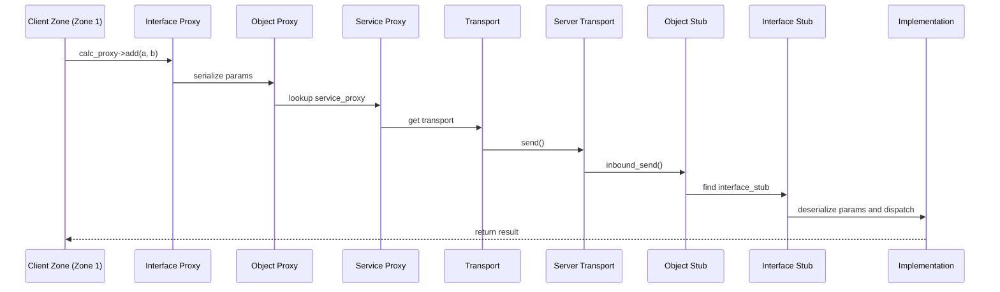
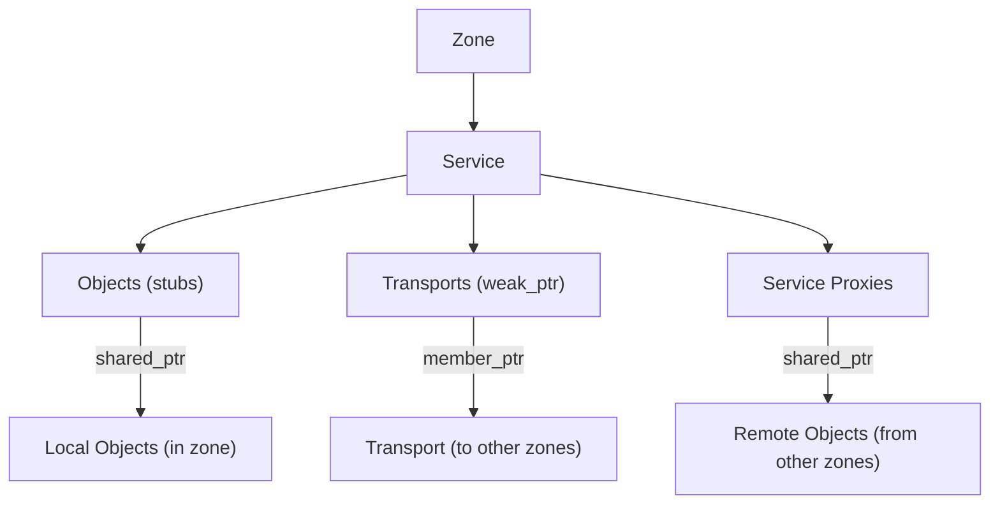
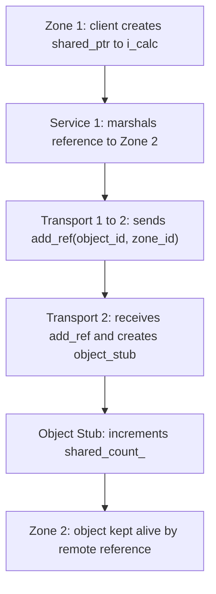
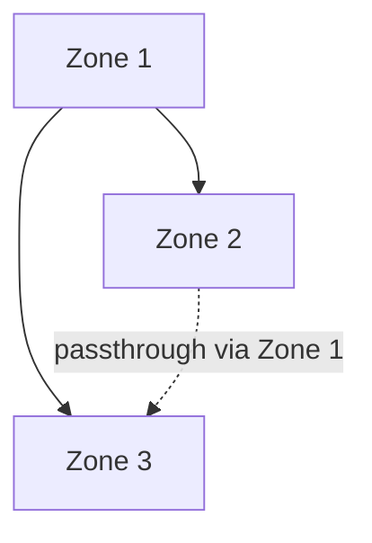

<!--
Copyright (c) 2026 Edward Boggis-Rolfe
All rights reserved.
-->

# Architecture Overview

Scope note:

- this document describes shared Canopy architecture concepts through the
  primary C++ implementation
- conceptual sections should usually be read as shared semantics
- code names, coroutine behavior, concrete classes, and build/runtime details
  should be read as C++-specific unless explicitly stated otherwise

This section provides a comprehensive view of Canopy's internal architecture. Understanding these components is essential for advanced usage, debugging, and contributing to the project.

## Document Organization

The architecture documentation is organized by component, each building on previous concepts:

1. **[Zones](02-zones.md)** - Execution context boundaries
2. **[Services](03-services.md)** - Object lifecycle management within zones
3. **[Memory Management](04-memory-management.md)** - Smart pointers and reference counting
4. **[Proxies and Stubs](05-proxies-and-stubs.md)** - RPC marshalling machinery
5. **[Transports and Passthroughs](06-transports-and-passthroughs.md)** - Communication plumbing between services
6. **[Zone Hierarchies](07-zone-hierarchies.md)** - Multi-level zone topologies

## Core Architecture Principles

### 1. Zone-Based Isolation

Every object in Canopy lives within a **zone**—an execution context with its own identity, object namespace, and service manager. Zones represent process any boundary, machine, logical, shared object, or secure enclave boundaries.

### 2. Service-Managed Lifecycles

Each zone has a **service** that acts as the central authority for:
- Object registration and ID generation
- Transport connection management
- Reference count tracking
- Zone lifecycle coordination

### 3. Smart Pointer Memory Management

Canopy's memory model is built entirely on **smart pointers**:
- `rpc::shared_ptr` - RAII ownership semantics (object dies when references reach zero)
- `rpc::weak_ptr` - local weak reference to a proxy/control block
- `rpc::optimistic_ptr` - callable remote weak pointer for independent lifetimes and cycle breaking across zones

**Zone Death (Amnesia)**: A zone dies when all `shared_ptr` references are released—references to objects **in** the zone, **from** the zone (outbound proxies), and **through** the zone (passthroughs).

### 4. Two-Level Proxy/Stub Architecture

RPC marshalling operates at two levels:
- **Object-level**: Generic `object_proxy` and `object_stub` provide RPC machinery
- **Interface-level**: Generated `i_calculator_proxy` and `i_calculator_stub` provide type-safe method dispatch and parameter serialization/deserialization in configurable formats (YAS binary, JSON, Protocol Buffers)

### 5. Transport and Passthrough Plumbing

Communication between services uses two mechanisms:
- **Transports**: Direct connections between **adjacent zones**
- **Passthroughs**: Multi-hop routing through **intermediary zones** when zones aren't adjacent

Transport lifetime is managed by multiple strong reference holders:
- **Service proxies** - Hold strong references (`member_ptr`) to transports
- **Passthroughs** - Hold strong references to both transports (forward and reverse) and to the intermediary service, keeping the entire routing path alive
- **Child services** - Hold strong reference to parent transport
- **Active stubs** - May cause transports to hold strong references to adjacent transports
- **Services** - Hold only weak references (registry only, doesn't keep alive)

This creates the reference chain that keeps zones and their communication
plumbing alive. Zones can function purely as routing intermediaries, staying
alive as long as passthroughs exist routing traffic through them.
These circular references are designed to form a self-supporting structure that
can be torn down when no longer needed. When the last reference is released,
the zone dies.

## Component Interactions

### Typical RPC Call Flow



### Zone Lifecycle Dependencies



**Key Insight**: Zone stays alive as long as there are references **in**, **from**, or **through** it. When all three counts reach zero, the zone enters "amnesia" and begins shutdown.

## Memory Management Flow

### Reference Count Propagation



### Zone Death Sequence

```
1. All references released:
   - Local objects in zone destroyed
   - Remote proxies to zone released
   - Passthroughs through zone destroyed

2. Service detects it is no longer needed:
   This occurs when all shared pointers to it are released.

3. Service notifies transport:
   transport->disconnect()
   no further inbound or outbound communication then occurs with the zone

4. Transport cleanup:
   - Disconnect from remote
   - Release parent reference (for child zones)
   - Notify optimistic pointers

5. Zone destruction:
   - Service destructor runs
   - Transport destructor runs
   - Zone memory released
```


Transports are kept alive by:
- **Service proxies** holding strong references while proxies exist
- **Active stubs** causing transports to maintain references to adjacent zones
- **Passthroughs** keeping routing paths alive
- Services hold only **weak references** to transports (registry, doesn't keep alive)
- `child_service` holds a **strong reference** to its parent transport, ensuring the parent zone outlives the child. This creates an intentional circular dependency that's broken during shutdown.

When all service proxies and active stubs are destroyed, the transport can be cleaned up.

## Transport Types and Patterns

### Peer-to-Peer Transports
- **TCP**: Network communication between independent zones
- **SPSC**: Lock-free inter-process communication

### Hierarchical Transports
- **Local**: In-process parent/child zones
- **SGX**: Host/enclave secure communication
- **DLL**: In-process child zones loaded from shared objects
- **Coroutine DLL**: Coroutine-aware in-process DLL child zones
- **IPC + DLL**: Child processes that host DLL-backed child zones over SPSC streams


### Passthrough Routing

When zones aren't adjacent, a **passthrough** routes communication through an intermediary:



Passthroughs hold **strong references** to both transports AND the intermediary service, keeping the entire routing path (including the intermediary zone) alive.

## Code Generation Pipeline

```
IDL File (calculator.idl)
  ↓
IDL Parser (submodules/idlparser)
  ↓
AST (Abstract Syntax Tree)
  ↓
Code Generator (generator/src/synchronous_generator.cpp)
  ↓
Generated C++ Headers
  ├─ calculator.h (interface definition)
  ├─ calculator_proxy.h (client-side marshalling)
  ├─ calculator_stub.h (server-side marshalling)
  └─ calculator_schema.h (JSON metadata)
```

Each interface gets:
- Pure virtual base class (`i_calculator`)
- Proxy class for clients (`i_calculator_proxy`) - serializes parameters, deserializes results
- Stub class for servers (`i_calculator_stub`) - deserializes parameters, serializes results
- Schema metadata for introspection

**Serialization formats** (configurable via generator options):
- `yas_binary` - Binary serialization (default, high performance)
- `yas_json` - JSON serialization (human-readable, universal fallback)
- `yas_compressed_binary` - Compressed binary
- `protocol_buffers` - Protocol Buffers format

## Key Design Patterns

### `rpc::shared_ptr` and `std::shared_ptr` are not the same
**Never mix `rpc::shared_ptr` with `std::shared_ptr`**. Use RPC smart pointers throughout RPC code, and keep standard pointers separate.

`member_ptr` is the thread-safe wrapper used by the C++ runtime for shared
pointer state that must be accessed across concurrent teardown and call paths.
Take a local copy before crossing a call boundary.

### Service Isolation
Each service only interacts with its own zone's objects. It is possible to use `get_current_service()` to access the current service in non-coroutine code only (this function is not suitable for coroutine code). Cross-zone access goes through transports and proxies.

### Stack-Based Lifetime Protection
When calls cross zone boundaries, stack-based strong references keep transports
and proxy plumbing alive during the active call. `rpc::weak_ptr` is only a weak
reference to the local proxy/control block; the distributed callable weak
concept is `rpc::optimistic_ptr`.

## Debugging and Telemetry

Enable telemetry for visualization:
- Zone creation/destruction events
- Reference count changes (add_ref/release)
- Transport status changes
- Passthrough routing activity

See [Telemetry Guide](../07-telemetry.md) for details.

## Next Steps

Read the architecture documents in order to build a complete mental model:

1. [Zones](02-zones.md) - Start with execution contexts
2. [Services](03-services.md) - Understand lifecycle management
3. [Memory Management](04-memory-management.md) - Master smart pointers
4. [Proxies and Stubs](05-proxies-and-stubs.md) - Learn marshalling machinery
5. [Transports and Passthroughs](06-transports-and-passthroughs.md) - Understand communication plumbing
6. [Zone Hierarchies](07-zone-hierarchies.md) - Build complex topologies

For practical usage, see the [Developer Guide](../01-introduction.md).
