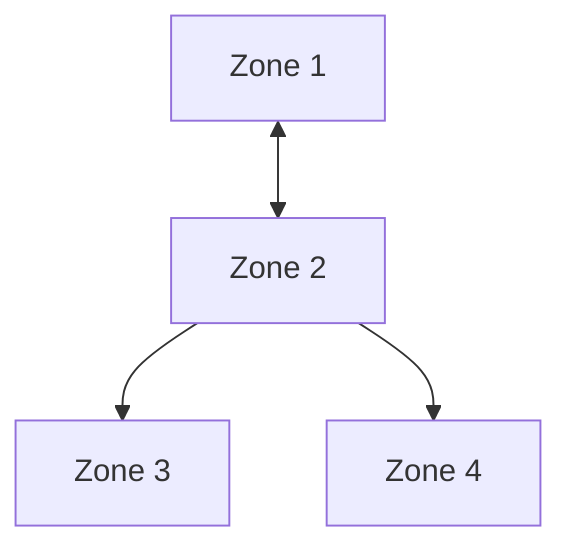

<!--
Copyright (c) 2026 Edward Boggis-Rolfe
All rights reserved.
-->

# Passthrough Architecture

Scope note:

- this document explains passthrough routing through the current C++
  implementation
- the conceptual routing model is shared, but class layout, telemetry names,
  and implementation details should be read as C++-specific unless stated
  otherwise

Passthroughs enable transparent communication between non-adjacent zones by routing through an intermediary zone.

## Purpose

When Zone A wants to share a reference with Zone C, but they're not directly connected and both connect through Zone B, a **passthrough** in Zone B routes the communication.

## Topology Example



- Zone 1 and Zone 2 are adjacent (direct connection)
- Zone 2 and Zone 3 are adjacent (hierarchical: Zone 3 is child of Zone 2)
- Zone 2 and Zone 4 are adjacent (hierarchical: Zone 4 is child of Zone 2)
- Zone 3 and Zone 4 are NOT adjacent (siblings)
- **Zone 1 and Zone 3** communicate through Zone 2's passthrough
- **Zone 3 and Zone 4** communicate through Zone 2's passthrough

## Passthrough Structure

```cpp
class pass_through : public i_marshaller
{
    std::shared_ptr<transport> forward_;   // To forward destination
    std::shared_ptr<transport> reverse_;   // To reverse destination
    std::shared_ptr<service> service_;     // Hosting service runtime (Zone 2)

    destination_zone forward_destination_;  // Zone 3
    destination_zone reverse_destination_;  // Zone 4

    std::atomic<uint64_t> shared_count_{0};      // Shared references
    std::atomic<uint64_t> optimistic_count_{0};  // Optimistic references
};
```

## Relay Operation (options=3)

### What is options=3?

In `rpc_types.idl`, `add_ref_options` value 3 is the bitwise OR of:
```cpp
build_destination_route = 0x01  // Bit 0
build_caller_route      = 0x02  // Bit 1
// options = 3: Both bits set
```

This signals a **relay operation**: "build or reuse passthrough routing state
for another caller/destination pair rather than treating this as a normal
adjacent-zone reference."

### Relay Sequence

**Scenario**: Zone 1 has a reference to an object in Zone 3, wants to share it with Zone 4

**Step 1: Relay Instruction**
```
Zone 1 → Zone 2: add_ref(object, options=3, caller=Zone4, destination=Zone3)
```
This is a **control message**, NOT a reference operation on Zone 1↔Zone 2 transport.

**Step 2: Zone 2 Processes Relay**

Check: Does passthrough exist for Zone 3 ↔ Zone 4?

**Case A: No Passthrough Exists**
```cpp
// Create new passthrough
auto passthrough = std::make_shared<pass_through>(
    transport_to_zone3,    // forward
    transport_to_zone4,    // reverse
    service,               // Zone 2's service
    destination_zone{Zone{3}},  // forward_destination
    destination_zone{Zone{4}}); // reverse_destination

passthrough->shared_count_ = 1;  // Initial reference
```

**Case B: Passthrough Already Exists**
```cpp
// Increment existing passthrough
passthrough->shared_count_++;  // 1→2, 2→3, etc.
```

**Step 3: Establish Routes**
```
Zone 2 → Zone 3: add_ref(object, options=build_destination_route)
Zone 2 → Zone 4: add_ref(object, options=build_caller_route)
```

**Step 4: Communication Flows Through Passthrough**
```
Zone 4 → object method call
  ↓ (through Zone 4's transport to Zone 2)
Zone 2's passthrough routes to Zone 3
  ↓ (through passthrough's forward_ transport)
Zone 3 → object in Zone 3 receives call
```

## Passthrough Lifecycle

### Creation

Passthrough created when:
1. Relay add_ref (options=3) arrives
2. No existing passthrough for that destination/caller pair
3. Initial `shared_count=1`

### Reference Counting

**Shared References:**
- Normal `rpc::shared_ptr` references
- Tracked in `shared_count_`
- Incremented by: relay add_ref (options=3)
- Decremented by: relay release (options=3)

**Optimistic References:**
- `rpc::optimistic_ptr` references
- Tracked in `optimistic_count_`
- Incremented by: relay add_ref with optimistic flag
- Decremented by: relay release with optimistic flag

### Deletion

Passthrough deleted when:
1. `shared_count_ == 0` AND `optimistic_count_ == 0`
2. No more references exist between the zones
3. Passthrough cleans itself up automatically

### Self-Deletion Logic

```cpp
void pass_through::release(...) {
    uint64_t prev = shared_count_.fetch_sub(1, std::memory_order_acq_rel);

    if (prev == 1 && optimistic_count_.load() == 0) {
        // Last reference - schedule self-deletion
        delete_self();
    }
}
```

## Routing Logic

### Forward Direction (Reverse → Forward)

When call comes from reverse destination (e.g., Zone 4):
```cpp
if (caller == reverse_destination_) {
    // Route to forward destination (Zone 3)
    return forward_->send(...);
}
```

### Reverse Direction (Forward → Reverse)

When call comes from forward destination (e.g., Zone 3):
```cpp
if (caller == forward_destination_) {
    // Route to reverse destination (Zone 4)
    return reverse_->send(...);
}
```

## Transport vs Passthrough Ref Counts

**Critical Distinction:**

### Transport Ref Counts
- Track proxies/stubs between **adjacent zones**
- Direct connections: Zone 1 ↔ Zone 2
- Incremented by: Normal add_ref (options=0)
- Decremented by: Normal release (options=0)

### Passthrough Ref Counts
- Track references between **non-adjacent zones**
- Routed connections: Zone 3 ↔ Zone 4 (through Zone 2)
- Incremented by: Relay add_ref (options=3)
- Decremented by: Relay release (options=3)

### Why Relay Operations Don't Affect Transport Counts

```
Zone 1 → Zone 2: add_ref(options=3)
```

This does NOT represent "Zone 1 holds a reference through Zone 2". It represents "Zone 1 is instructing Zone 2 to establish a passthrough between Zone 4 and Zone 3".

The reference exists in the **passthrough**, not on the Zone 1↔Zone 2 transport.

## Telemetry Tracking

### Transport Events
```javascript
transport_outbound_add_ref  (options != 3)  // Increment transport ref
transport_inbound_add_ref   (options != 3)  // Increment transport ref
transport_outbound_release  (options != 3)  // Decrement transport ref
transport_inbound_release   (options != 3)  // Decrement transport ref
```

### Passthrough Events
```javascript
pass_through_creation       // New passthrough created
pass_through_add_ref        // Passthrough ref count incremented
pass_through_release        // Passthrough ref count decremented
pass_through_deletion       // Passthrough deleted (ref count = 0)
```

### Relay Activity (options=3)
```javascript
// Transport events with options=3 are relay operations
// They trigger passthrough ref changes, not transport ref changes
if (options === 3) {
    pulseRelayActivity();  // Visual feedback only
    return;  // Don't update transport ref counts
}
```

## Multi-Hop Routing

Passthroughs can chain for multi-hop routing:

```
Zone 1 ↔ Zone 2 ↔ Zone 3 ↔ Zone 4
```

If Zone 1 wants to reach Zone 4:
- Zone 2 has passthrough: Zone 1 ↔ Zone 3
- Zone 3 has passthrough: Zone 2 ↔ Zone 4
- Calls route: Zone 1 → Zone 2 (passthrough) → Zone 3 (passthrough) → Zone 4

Each passthrough maintains its own reference counts and adjacent transport
links.

## Thread Safety

Passthroughs are thread-safe:
- `std::atomic` for ref counts
- Transport operations are thread-safe
- Multiple threads can route through same passthrough concurrently

## Performance Considerations

**Overhead:**
- Additional routing hop through intermediary zone
- No extra serialization (already serialized for zone boundaries)
- Ref count atomic operations (minimal overhead)

**Benefits:**
- Transparent multi-zone communication
- No need for every zone to connect to every other zone
- Simplified topology management

## Debugging Passthroughs

### Telemetry Visualization

Enable telemetry to see passthroughs:
- Purple boxes represent passthroughs in zone diagrams
- Ref counts shown: `S<shared> O<optimistic>`
- Forwarding routes visualized with arrows

### Common Issues

**Problem**: Passthrough never deleted (leak)
- **Cause**: Mismatched relay add_ref/release
- **Fix**: Verify relay operations are balanced (options=3)

**Problem**: Passthrough ref count negative
- **Cause**: Release without corresponding add_ref
- **Fix**: Check relay operation flow, ensure options=3 on both

**Problem**: Object not found through passthrough
- **Cause**: Passthrough routing logic issue
- **Fix**: Verify forward/reverse destinations match caller/destination zones

## Code References

**Implementation:**
- `c++/rpc/include/rpc/internal/pass_through.h` - Passthrough class definition
- `c++/rpc/src/pass_through.cpp` - Passthrough implementation

**Creation:**
- `transport::create_pass_through()` - Factory method (rpc/internal/transport.h:110)

**Telemetry:**
- `on_pass_through_creation()` - Creation event
- `on_pass_through_add_ref()` - Add reference event
- `on_pass_through_release()` - Release event
- `on_pass_through_deletion()` - Deletion event

## Related Issues

- **canopy-w6l**: Telemetry ref counting for relay operations
- **canopy-gj2**: Hierarchical transport circular dependency (applies to passthrough transports too)

## See Also

- `documents/architecture/zones.md` - Zone architecture overview
- `documents/transports/hierarchical.md` - Hierarchical transport pattern
- `rpc_types.idl` - add_ref_options and release_options definitions
