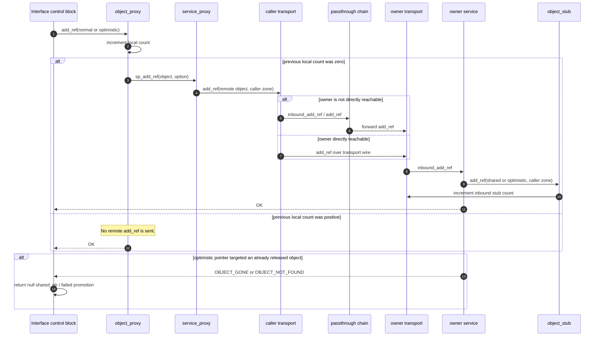
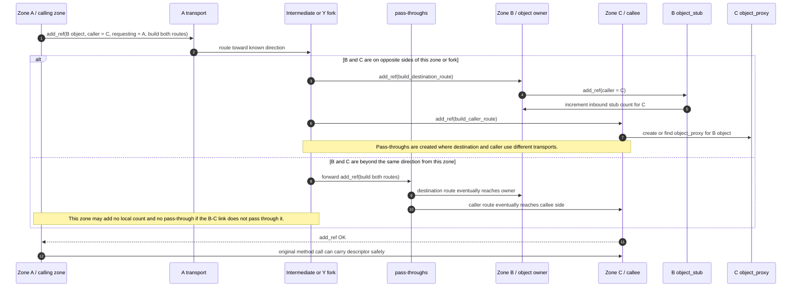
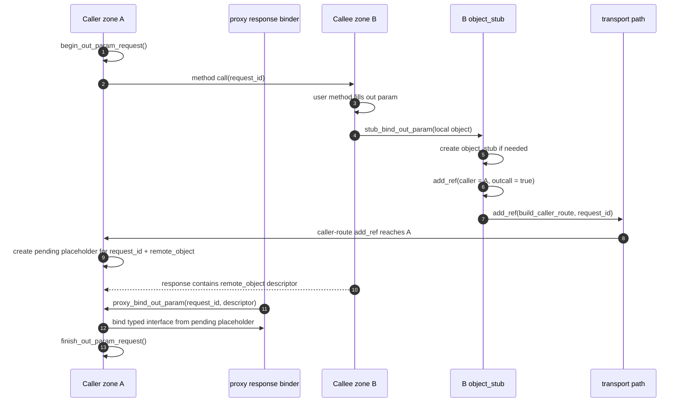
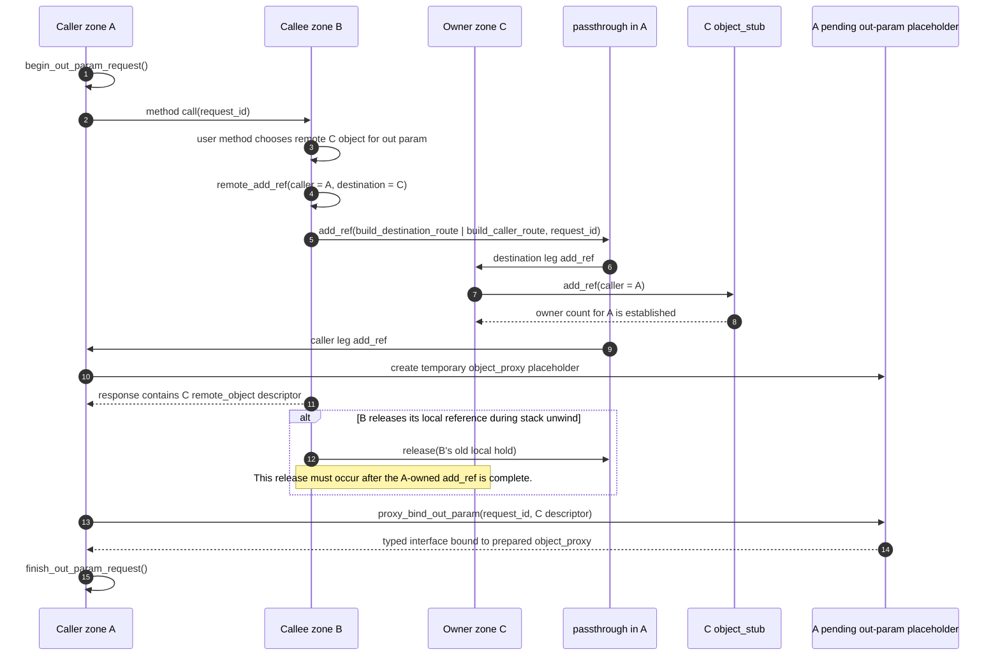

# Add Ref Protocol

`add_ref` is the protocol used to establish a remote reference and, in the harder cases, to create the routing needed for one zone to hold a reference to an object owned by another zone.

The operation is more than a counter increment:

- `normal` means a shared reference is being established.
- `optimistic` means an optimistic reference is being established.
- `build_destination_route` means the add_ref must reach the owner side of the object.
- `build_caller_route` means the add_ref must also establish the route back to the caller side.
- `requesting_zone_id` is the known direction to follow when the current zone does not yet know the destination or caller route directly.

Control blocks reduce traffic: copying an interface pointer does not send `add_ref` while the local count for that reference kind is already positive. The protocol is sent on the local `0 -> 1` transition for shared or optimistic references, and when generated binding code must transfer an interface between zones.

## Simple Add Ref

This is the base case used when a local pointer control block needs to establish a new remote count. The protocol shape is the same for a shared reference and an optimistic reference; the option bit selects which owner-side count is incremented.



The simple flow is:

1. The pointer control block asks `object_proxy::add_ref` for either `normal` or `optimistic`.
2. The `object_proxy` increments the local count for that reference kind.
3. If the previous local count was non-zero, the operation is complete locally.
4. If the previous local count was zero, the `object_proxy` calls `service_proxy::sp_add_ref`.
5. The `service_proxy` sends `add_ref` through its transport.
6. Intermediate transports and pass-throughs route the request until it reaches the owner zone.
7. The owner service calls `object_stub::add_ref`.
8. The stub increments the per-caller-zone count and the global shared or optimistic count.
9. The owner transport increments its inbound stub count for the caller zone.
10. If a shared add_ref targets a released remote object, the failure is reported as `OBJECT_GONE` or an object-not-found path and the resulting shared pointer should be null.

The same shape applies when creating an optimistic reference from a shared reference. The reference kind changes, but the path and the `0 -> 1` rule are the same.

Validation concern: the desired optimistic-to-shared promotion rule is that a successful promotion must establish a shared owner-side count, and if the owner object is already gone the result must be a null shared pointer. The current `make_shared(optimistic_ptr<T>)` implementation increments the local shared count directly from the optimistic pointer's control block. It does not visibly send a `normal` add_ref on a local shared `0 -> 1` transition. That should be checked against the intended weak semantics before treating this flow as correct.

## Passing An Interface As An In Parameter

The hard `[in]` case is when zone A calls zone C and passes an interface to an object owned by zone B. Zone C must receive a valid reference to zone B's object. Zone B must learn that zone C now has that reference. Any missing route between B and C must be created before the call can safely use the interface.

The intended route-building protocol for this transfer uses:

```text
build_destination_route | build_caller_route | normal-or-optimistic
```

for a remote interface being transferred between zones. Some current generated
in-parameter paths do not yet send this full protocol for an already-remote
third-zone descriptor; they may only serialise the descriptor and rely on an
existing route.

Implementation note from the SGX coroutine investigation:

- the intended protocol requires the B/C reference and route to exist before C
  uses the descriptor
- current generated code may not perform that route-building add_ref in every
  in-parameter transfer case
- current generated in-parameter cleanup only releases a locally created
  temporary stub
- therefore a generic `proxy_bind_in_param(...)` change that sends an extra
  remote `add_ref` for every third-zone remote descriptor is incomplete unless
  the generated cleanup path also gets a matching remote release
- the SGX coroutine route failure found on 2026-04-26 was fixed in the SGX
  transport delegate routing layer, not by changing generic binding semantics

This distinction matters because route creation and reference ownership are
coupled but not interchangeable. A route-only repair must not silently create an
unbalanced owner-side reference count.



The `[in]` transfer flow is:

1. The calling zone has a remote interface for an object owned by zone B and passes it to a method executing in zone C.
2. The generated binding path sends `add_ref` with both `build_destination_route` and `build_caller_route`, plus either `normal` or `optimistic`.
3. `remote_object_id` identifies the owner object in zone B.
4. `caller_zone_id` is zone C, because C is the zone that will hold the new reference.
5. `requesting_zone_id` is the known direction from the current zone. It lets add_ref flow toward a zone that may know an otherwise unadvertised fork.
6. `transport::inbound_add_ref` is responsible for discovering or creating the route. It may:
   - find an existing direct transport,
   - find a transport through existing pass-throughs,
   - use `requesting_zone_id` as the direction to search,
   - add a transport alias for a newly discovered zone,
   - create a pass-through when the destination and caller sides use different transports.
7. `pass_through::add_ref` splits a combined route-building add_ref into two calls:
   - destination side: clears `build_caller_route` and forwards toward the owner object,
   - caller side: clears `build_destination_route` and forwards toward the new holder.
8. In the current implementation, the pass-through forwards the destination side first, then the caller side.
9. When the destination side reaches zone B, `service::add_ref` calls `object_stub::add_ref` and increments the owner-side reference count for caller zone C.
10. When the caller side reaches zone C, `service::add_ref` ensures C can route back to the destination object. For out-parameter request ids, it can also create a pending placeholder proxy.
11. If B and C are both beyond the same transport direction from A, A should not need to create a local reference count or pass-through for the B-C relationship. The combined add_ref continues until it reaches the fork or path segment that actually separates B from C.

## Y Topology Case

The `remote_type_test.test_y_topology_and_return_new_prong_object` scenario exercises the case where the original root zone does not know about a later prong.

The shape is:

```text
Zone 1 -> Zone 2 -> Zone 3 -> Zone 4 -> Zone 5
                    |
                    +-> Zone 6 -> Zone 7
```

Zone 5 asks the known factory at zone 3 to create a new prong, then an object from zone 7 is returned toward zone 1. Zone 1 did not create zones 6 or 7, so it cannot assume it already has a route to zone 7.

The protocol requirement is:

1. The add_ref must be allowed to travel in the `requesting_zone_id` direction until it reaches a zone that knows the fork.
2. The fork zone can then build or expose the route between the returning caller and the destination owner.
3. The root must not fabricate an owner route from local knowledge it does not have.

This is why `requesting_zone_id` is part of `add_ref_params`; it is not just diagnostic metadata.

## Identity Topology Case

`remote_type_test.check_identity` repeatedly sends objects around a hierarchy and a fork, then checks that the returned interface compares equal to the original. It exercises the requirement that add_ref must not create duplicate object identity for the same remote object when a zone already has a live proxy.

The relevant rule is:

1. If a zone already has an `object_proxy` and a live interface proxy for the remote object, route establishment should reuse that identity.
2. If an extra incoming remote add_ref was needed only to establish a route or pending placeholder, the implementation may collapse that extra remote count after binding to the existing local control block.
3. Equality depends on preserving the `(destination zone, object id)` identity and converging on the existing proxy/control block where possible.

## Out Parameters

Out parameters and return values are harder than in parameters because the caller-side stack has only one response-unwind opportunity. Once generated proxy code has unmarshalled the response and the call stack returns to user code, there is no later stack-owned phase that can safely repair missing references or routes.

Therefore a non-null interface out parameter must be add-refed before the remote object descriptor is handed to the call site.

The current C++ implementation uses these pieces:

- `service::begin_out_param_request()` creates a request-local `request_id`.
- `send_params::request_id` carries that id on the call.
- `stub_bind_out_param(...)` is the intended producer of nonzero `add_ref_params::request_id`.
- `service::stub_add_ref(...)` handles out params that are local to the callee service.
- `service::remote_add_ref(...)` handles out params that are already remote from the callee service.
- `service::add_ref(...)` on the caller side validates the `request_id` and creates a pending no-op placeholder proxy.
- `proxy_bind_out_param(...)` consumes the pending placeholder to bind the real typed interface.
- `service::finish_out_param_request()` erases the request-scoped pending state after response binding.

### Out Parameter Returning A Local Callee Object



The local-callee-object flow is:

1. The caller allocates a nonzero `request_id` before making a call that may return interface out params.
2. The callee runs user code and obtains a non-null local interface for the out param.
3. `stub_bind_out_param(...)` calls `service::stub_add_ref(...)`.
4. The callee creates an `object_stub` if the local object does not already have one.
5. The stub increments the owner-side count for caller zone A before the response descriptor is returned.
6. Because this is an out call, `object_stub::add_ref(..., outcall = true)` also sends an add_ref with `build_caller_route` and the original `request_id`.
7. When that add_ref reaches the caller side, the caller creates or finds the object proxy and stores a request-scoped placeholder under `request_id + remote_object`.
8. The response descriptor can then unwind to generated proxy code.
9. `proxy_bind_out_param(...)` finds the placeholder and binds the real typed interface without needing another remote check.
10. The caller erases the request-scoped pending entry after binding, letting ordinary pointer ownership take over.

### Out Parameter Forwarding A Remote Object

This is the case where caller zone A calls callee zone B, and B returns an interface to an object owned by zone C. B may have reached C through A or through another route. A may already contain a pass-through between B and C.



The remote-forwarding flow is:

1. Zone A starts a request-scoped out-param call and sends `request_id` to zone B.
2. Zone B returns an interface that is remote from B and owned by zone C.
3. B cannot wait until after the response is delivered to repair A's reference; the response stack will be gone.
4. B must call `remote_add_ref(...)` before returning the remote object descriptor.
5. `remote_add_ref(...)` sends `build_destination_route | build_caller_route | normal-or-optimistic` with:
   - `remote_object_id = C object`,
   - `caller_zone_id = A`,
   - `requesting_zone_id = B's known direction`,
   - `request_id = original request_id`.
6. The add_ref establishes the owner-side count in C for caller A.
7. The same add_ref establishes or repairs caller-side route state so A can bind the returned object.
8. If A needs an `object_proxy` for the C object and none exists yet, A manufactures a temporary request-scoped no-op placeholder proxy.
9. If B then releases its own local reference to the C object during stack unwind, that release must complete after the add_ref for A has completed.
10. After the response descriptor reaches A, `proxy_bind_out_param(...)` uses the placeholder to bind the typed output interface.
11. When binding is complete, `finish_out_param_request()` erases the request-scoped placeholder and ordinary pointer reference counts own the object.

The key rule is acquire-before-release:

```text
new A -> C ownership must be established before old B -> C ownership is released
```

The B-side release is not the inverse of the A-side add_ref. They are different ownership facts and must remain isolated.

### Why The Placeholder Exists

The caller may receive a descriptor for an object whose `object_proxy` does not exist locally yet. This is common when the returned object lives in a third zone and the route was created only as part of the out-param add_ref.

The placeholder solves four problems:

1. It gives the caller something to bind during response unwind.
2. It holds the returned object proxy strongly while pass-throughs and old callee-side references may be released.
3. It deduplicates repeated references to the same returned remote object within one request.
4. It prevents generated proxy code from needing a second remote operation after the response stack has unwound.

The placeholder should be request-scoped. It should not be transport self-ownership, and it should not outlive `finish_out_param_request()`.

### Out Parameter Failure Rules

1. A nonzero `request_id` is valid only while the caller service has a pending out-param request entry.
2. An add_ref with an unknown nonzero `request_id` is a protocol violation and should return `FRAUDULANT_REQUEST()`.
3. If the callee fails to add_ref a non-null out param, it must not return a descriptor as if the out param were valid.
4. If a split add_ref partially succeeds, the protocol needs compensation or teardown of the partial ownership. This is a current weak area because release traffic does not carry the same route intent as add_ref.
5. If response binding fails after owner-side add_ref succeeded, ordinary cleanup of the request-scoped placeholder and interface pointers must release the temporary hold.
6. Null out params do not send add_ref and do not require a pending placeholder.

### Weaknesses And Open Risks

These are the areas that remain fragile or under-specified:

1. `release_params` does not carry route intent matching `add_ref_options`. That makes it hard to prove that cleanup removes exactly the ownership fact created by a route-building add_ref.
2. `build_destination_route` has more than one meaning: direct destination-facing ownership and the destination leg of a split handoff. The wire data does not fully distinguish them.
3. `build_caller_route` has no equally explicit release-side representation, even though it behaves like caller-facing reverse-route ownership.
4. A combined route-building add_ref can split across multiple transports. If one leg succeeds and another fails, partial cleanup is not fully specified.
5. The implementation must preserve add_ref-before-release ordering across coroutine scheduling, transport queues, enclave calls, and DLL/SPSC boundaries. Fire-and-forget release in this path would be unsafe.
6. Multiple out params may refer to the same remote object, possibly through different interface types or pointer kinds. The request-scoped placeholder must deduplicate identity without losing the correct shared or optimistic count semantics.
7. A callee can return an object that is already being released locally. The owner-side add_ref must either complete first or return an error; it must not race with stub deletion and produce a live-looking descriptor for a gone object.
8. `inout` parameters are not a single transition. They are an incoming release or preservation decision plus an outgoing add_ref handoff, and should be documented separately.
9. Hostile or malformed traffic can try to reuse `request_id`, invent caller zones, or convert handoff traffic into direct ownership. The receiver must validate topology and pending-request state rather than trusting fields blindly.
10. Service-proxy lifetime, object-proxy ownership, stub counts, and pass-through joins are separate ownership layers. Out-param handoff must not double-count one layer or let cleanup of one layer consume another.

## Validation Notes

- Plain pointer promotion is correctly modeled as `object_proxy -> service_proxy -> transport -> pass-throughs -> owner service -> object_stub`.
- A local control block with a positive count avoids repeated remote add_refs for copies.
- Combined route-building add_ref is the complex case; it is not just an owner-side count increment.
- In the current pass-through implementation, when both route flags are set, the destination-side add_ref is forwarded before the caller-side add_ref.
- `requesting_zone_id` is required for Y-shaped or otherwise partially advertised topologies.
- Transport-specific implementations should only explain how they carry `add_ref` messages. The route and count semantics belong to this common protocol.
