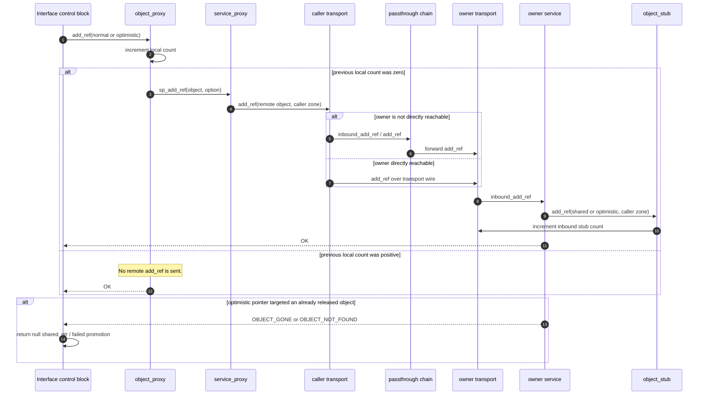
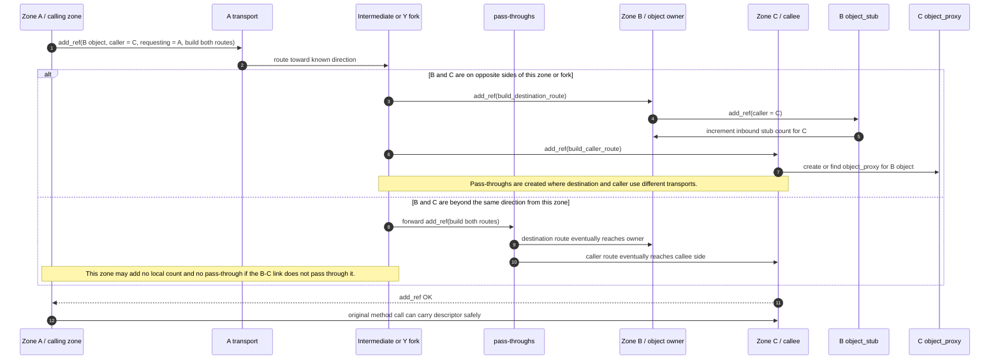
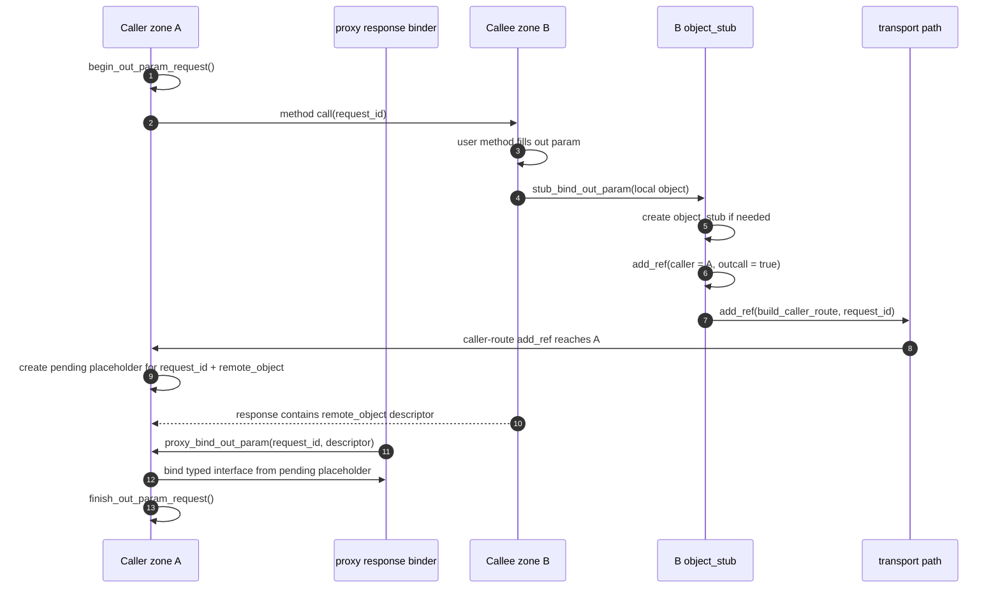
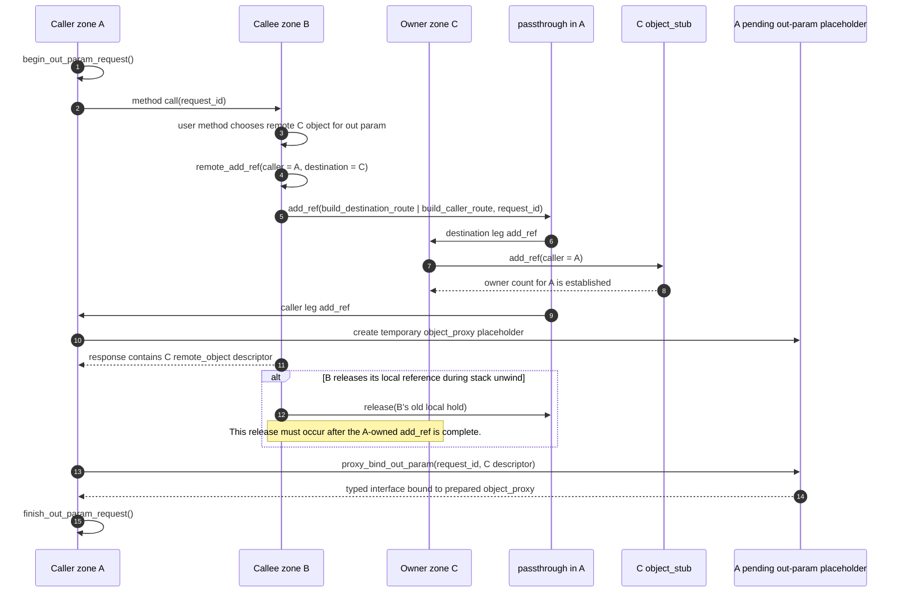

# Add Ref Protocol

`add_ref` is the protocol used to establish a remote reference and, in the harder cases, to create the routing needed for one zone to hold a reference to an object owned by another zone.

The operation is more than a counter increment:

- `normal` means a shared reference is being established.
- `optimistic` means an optimistic reference is being established.
- `build_destination_route` means the add_ref must reach the owner side of the object.
- `build_caller_route` means the add_ref must also establish the route back to the caller side.
- `requesting_zone_id` is the known direction to follow when the current zone does not yet know the destination or caller route directly.

Control blocks reduce traffic: copying an interface pointer does not send `add_ref` while the local count for that reference kind is already positive. The protocol is sent on the local `0 -> 1` transition for shared or optimistic references, and when generated binding code must transfer an interface between zones.

## Scenario Inventory

This section enumerates the cases that `add_ref` must support. The purpose is
to make the route-subject rules explicit before attestation policy is layered
over the protocol. In all cases, the important identities are the zones named
inside the `add_ref_params`, not merely the adjacent transport that delivered
the message.

### Common Field Meaning

- `remote_object_id` names the object owner route. Its zone component is the
  destination or owner route that must receive a destination-side `add_ref`
  when `build_destination_route` is set.
- `caller_zone_id` names the zone that will hold the reference after the
  operation. It is the caller route that must receive caller-side setup when
  `build_caller_route` is set.
- `requesting_zone_id` is the known direction that caused this `add_ref` to be
  routed through the current zone. It is a routing hint and provenance field,
  not a substitute for the caller or destination identity.
- The adjacent transport identity is only the immediate peer relationship. It
  may be neither the caller route nor the destination route.
- `request_id` is only for request-scoped out-parameter binding. A nonzero
  value has meaning only while the receiving service has an active
  `pending_out_param_entry` for that request.

### Direct Local Copy

A local copy of an existing interface pointer does not send protocol traffic
when the local control block count for that reference kind is already positive.
This case exists to avoid turning every C++ pointer copy into remote traffic.

Expected behaviour:

1. Increment the local shared or optimistic count.
2. If the previous count was nonzero, stop locally.
3. Do not create route state, pass-through state, or pending out-param state.

### Simple Remote Owner Add Ref

This is the ordinary `0 -> 1` remote transition. A zone already knows how to
reach the object owner and establishes a shared or optimistic owner-side count.

Field shape:

- `remote_object_id = owner zone + object id`
- `caller_zone_id = local holder zone`
- `requesting_zone_id = local known route direction`
- `build_out_param_channel = normal` or `optimistic`

Expected behaviour:

1. The message reaches the owner side.
2. The owner service calls `object_stub::add_ref(...)`.
3. The owner records the count against `caller_zone_id`.
4. Intermediate zones do not infer that they own the object.

### Direct Parent/Child Route

A parent and child transport already have a direct route. This is the simplest
multi-zone case and is the baseline for local, SGX ECALL/OCALL, coroutine
stream, and other transport implementations.

Expected behaviour:

1. The child can add-ref a parent object directly.
2. The parent can add-ref a child object directly.
3. `requesting_zone_id` normally equals the known adjacent direction, but the
   implementation must still use `remote_object_id` and `caller_zone_id` as
   the route subjects.

### Destination-Only Leg

A combined handoff may be split by a pass-through. The destination leg carries
the owner-side part of the operation after `build_caller_route` has been
cleared.

Field shape:

- `remote_object_id = owner zone + object id`
- `caller_zone_id = final holder zone`
- `build_destination_route` set
- `build_caller_route` clear

Expected behaviour:

1. Route toward `remote_object_id.as_zone()`.
2. Increment the owner-side count for `caller_zone_id`.
3. Do not create caller-side placeholder state unless this zone is also the
   caller side and `request_id` is valid.

### Caller-Only Leg

A combined handoff may also split into the caller leg after
`build_destination_route` has been cleared. This prepares the holder side to
route back to the object owner and, for out params, may create the pending
placeholder needed by response binding.

Field shape:

- `remote_object_id = owner zone + object id`
- `caller_zone_id = holder zone being prepared`
- `build_caller_route` set
- `build_destination_route` clear

Expected behaviour:

1. Route toward `caller_zone_id`.
2. Ensure the caller side has a route to the owner zone.
3. If `request_id != 0`, validate the pending out-param request and create or
   find the request-scoped placeholder.

### Combined Third-Zone Handoff

This is the hard case for interface parameters. Zone A calls zone C and passes
an interface to an object owned by zone B, or zone B returns an object owned by
zone C to caller A. The holder and owner are different remote zones, and the
current zone may only know one useful direction.

Field shape:

- `remote_object_id = owner zone + object id`
- `caller_zone_id = eventual holder zone`
- `requesting_zone_id = known direction that can lead to the missing route`
- `build_destination_route | build_caller_route | normal-or-optimistic`

Expected behaviour:

1. Establish the owner-side count.
2. Establish or repair the caller-side route.
3. Create pass-throughs only at zones where the destination and caller sides
   are reached through different transports.
4. Do not count the intermediate as the long-term owner unless it separately
   holds a reference.

### Third-Direction Add Ref Through An Intermediate

An `add_ref` can arrive over a transport whose adjacent peer is neither the
object owner nor the eventual holder. For example, zone B may deliver an
`add_ref` to zone C for an object owned by zone D and held by zone A.

Field shape:

- adjacent transport = B
- `remote_object_id.as_zone() = D`
- `caller_zone_id = A`
- `requesting_zone_id = B`

Expected behaviour:

1. The current zone must not assume the adjacent transport is the caller.
2. The current zone must not assume the adjacent transport is the destination.
3. Destination route registration follows `remote_object_id.as_zone()`.
4. Caller route registration follows `caller_zone_id` when caller route setup
   is required.
5. `requesting_zone_id` is only the known direction to try when one of those
   route subjects is not locally known.

This is the lower-level invariant covered by the transport registry regression
for third-direction `add_ref`.

### Deep Fork With Channel Convergence

The `remote_type_test.check_deeply_nested_zone_reference_counting_fork_scenario`
case creates a fork where the route toward the owner and the route toward the
caller can appear to converge at an intermediate zone.

Topology shape:

```text
    Zone 6     Zone 7
       \       /
        Zone 4/5      Zone 8
             \       /
              Zone 2/3
                 \ /
                Zone 1
```

Protocol requirement:

1. If destination and caller lookup produce the same transport, the current
   zone must still preserve the distinction between destination-side ownership
   and caller-side route preparation.
2. A converged channel is not permission to drop either route subject.
3. Reference counts must remain attached to the owner/caller pair, not to the
   intermediate convergence point.

### Unknown Zone Cross-Branch Reference Path

The `remote_type_test.check_unknown_zone_reference_path` case creates two deep
branches from the same root, then passes objects between the deepest zones and
intermediate zones in the opposite branch.

Protocol requirement:

1. A branch that does not know the other branch's deep zone must not invent a
   parent fallback route.
2. `requesting_zone_id` is the first direction to try when the destination or
   caller route is unknown.
3. If no known direction can reach the route subject, fail with a routing error
   rather than recursively bouncing `add_ref`.

### Interface Routing With Out Params

The `remote_type_test.check_interface_routing_with_out_params` case combines
out parameters, in parameters, deep zones, and a parallel branch.

Protocol requirement:

1. `receive_interface(...)` out parameters must send an `add_ref` before the
   descriptor is bound by the caller.
2. Cross-zone `receive_interface(...)` must use the same route-subject rules as
   a third-zone return value.
3. `give_interface(...)` in parameters must not rely on an already-existing
   route when the object owner and callee are in different branches.
4. Root-to-deep calls and parallel-branch calls must both preserve object
   identity and balanced owner-side reference counts.

### Y Topology Return From Unknown Prong

The `remote_type_test.test_y_topology_and_return_new_prong_object` scenario
exercises a root that does not know a later autonomous prong.

Topology:

```text
Zone 1 -> Zone 2 -> Zone 3 -> Zone 4 -> Zone 5
                    |
                    +-> Zone 6 -> Zone 7
```

Sequence:

1. Zone 1 creates the first chain down to zone 5.
2. Zone 5 asks the known factory at zone 3 to create a second prong ending at
   zone 7.
3. Zone 5 receives an object from zone 7.
4. The object is returned toward zone 1, which never directly created or
   learned zones 6 and 7.

Protocol requirement:

1. The `add_ref` must be able to travel in the `requesting_zone_id` direction
   until it reaches a zone that knows the fork.
2. The fork zone can then expose or create the route between the caller side
   and the destination owner.
3. The root must not fabricate a route to zone 7 from only local tree
   knowledge.

This is the original reason `requesting_zone_id` became part of
`add_ref_params`.

### Y Topology Cached Retrieval

The `remote_type_test.test_y_topology_and_cache_and_retrieve_prong_object`
scenario is the same structural problem, but the object from the autonomous
prong is cached first and retrieved later.

Expected behaviour:

1. Caching the object must not erase the route provenance needed for the later
   `add_ref`.
2. The later retrieval must still be able to follow `requesting_zone_id` toward
   a zone that knows the hidden prong.
3. The caller-side placeholder and object identity rules are the same as for a
   direct return.

This catches bugs where the immediate response path worked but later lookup of
the same remote object lost the route context.

### Y Topology Host Registry Transfer

The `remote_type_test.test_y_topology_and_set_host_with_prong_object` scenario
is the severe host-registry variant of the Y-topology problem. Zone 5 obtains
and caches an object from zone 7, then in a separate call stores that object in
zone 1's host registry. Zone 1 later looks the object up from the registry.

Protocol requirement:

1. The registry store must establish host-side ownership without losing the
   `requesting_zone_id` route context for zone 7.
2. The later lookup must perform ordinary out-param add_ref handling; the
   registry's ownership is not a substitute for the caller's new ownership.
3. Clearing the registry entry must release only the registry's ownership, not
   the caller reference returned by lookup.
4. If `requesting_zone_id` is absent or zero in this topology, the protocol can
   recurse while trying to find zone 7. The correct result is to follow the
   requesting direction to the zone that knows the fork or fail cleanly.

### Identity Preservation Across Hierarchies

The `remote_type_test.check_identity` scenario repeatedly sends objects around
a chain and a fork and checks that the returned interface compares equal to the
original. It is not just a convenience test; it proves that route repair does
not manufacture duplicate local identities for the same remote object.

Expected behaviour:

1. The key identity remains `(destination zone, object id)`.
2. If a live `object_proxy` already exists for that identity, the implementation
   should converge on it.
3. An `add_ref` used to repair a route or satisfy an out-param request may
   create a temporary no-op placeholder, but binding must reuse the existing
   live interface proxy when one exists.
4. If the incoming remote count is redundant because a live local control block
   already holds the object, the implementation may collapse the extra remote
   count after binding.

The transport-down repair variant of the test adds one more rule: a stale
`transport_down` for a route that has already been replaced must not destroy
the canonical route needed by later `add_ref` and release traffic.

### Complex Topology Trap Set

The complex topology tests deliberately create many converging and crossing
branches to catch route-selection bugs that simple trees do not expose.

Covered patterns:

1. `complex_topology_cross_branch_routing_trap_1`: deepest nodes in unrelated
   sub-branches exchange object references without prior communication.
2. `complex_topology_intermediate_channel_collision_trap_2`: route subjects
   converge at an intermediate node where destination and caller channels can
   look identical.
3. `complex_topology_deep_nesting_parent_fallback_trap_3`: deepest nodes pass
   references in all directions, forcing lookup to avoid naive parent fallback.
4. `complex_topology_service_proxy_cache_bypass_trap_4`: shallow, deep, and
   cross-branch exchanges are interleaved to prove service-proxy cache hits do
   not bypass route repair.
5. `complex_topology_multiple_convergence_points_trap_5`: multiple possible
   convergence points exist, so the chosen route must still follow the message
   route subjects.

Protocol requirement:

1. Route lookup may use caches, pass-throughs, and `requesting_zone_id`, but
   the selected route must still be valid for the named owner/caller pair.
2. A successful lookup for one object must not poison the route choice for a
   different owner/caller pair.
3. Recursive add_ref loops are protocol failures, not valid repair attempts.

### Host Creates Enclave And Throws Away Result

In the coroutine SGX hierarchy tests, a child service calls the host to create
an enclave, receives the returned interface inside that child service, may use
it, and then lets it go out of scope without returning it to the original
caller.

Protocol requirement:

1. The host-created enclave interface is still a real out parameter for the
   inner host call.
2. The child side must validate the `request_id`, create or find the pending
   placeholder, bind the typed interface, and then clean up the request-scoped
   state.
3. Dropping the local variable after the call must release only the ownership
   established for that child-side holder.

This case catches bugs where out-param handling only works when the returned
interface is immediately forwarded to the outer caller.

### Host Creates Enclave And Returns Result

The `coro_call_host_create_enclave` class of tests is harder: a child service
asks the host to create an enclave and then returns that interface as an out
parameter to its own caller.

There are two nested handoffs:

1. Host-created enclave object -> child service, for the inner host call.
2. Host-created enclave object -> original caller, for the outer service call.

Protocol requirement:

1. Each handoff has its own `request_id` scope.
2. The inner pending placeholder must not be mistaken for the outer pending
   placeholder.
3. The intermediate child service may release its local hold after the outer
   add_ref for the original caller has completed.
4. The final caller must bind the result to the correct object identity and
   interface type.

The historical coroutine SGX bug in this area was fixed by two related design
points:

- `i_noop` gives `add_ref` and pending placeholders a type-erased interface
  carrier, so the route/reference protocol does not need to know the final IDL
  interface type before response binding.
- `pending_out_param_entry` stores request-scoped shared and optimistic
  placeholders by `request_id + remote_object`, so the proxy binder can later
  recover the correct placeholder and cast or bind the typed interface.

### Host Registry Store, Lookup, And Delete

The host app registry tests store an interface in a host-visible registry,
look it up later, return it through an out parameter, and then unload or delete
the registry entry.

Expected behaviour:

1. Storing the interface establishes the registry's own ownership.
2. Looking it up and returning it establishes a new caller-side ownership fact
   before the descriptor is handed to the caller.
3. Unloading the registry entry releases only the registry ownership.
4. The returned caller reference remains valid if its add_ref completed.
5. If the same object is looked up again, identity should converge on the
   existing proxy/control block where possible.

### Multiple Interface Types For One Remote Object

`add_ref` does not prove a specific application interface. It proves that a
zone may hold a reference to a remote object. The final interface type is bound
by generated proxy code, `try_cast`, or the static type of the call site.

Expected behaviour:

1. Pending placeholders use `i_noop` so that add_ref can finish before the
   final typed proxy exists.
2. The same remote object may later be viewed through multiple IDL interfaces.
3. Interface type discovery must not create a second owner-side reference count
   unless a real additional local `0 -> 1` transition occurs.

### Optimistic Reference Variant

Most route shapes have a shared and optimistic variant. The routing semantics
are the same; the owner-side count and local control-block count differ.

Expected behaviour:

1. `optimistic` follows the same route-subject rules as `normal`.
2. A later promotion to shared must establish a real shared owner-side count or
   fail cleanly if the object is gone.
3. Shared and optimistic pending placeholders must not overwrite each other
   inside one `pending_out_param_entry`.

### Attestation Enforcement View

For attestation and protected RPC, the route subjects introduced by `add_ref`
are:

1. The destination owner route: `remote_object_id.as_zone()`.
2. The caller holder route: `caller_zone_id` when caller-side route setup is
   being created or relied on.
3. The immediate adjacent peer only as a transport neighbour.
4. The `requesting_zone_id` only as a direction/provenance hint.

An attesting service must therefore avoid a single "check the adjacent zone"
rule. A routed `add_ref` may legitimately arrive from an intermediate, and the
security decision must be based on the route subjects named by the message and
the local zone policy.

Protected-route downgrade checks follow the same subject rule. If either the
destination route or the caller route named by an `add_ref` already has an
established protected context, a plaintext `add_ref` for that route subject
must be rejected. A caller-only leg is not exempt just because it does not
increment the owner-side count.

The destination owner route is always a security subject, even when the option
bits describe only caller-side setup. A caller-only leg still gives the holder
a reference to `remote_object_id`, so the holder must not bind that reference
unless the destination owner route is admitted by policy.

## Simple Add Ref

This is the base case used when a local pointer control block needs to establish a new remote count. The protocol shape is the same for a shared reference and an optimistic reference; the option bit selects which owner-side count is incremented.



The simple flow is:

1. The pointer control block asks `object_proxy::add_ref` for either `normal` or `optimistic`.
2. The `object_proxy` increments the local count for that reference kind.
3. If the previous local count was non-zero, the operation is complete locally.
4. If the previous local count was zero, the `object_proxy` calls `service_proxy::sp_add_ref`.
5. The `service_proxy` sends `add_ref` through the local service's
   `outbound_add_ref(...)` virtual, and the service calls the transport.
6. Intermediate transports and pass-throughs route the request until it reaches the owner zone.
7. The owner service calls `object_stub::add_ref`.
8. The stub increments the per-caller-zone count and the global shared or optimistic count.
9. The owner transport increments its inbound stub count for the caller zone.
10. If a shared add_ref targets a released remote object, the failure is reported as `OBJECT_GONE` or an object-not-found path and the resulting shared pointer should be null.

The same shape applies when creating an optimistic reference from a shared reference. The reference kind changes, but the path and the `0 -> 1` rule are the same.

Validation concern: the desired optimistic-to-shared promotion rule is that a successful promotion must establish a shared owner-side count, and if the owner object is already gone the result must be a null shared pointer. The current `make_shared(optimistic_ptr<T>)` implementation increments the local shared count directly from the optimistic pointer's control block. It does not visibly send a `normal` add_ref on a local shared `0 -> 1` transition. That should be checked against the intended weak semantics before treating this flow as correct.

## Passing An Interface As An In Parameter

The hard `[in]` case is when zone A calls zone C and passes an interface to an object owned by zone B. Zone C must receive a valid reference to zone B's object. Zone B must learn that zone C now has that reference. Any missing route between B and C must be created before the call can safely use the interface.

The intended route-building protocol for this transfer uses:

```text
build_destination_route | build_caller_route | normal-or-optimistic
```

for a remote interface being transferred between zones. Some current generated
in-parameter paths do not yet send this full protocol for an already-remote
third-zone descriptor; they may only serialise the descriptor and rely on an
existing route.

Implementation note from the SGX coroutine investigation:

- the intended protocol requires the B/C reference and route to exist before C
  uses the descriptor
- current generated code may not perform that route-building add_ref in every
  in-parameter transfer case
- current generated in-parameter cleanup only releases a locally created
  temporary stub
- therefore a generic `proxy_bind_in_param(...)` change that sends an extra
  remote `add_ref` for every third-zone remote descriptor is incomplete unless
  the generated cleanup path also gets a matching remote release
- the SGX coroutine route failure found on 2026-04-26 was fixed in the SGX
  transport delegate routing layer, not by changing generic binding semantics

This distinction matters because route creation and reference ownership are
coupled but not interchangeable. A route-only repair must not silently create an
unbalanced owner-side reference count.



The `[in]` transfer flow is:

1. The calling zone has a remote interface for an object owned by zone B and passes it to a method executing in zone C.
2. The generated binding path sends `add_ref` with both `build_destination_route` and `build_caller_route`, plus either `normal` or `optimistic`.
3. `remote_object_id` identifies the owner object in zone B.
4. `caller_zone_id` is zone C, because C is the zone that will hold the new reference.
5. `requesting_zone_id` is the known direction from the current zone. It lets add_ref flow toward a zone that may know an otherwise unadvertised fork.
6. `transport::inbound_add_ref` is responsible for discovering or creating the route. It may:
   - find an existing direct transport,
   - find a transport through existing pass-throughs,
   - use `requesting_zone_id` as the direction to search,
   - add a transport alias for a newly discovered zone,
   - create a pass-through when the destination and caller sides use different transports.
7. `pass_through::add_ref` splits a combined route-building add_ref into two calls:
   - destination side: clears `build_caller_route` and forwards toward the owner object,
   - caller side: clears `build_destination_route` and forwards toward the new holder.
8. In the current implementation, the pass-through forwards the destination side first, then the caller side.
9. When the destination side reaches zone B, `service::add_ref` calls `object_stub::add_ref` and increments the owner-side reference count for caller zone C.
10. When the caller side reaches zone C, `service::add_ref` ensures C can route back to the destination object. For out-parameter request ids, it can also create a pending placeholder proxy.
11. If B and C are both beyond the same transport direction from A, A should not need to create a local reference count or pass-through for the B-C relationship. The combined add_ref continues until it reaches the fork or path segment that actually separates B from C.

## Y Topology Case

The `remote_type_test.test_y_topology_and_return_new_prong_object` scenario exercises the case where the original root zone does not know about a later prong.

The shape is:

```text
Zone 1 -> Zone 2 -> Zone 3 -> Zone 4 -> Zone 5
                    |
                    +-> Zone 6 -> Zone 7
```

Zone 5 asks the known factory at zone 3 to create a new prong, then an object from zone 7 is returned toward zone 1. Zone 1 did not create zones 6 or 7, so it cannot assume it already has a route to zone 7.

The protocol requirement is:

1. The add_ref must be allowed to travel in the `requesting_zone_id` direction until it reaches a zone that knows the fork.
2. The fork zone can then build or expose the route between the returning caller and the destination owner.
3. The root must not fabricate an owner route from local knowledge it does not have.

This is why `requesting_zone_id` is part of `add_ref_params`; it is not just diagnostic metadata.

## Identity Topology Case

`remote_type_test.check_identity` repeatedly sends objects around a hierarchy and a fork, then checks that the returned interface compares equal to the original. It exercises the requirement that add_ref must not create duplicate object identity for the same remote object when a zone already has a live proxy.

The relevant rule is:

1. If a zone already has an `object_proxy` and a live interface proxy for the remote object, route establishment should reuse that identity.
2. If an extra incoming remote add_ref was needed only to establish a route or pending placeholder, the implementation may collapse that extra remote count after binding to the existing local control block.
3. Equality depends on preserving the `(destination zone, object id)` identity and converging on the existing proxy/control block where possible.

## Out Parameters

Out parameters and return values are harder than in parameters because the caller-side stack has only one response-unwind opportunity. Once generated proxy code has unmarshalled the response and the call stack returns to user code, there is no later stack-owned phase that can safely repair missing references or routes.

Therefore a non-null interface out parameter must be add-refed before the remote object descriptor is handed to the call site.

The current C++ implementation uses these pieces:

- `service::begin_out_param_request()` creates a request-local `request_id`.
- `send_params::request_id` carries that id on the call.
- `stub_bind_out_param(...)` is the intended producer of nonzero `add_ref_params::request_id`.
- `service::stub_add_ref(...)` handles out params that are local to the callee service.
- `service::remote_add_ref(...)` handles out params that are already remote from the callee service.
- `service::add_ref(...)` on the caller side validates the `request_id` and creates a pending no-op placeholder proxy.
- `proxy_bind_out_param(...)` consumes the pending placeholder to bind the real typed interface.
- `service::finish_out_param_request()` erases the request-scoped pending state after response binding.

### Out Parameter Returning A Local Callee Object



The local-callee-object flow is:

1. The caller allocates a nonzero `request_id` before making a call that may return interface out params.
2. The callee runs user code and obtains a non-null local interface for the out param.
3. `stub_bind_out_param(...)` calls `service::stub_add_ref(...)`.
4. The callee creates an `object_stub` if the local object does not already have one.
5. The stub increments the owner-side count for caller zone A before the response descriptor is returned.
6. Because this is an out call, `object_stub::add_ref(..., outcall = true)` also sends an add_ref with `build_caller_route` and the original `request_id`.
7. When that add_ref reaches the caller side, the caller creates or finds the object proxy and stores a request-scoped placeholder under `request_id + remote_object`.
8. The response descriptor can then unwind to generated proxy code.
9. `proxy_bind_out_param(...)` finds the placeholder and binds the real typed interface without needing another remote check.
10. The caller erases the request-scoped pending entry after binding, letting ordinary pointer ownership take over.

### Out Parameter Forwarding A Remote Object

This is the case where caller zone A calls callee zone B, and B returns an interface to an object owned by zone C. B may have reached C through A or through another route. A may already contain a pass-through between B and C.



The remote-forwarding flow is:

1. Zone A starts a request-scoped out-param call and sends `request_id` to zone B.
2. Zone B returns an interface that is remote from B and owned by zone C.
3. B cannot wait until after the response is delivered to repair A's reference; the response stack will be gone.
4. B must call `remote_add_ref(...)` before returning the remote object descriptor.
5. `remote_add_ref(...)` sends `build_destination_route | build_caller_route | normal-or-optimistic` with:
   - `remote_object_id = C object`,
   - `caller_zone_id = A`,
   - `requesting_zone_id = B's known direction`,
   - `request_id = original request_id`.
6. The add_ref establishes the owner-side count in C for caller A.
7. The same add_ref establishes or repairs caller-side route state so A can bind the returned object.
8. If A needs an `object_proxy` for the C object and none exists yet, A manufactures a temporary request-scoped no-op placeholder proxy.
9. If B then releases its own local reference to the C object during stack unwind, that release must complete after the add_ref for A has completed.
10. After the response descriptor reaches A, `proxy_bind_out_param(...)` uses the placeholder to bind the typed output interface.
11. When binding is complete, `finish_out_param_request()` erases the request-scoped placeholder and ordinary pointer reference counts own the object.

The key rule is acquire-before-release:

```text
new A -> C ownership must be established before old B -> C ownership is released
```

The B-side release is not the inverse of the A-side add_ref. They are different ownership facts and must remain isolated.

### Why The Placeholder Exists

The caller may receive a descriptor for an object whose `object_proxy` does not exist locally yet. This is common when the returned object lives in a third zone and the route was created only as part of the out-param add_ref.

The placeholder solves four problems:

1. It gives the caller something to bind during response unwind.
2. It holds the returned object proxy strongly while pass-throughs and old callee-side references may be released.
3. It deduplicates repeated references to the same returned remote object within one request.
4. It prevents generated proxy code from needing a second remote operation after the response stack has unwound.

The placeholder should be request-scoped. It should not be transport self-ownership, and it should not outlive `finish_out_param_request()`.

### Out Parameter Failure Rules

1. A nonzero `request_id` is valid only while the caller service has a pending out-param request entry.
2. An add_ref with an unknown nonzero `request_id` is a protocol violation and should return `FRAUDULANT_REQUEST()`.
3. If the callee fails to add_ref a non-null out param, it must not return a descriptor as if the out param were valid.
4. If a split add_ref partially succeeds after the destination owner leg has
   accepted the reference, the fork point must send a compensating `release` to
   the destination owner leg before returning failure. The compensating release
   uses the same `remote_object_id` and `caller_zone_id`; optimistic add_refs
   must compensate with `release_options::optimistic`.
5. If response binding fails after owner-side add_ref succeeded, ordinary cleanup of the request-scoped placeholder and interface pointers must release the temporary hold.
6. Null out params do not send add_ref and do not require a pending placeholder.

### Weaknesses And Open Risks

These are the areas that remain fragile or under-specified:

1. `release_params` does not carry route intent matching `add_ref_options`. That makes it hard to prove that cleanup removes exactly the ownership fact created by a route-building add_ref.
2. `build_destination_route` has more than one meaning: direct destination-facing ownership and the destination leg of a split handoff. The wire data does not fully distinguish them.
3. `build_caller_route` has no equally explicit release-side representation, even though it behaves like caller-facing reverse-route ownership.
4. A combined route-building add_ref can split across multiple transports. The
   pass-through implementation compensates a committed destination leg if the
   caller leg fails, but release traffic still does not carry add_ref route
   intent, so caller-leg-only cleanup remains a protocol area to review.
5. The implementation must preserve add_ref-before-release ordering across coroutine scheduling, transport queues, enclave calls, and DLL/SPSC boundaries. Fire-and-forget release in this path would be unsafe.
6. Multiple out params may refer to the same remote object, possibly through different interface types or pointer kinds. The request-scoped placeholder must deduplicate identity without losing the correct shared or optimistic count semantics.
7. A callee can return an object that is already being released locally. The owner-side add_ref must either complete first or return an error; it must not race with stub deletion and produce a live-looking descriptor for a gone object.
8. `inout` parameters are not a single transition. They are an incoming release or preservation decision plus an outgoing add_ref handoff, and should be documented separately.
9. Hostile or malformed traffic can try to reuse `request_id`, invent caller zones, or convert handoff traffic into direct ownership. The receiver must validate topology and pending-request state rather than trusting fields blindly.
10. Service-proxy lifetime, object-proxy ownership, stub counts, and pass-through joins are separate ownership layers. Out-param handoff must not double-count one layer or let cleanup of one layer consume another.

## Validation Notes

- Plain pointer promotion is correctly modeled as `object_proxy -> service_proxy -> transport -> pass-throughs -> owner service -> object_stub`.
- A local control block with a positive count avoids repeated remote add_refs for copies.
- Combined route-building add_ref is the complex case; it is not just an owner-side count increment.
- In the current pass-through implementation, when both route flags are set, the destination-side add_ref is forwarded before the caller-side add_ref.
- If the caller-side leg fails after that destination-side add_ref succeeds, the
  pass-through sends a matching release to the destination side and rolls back
  its local route reservation before reporting the original add_ref failure.
- `requesting_zone_id` is required for Y-shaped or otherwise partially advertised topologies.
- Transport-specific implementations should only explain how they carry `add_ref` messages. The route and count semantics belong to this common protocol.
