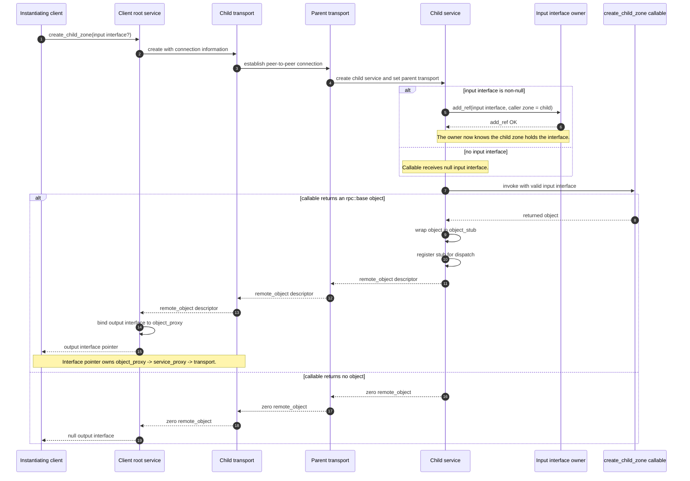

# Create Child Zone Protocol

This document describes the common protocol for creating a child zone. It is the baseline interaction that individual transports must preserve. Transport-specific documents may add setup details, but they should not change the ownership and reference-counting contract described here.

## Participants

- Instantiating client: the zone that requests creation of the child zone.
- Child transport: the transport object used by the instantiating client to reach the new child zone.
- Parent transport: the transport object inside the child zone that points back to the parent/instantiating side.
- Child service: the service created inside the child zone.
- Optional input interface: an interface pointer supplied by the instantiating client for use by the child zone.
- Optional output interface: an interface pointer returned by the child zone to the instantiating client.

## Basic Flow

1. The instantiating client requests a child zone.

   The request creates a `child_transport` with the connection information needed to reach the new zone.

2. The child transport establishes a peer-to-peer connection.

   The peer side contains a parent transport and a child service. The parent transport is the transport in the child zone that points back to its parent. The child service uses this transport as its parent transport in the hierarchical arrangement.

3. If the client supplied an input interface, the child zone add-refs it before running user code.

   The child zone sends `add_ref` for the supplied interface using the child zone as the caller zone id. This must happen before zone spawning is considered complete.

   After this step, the zone that owns the implementation of that interface knows that the new child zone holds a reference to it.

4. The input interface is now valid inside the child zone.

   The supplied interface pointer owns an `object_proxy`. The `object_proxy` owns a `service_proxy`. The `service_proxy` owns a transport `std::shared_ptr`. That chain keeps the transport and the reachable zone state alive while the interface pointer exists.

   Because the `add_ref` has already completed for a non-null interface, the callable passed to `create_child_zone` may call that interface immediately.

5. The child-zone callable runs.

   The callable receives the valid input interface if one was provided. It may choose not to return an interface, or it may create its own `rpc::base` derived object and return it to the instantiating client.

6. If the callable returns an object, the child service creates an object stub.

   The returned local object is wrapped in an `object_stub` and registered with the child service so message dispatch can find it. A `remote_object` descriptor for that stub is returned to the instantiating client.

   Because this is an out call, returning the object effectively performs an `add_ref` on behalf of the caller.

7. The instantiating client receives the output interface pointer.

   If the returned `remote_object` is non-zero, the client binds it to an interface pointer. That pointer has the same ownership chain as any other remote interface pointer: interface pointer to `object_proxy`, `object_proxy` to `service_proxy`, and `service_proxy` to transport.

## Lifetime Contract

The root service is owned by the setup or application code that created it.

Child services and transports are not kept alive by arbitrary setup-owned transport references once interface pointers have been obtained. They are kept alive by the reference-counting graph:

- marshalled interface pointers own object proxies,
- object proxies own service proxies,
- service proxies own transports,
- hierarchical child services keep their parent transport while the child zone is alive.

When the final marshalled interface references are released, the corresponding object and transport reference counts should fall to zero and transport shutdown should proceed from those counts.

## Transport-Specific Notes

Transport-specific setup belongs in subdirectories under `documents/protocol/`, for example:

- `documents/protocol/local/`
- `documents/protocol/streaming/`
- `documents/protocol/sgx_coroutine/`
- `documents/protocol/libcoro_spsc_dynamic_dll/`

Those documents should explain only the extra transport handshakes, queues, threads, ECALLs, or process boundaries needed to implement this common protocol.
