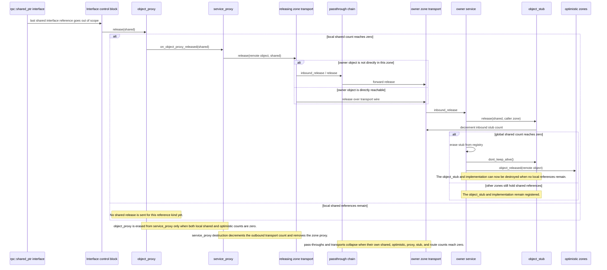
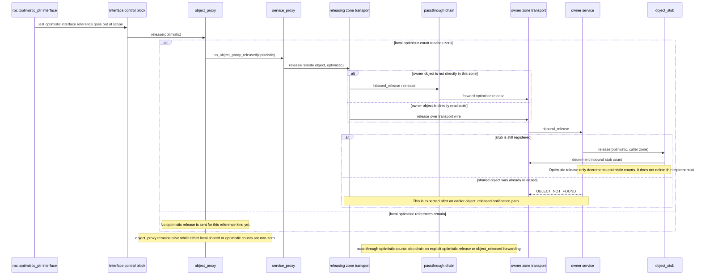

# Release Protocol

This page describes what should happen when references to a remote object are released. It is written against the core implementation in `c++/rpc/src/object_proxy.cpp`, `c++/rpc/src/service_proxy.cpp`, `c++/rpc/src/transport.cpp`, `c++/rpc/src/pass_through.cpp`, `c++/rpc/src/service.cpp`, and `c++/rpc/src/stub.cpp`.

The important rule is that release is counted per reference kind:

- `rpc::shared_ptr` release removes a shared reference.
- `rpc::optimistic_ptr` release removes an optimistic reference.
- The implementation object is governed by shared references. Optimistic references are notified when the shared object is gone; they do not keep the implementation alive.

## Shared Pointer Release

The shared release flow is:

1. A non-null `rpc::shared_ptr` to an interface for a remote object goes out of scope.
2. If this was the last active local shared reference in the interface control block, the control block calls `object_proxy::release(false)`.
3. The `object_proxy` decrements its shared count. If that shared count reaches zero, it asks its `service_proxy` to release the remote object.
4. The `object_proxy` is deleted only when both its local shared count and local optimistic count are zero.
5. The `service_proxy` sends a shared release request to its transport.
6. The transport sends the release to its companion transport over the wire, queue, ecall/ocall bridge, shared library boundary, or other transport-specific mechanism.
7. If the destination object is not in the current zone, `transport::inbound_release` forwards the release through a `pass_through` until the release reaches the destination zone.
8. The destination transport sends the release to its local service.
9. The service sends the release to the `object_stub`.
10. The `object_stub` decrements the shared count for the caller zone and the global shared count.
11. If the global shared count drops to zero, the service erases the stub from its registry and calls `dont_keep_alive()` on the stub. That allows the `object_stub` and implementation object to be destroyed once no ordinary local references still hold them.
12. If other zones, including the owner zone, still have positive shared references, the stub and implementation object stay alive.
13. When the shared count reaches zero, the service sends `object_released` to each zone that still has positive optimistic references to that object.
14. Pass-throughs update their own shared reference counts after a successful forwarded shared release. A pass-through can destroy itself only when both its shared and optimistic route counts have reached zero and no call is active.
15. When the releasing zone has no remaining object proxies for a destination, the `service_proxy` can be destroyed. Its destructor decrements the outbound proxy count on the transport and removes the zone proxy from the service.
16. Services, transports, and pass-through chains are not deleted by one direct release call. They disappear when their own reference-counted owners have drained: object stubs, service proxies, pass-throughs, incoming stub counts, outgoing proxy counts, and explicit transport ownership.

## Optimistic Pointer Release

The optimistic release flow is:

1. A non-null `rpc::optimistic_ptr` to an interface for a remote object goes out of scope.
2. If this was the last active local optimistic reference in the interface control block, the control block calls `object_proxy::release(true)`.
3. The `object_proxy` decrements its optimistic count. If that optimistic count reaches zero, it asks its `service_proxy` to send an optimistic release.
4. The `object_proxy` is deleted only when both its local shared and local optimistic counts are zero.
5. The `service_proxy` sends a release request with the optimistic release option set.
6. The transport and any pass-throughs route the release to the destination zone in the same way as a shared release.
7. If the destination service still has the stub, the stub decrements the optimistic count for the caller zone and the global optimistic count.
8. Optimistic release does not delete the implementation object. Implementation lifetime is driven by shared references.
9. If the destination service no longer has the stub, `OBJECT_NOT_FOUND` is valid. This can happen after the shared count reached zero and the service already sent `object_released` to optimistic holders.
10. Pass-through optimistic route counts are decremented on successful optimistic release. They are also decremented when `object_released` is forwarded back to optimistic holders.

## Validation Notes

The proposed release sequence is valid as a protocol model with these corrections:

- The `object_proxy` sends release per reference kind on a transition to zero for that kind. It is erased from the `service_proxy` map only when both local shared and local optimistic counts are zero.
- The owner `object_stub` and implementation are released when the shared count reaches zero, not when optimistic references reach zero.
- `object_released` is a notification from the owner side to zones with remaining optimistic references. It is emitted when the owner shared count reaches zero.
- Services and transports are not normally destroyed as a direct synchronous continuation of the release RPC. They are destroyed when their owning counts and containers drain.
- A `service_proxy` destructor participates in cleanup by decrementing the outbound proxy count and removing the zone proxy. It should not be treated as the sender of the initial release; that happens while the object proxy is being released.

## Transport-Specific Work

Each transport only needs to explain how it carries the common release and `object_released` messages:

- local transport: direct in-process dispatch.
- streaming transport: encoded release and `object_released` messages over the stream.
- coroutine SGX transport: release and `object_released` messages over the enclave/host queue and ecall/ocall boundary.
- dynamic DLL SPSC transport: release and `object_released` messages over the shared-library SPSC boundary.

The reference-counting obligations are common. Transport-specific code should not invent an independent object lifetime rule unless the common transport abstraction cannot represent the required boundary.
