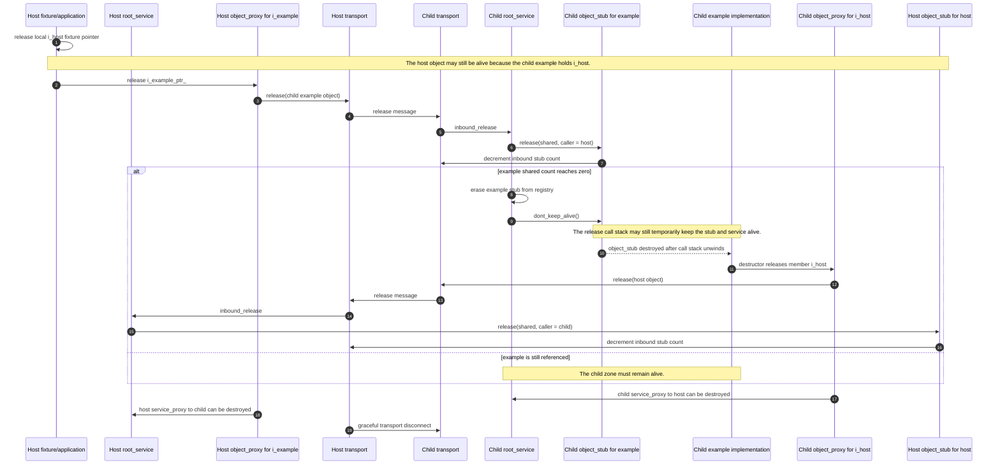
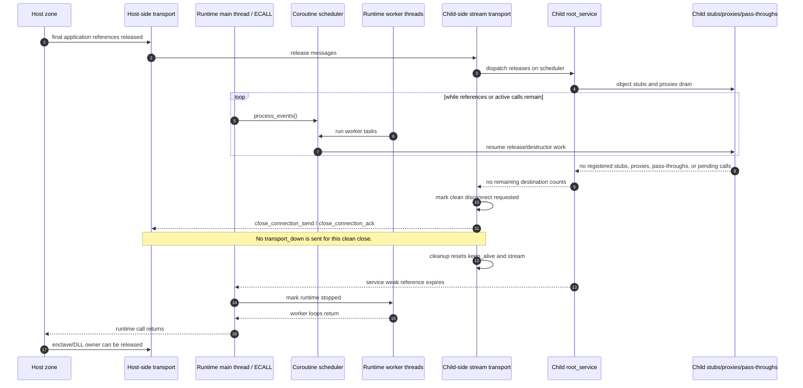

# Zone Shutdown Sequence

Security note: clean reference-drain shutdown and fraudulent transport input are
different states. This document describes the clean shutdown path. Attack paths
that corrupt lifecycle, reference, or transport state are tracked in
[Reference Protocol Security](../security/reference-protocol-security.md) and
[Untrusted Transport Input](../security/untrusted-transport-input.md).

This document describes the intended shutdown sequence for a zone connected by an RPC transport. It is written from the perspective of a parent or host zone releasing its final interface pointer to an object in a remote zone, such as a coroutine SGX enclave or a coroutine SPSC dynamic DLL.

The key rule is:

The remote zone must not be terminated simply because the parent fixture or application dropped its root service pointer. The zone may shut down only after the reference graph between the zones has drained: object stubs, object proxies, service proxies, transport destination counts, pass-throughs, and active release call stacks must all be gone or in the process of unwinding naturally.

A clean refcount-zero shutdown is not a transport failure. It must not emit `transport_down`. `transport_down` is reserved for real failure cases where the peer transport has become unreliable and normal release messages cannot be trusted to complete.

## Expected Host-To-Child Shutdown

This is the common case where the host owns an `i_example` proxy to an object inside a child zone. The example implementation in the child may also hold an `i_host` proxy back to an object owned by the host.

The important ordering is:

1. The host fixture may release its local `i_host` pointer first. That must not destroy the host object while the child still holds a remote `i_host` reference.
2. Releasing the host-side `i_example_ptr_` sends a release for the child example object.
3. The child transport dispatches the release to the child service.
4. The child service calls `object_stub::release` for the example object.
5. If the example stub shared count reaches zero, the service erases the stub and calls `dont_keep_alive()`.
6. The release call stack may still hold the stub, service, and transport alive until it returns.
7. Once the release call stack unwinds, the example implementation destructor must run.
8. The example destructor releases its `i_host` member.
9. Releasing that `i_host` proxy sends a release back to the host zone.
10. The host stub for the local host object receives the release and drops the child-zone reference.
11. With no remaining object proxies, object stubs, pass-throughs, or destination counts between the zones, the service proxies and transports can be destroyed.

## Runtime Boundary Shutdown

Coroutine SGX and coroutine SPSC DLL transports add a runtime boundary. The runtime boundary owns the scheduler and the worker execution context, but it should not impose an independent object lifetime rule.

The runtime sequence is:

1. The runtime creates a root service, a stream transport, and a scheduler.
2. The runtime exposes worker slots or threads before it starts processing RPC messages.
3. The runtime processes release messages as normal RPC work. It must not bypass object lifetime by terminating the zone while references remain.
4. Worker threads continue running until release coroutines, destructors, service-proxy release coroutines, and transport cleanup have had a chance to complete.
5. The transport reaches `DISCONNECTING` only after the transport destination graph has drained or the peer initiates a valid graceful close.
6. Refcount-driven `DISCONNECTING` is recorded as a clean disconnect so the transport can flush release messages and close the stream without sending `transport_down`.
7. The transport reaches `DISCONNECTED` after the stream close handshake and cleanup.
8. Transport cleanup must reset transport self-keepalive state and release the stream.
9. The service weak reference should expire naturally after:
   - child objects have been destroyed,
   - object proxies have released remote references,
   - service proxies have been destroyed,
   - pass-throughs have been removed,
   - transport activity trackers have released their service references.
10. Only after the service and transport no longer need to exist should the runtime stop worker loops.
11. Only after worker loops have returned should the runtime thread or ECALL return to the host.

## Shutdown Checklist

Use this checklist when investigating a hanging or premature shutdown.

### Object Release

- The fixture/application released its root remote interface pointer, for example `i_example_ptr_`.
- The releasing zone sent a shared `release` message for that remote object.
- The owner zone received `inbound_release`.
- The owner `object_stub` shared count reached zero.
- The owner service erased the stub from its registry.
- The owner service called `dont_keep_alive()` on the stub.
- The release call stack was allowed to unwind before expecting the implementation destructor to run.
- The implementation destructor actually ran.

### Back Reference Release

- The implementation destructor released any member interface pointers, such as `example::host_`.
- Releasing a member remote interface sent a release back to the owning zone.
- The owning zone received that release.
- The owning zone decremented the corresponding local stub count.
- The host object stayed alive until the remote release arrived, even if the fixture had already released its local pointer.

### Service Proxy And Transport Counts

- Each destroyed `object_proxy` was erased from its `service_proxy`.
- Each `service_proxy` destructor decremented the outbound proxy count on its transport.
- Each `object_stub::release` decremented the inbound stub count on its transport.
- Any pass-through counts created for the zone pair were decremented.
- The transport destination count reached zero only after inbound stub counts, outbound proxy counts, and pass-through counts drained.
- Transport shutdown was triggered by the drained graph, not by an arbitrary runtime timeout.
- Refcount-zero shutdown was treated as a clean disconnect.
- No `transport_down` message was sent for a clean disconnect.
- Any observed `transport_down` corresponds to an actual stream failure or unexpected peer disappearance.

### Coroutine Runtime

- Scheduler work was still being driven while release/destructor work was pending.
- Worker-loop threads were still attached while release handlers and destructor-triggered release coroutines could run.
- Completed coroutine frames were reaped so they did not retain local `rpc::shared_ptr` values.
- The runtime did not return from the main loop while the service weak pointer was still live because of real object/proxy references.
- The runtime did not destroy the enclave or unload the DLL while non-zero references remained.

### Final State

- No child service stubs remain registered.
- No service proxies remain for the host-child zone pair.
- No object proxies remain for the host-child zone pair.
- No pass-throughs remain for the host-child zone pair.
- The transport is `DISCONNECTED`.
- The service weak reference has expired.
- Worker loops have returned.
- The runtime main thread or ECALL has returned to the host.
- The enclave or DLL owner has been released.

## Failure Modes

If shutdown hangs, check these cases first:

1. The child implementation destructor did not run after the owner stub count reached zero.
2. A completed coroutine frame still owns the returned implementation pointer or service pointer.
3. The transport was moved to `DISCONNECTING` before destructor-triggered releases were sent.
4. A service proxy still owns a transport because an object proxy remains in its map.
5. A pass-through count was created during route building but not removed during release.
6. A runtime loop stopped driving scheduler or worker-pool work before the release call stack fully unwound.
7. The runtime forcibly returned while the service weak reference was still live.
8. A clean close was misclassified as transport failure, causing `transport_down` to tear down routes that still needed normal release messages.

If shutdown completes too early, check these cases first:

1. The runtime treated transport disconnect as permission to terminate despite live service references.
2. The host destroyed the enclave or DLL owner before worker loops returned.
3. The transport closed the stream before release messages triggered by implementation destructors were flushed.
4. A fixture-owned pointer was mistaken for the only owner of a host object that is still referenced by a remote zone.
5. The failure path was used for an ordinary refcount-zero close.
