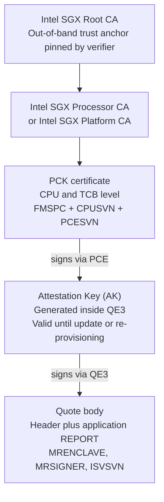
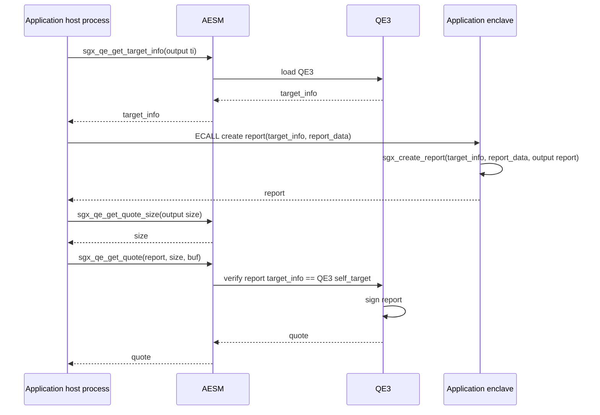
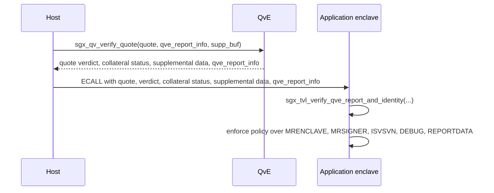
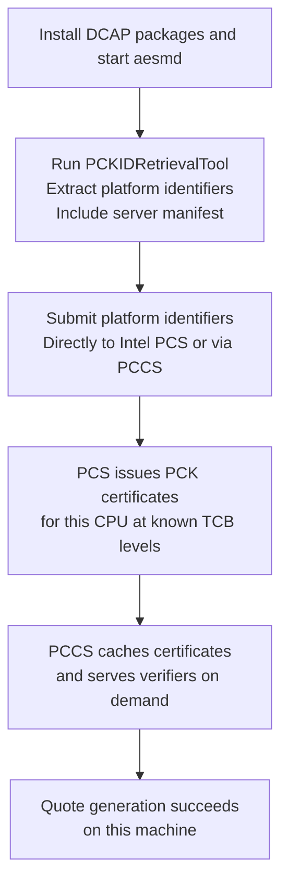

<!--
Copyright (c) 2026 Edward Boggis-Rolfe
All rights reserved.
-->

# DCAP Operations

## Audience

This document is for readers who know SGX exists but have not implemented
DCAP. It describes what DCAP is, what services and daemons must be running,
how a platform is provisioned, how a quote is generated and verified
end-to-end, and how Canopy is expected to plug into it.

Function signatures, header names, and tool paths in this document have been
cross-checked against the Intel SGX source vendored at
`submodules/confidential-computing.sgx`. In particular DCAP sits under
`submodules/confidential-computing.sgx/external/dcap_source/`, with the
trusted verification library, QE3 source, sample code, PCCS, and the
provisioning tools all present in-tree. The pinned version exposes both the
legacy `sgx_qv_verify_quote` and the newer `tee_verify_quote` / 
`tee_verify_quote_qvt` APIs, and ships Intel's RA-TLS helpers
(`sgx_ttls.h`).

## What DCAP Is

DCAP stands for *Data Center Attestation Primitives*. It is Intel's modern SGX
remote attestation framework. It replaces the older EPID/IAS scheme, which
required an online round-trip to Intel's Attestation Service for every
verification and used a group-signature scheme that made third-party
verification awkward.

DCAP has four practical differences from EPID:

- **ECDSA signatures, not EPID group signatures.** Anyone with the relevant
  collateral can verify a quote offline. No mandatory IAS round-trip per
  verification.
- **Collateral is published, not queried.** Intel exposes a Provisioning
  Certification Service (PCS) that publishes PCK certificates, TCB info, QE
  identity, and CRLs. The verifier fetches and caches this material rather
  than asking Intel "is this quote valid?" each time.
- **Verifier flexibility.** The verifier can run inside another enclave
  (using the Intel-signed Quoting Verification Enclave plus the trusted
  verification library) or outside (untrusted host process linking the QvL).
- **Multi-platform.** The framework was extended to cover TDX in addition to
  SGX. The unified `tee_verify_quote` API accepts both.

For the first SGX production target, "remote attestation" means DCAP/ECDSA
quotes. EPID remains in scope only as a legacy compatibility backend on
SGX1-only platforms where the operator policy explicitly accepts it. The
shared Canopy attestation service should still use backend-neutral terminology
so future TDX, SEV-SNP, and TrustZone/PSA backends do not inherit SGX-specific
names outside their backend modules.

## The Actors

DCAP attestation involves seven distinct components. New readers most often
get confused by the QE/QvE/PCE naming; the list below makes the split
explicit.

- **Application enclave** -- where your code lives. Application-defined
  trust. Produces an `sgx_report_t` containing application identity
  (MRENCLAVE etc.) and 64 bytes of caller-controlled `report_data`.
- **Quoting Enclave 3 (QE3)** -- Intel-signed enclave, loaded by AESM.
  Intel-rooted trust. Verifies an application report targeted at itself,
  then signs it with an attestation key (AK) to produce an ECDSA
  `sgx_quote3_t`.
- **Provisioning Certification Enclave (PCE)** -- Intel-signed enclave,
  loaded by AESM. Intel-rooted trust. Owns the platform's PCK and signs
  the QE3's attestation key during platform provisioning.
- **AESM (`aesmd`)** -- userspace daemon. Untrusted glue. Launches QE3
  and PCE on demand, brokers calls between application code and those
  enclaves over `/var/run/aesmd/aesm.socket`.
- **Quoting Verification Enclave (QvE)** -- Intel-signed enclave on the
  verifier side. Intel-rooted trust. Performs quote signature and
  collateral checks inside an enclave, then issues a `qve_report_info`
  that the application enclave can re-verify with the trusted verification
  library.
- **Provisioning Certification Service (PCS)** -- Intel-hosted HTTPS
  service. Intel-rooted trust. Publishes PCK certificate chains,
  `TcbInfo` per platform family, `QeIdentity`, `QveIdentity`, and CRLs.
  Production verifiers fetch from a caching mirror, not directly.
- **Provisioning Certificate Caching Service (PCCS)** -- operator-hosted
  Node.js service. Operator-controlled. Caches PCS responses; the in-host
  quote-provider library (QPL) talks to it instead of PCS.

A quote is a structure signed by the QE3. It carries the application enclave's
report plus a chain of identities ending at the PCK certificate. Verification
is a sequence of signature checks rooted at Intel's CA plus a policy check
against the embedded report.

## The Trust Chain

A DCAP ECDSA-v3 quote chains like this:



The verifier needs:

1. The Intel SGX Root CA certificate. Out-of-band trust. Shipped with the
   SDK and pinned by the verifier.
2. The PCK certificate chain for the *signing* CPU. Comes from PCS via PCCS,
   indexed by FMSPC.
3. The published `TcbInfo` for that FMSPC. Tells the verifier which CPUSVN +
   PCESVN combinations are still considered up-to-date.
4. The published `QeIdentity` and `QveIdentity`. Tell the verifier which
   MRSIGNER/MRENCLAVE/ISVSVN are acceptable for the Intel QE3 and QvE.
5. The relevant CRLs (root CRL plus PCK CRL).

Once the chain is verified and the report data matches the expected
session-binding value, the verifier applies application policy to the embedded
report.

### What FMSPC, CPUSVN, ISVSVN Are

These get confused often.

- **FMSPC** -- Family-Model-Stepping-Platform-CustomSKU. A 6-byte string
  identifying a CPU model plus microcode generation, **not** an individual
  CPU. Used to index `TcbInfo`.
- **CPUSVN** -- 16-byte CPU-internal security version. Bumped when Intel
  ships a microcode update that fixes a hardware-security issue.
- **PCESVN** -- version of the Provisioning Certification Enclave.
- **ISVSVN** -- Independent Software Vendor SVN. A 16-bit value chosen by
  the enclave author and stored in `SIGSTRUCT`. Used by application policy
  to refuse old vulnerable enclave builds.
- **ISVPRODID** -- 16-bit product id, also from `SIGSTRUCT`. Lets one
  signer produce multiple products that policy can distinguish.

PCK certificates are issued *per CPU* but indexed by FMSPC because Intel
publishes one TcbInfo per FMSPC describing the acceptable CPUSVN/PCESVN
combinations.

## Quote Generation Workflow

A complete generation flow on the signing platform:



Three host calls per attestation:

1. `sgx_qe_get_target_info` returns the QE3's own `sgx_target_info_t`. The
   application enclave uses this so its `sgx_report_t` is locked to be
   verifiable only by the QE3.
2. `sgx_qe_get_quote_size` reports the size of the resulting quote (it
   varies with PCK chain length).
3. `sgx_qe_get_quote` produces the signed quote. AESM serialises QE3 access.

`report_data` is 64 bytes of caller-controlled data. The binding preimage
depends on the attestation carrier:

- in `sgx_ttls` RA-TLS mode, Intel's helper hashes the public-key claims for
  the certificate key into `report_data`;
- in post-handshake in-tunnel development mode, Canopy may bind Evidence to a
  TLS exporter value plus Canopy transcript context;
- in routed RPC attestation, Canopy binds Evidence to the end-to-end key
  exchange transcript because the endpoints do not share an adjacent TLS
  handshake.

Do not mix these formats. A verifier must know which carrier/policy is in use
before checking `report_data`.

## Quote Verification Workflow

There are two verifier shapes. Choose based on how much trust the verifying
side wants in its own host.

### Untrusted Verifier (Host Process Only)

Used when the verifier itself is not an enclave, for example a host-side
gateway or a test harness. The vendored DCAP source offers three
verification APIs (header path below shortened with `<dcap>` =
`submodules/confidential-computing.sgx/external/dcap_source`):

- `sgx_qv_verify_quote` -- original DCAP, SGX-only. Smallest dependency
  surface; still fully supported. Declared in
  `<dcap>/QuoteVerification/dcap_quoteverify/inc/sgx_dcap_quoteverify.h`.
- `tee_verify_quote` -- unified SGX + TDX. Recommended forward target;
  supplemental data is versioned via `tee_supp_data_descriptor_t`. Same
  header.
- `tee_verify_quote_qvt` -- newer. Returns a JWT verification-result token
  instead of an in-process verdict. Useful when the verifier wants to
  forward an attested verdict to another service. Same header.

The legacy host call shape:

```text
sgx_qv_get_quote_supplemental_data_size(&supp_size);
sgx_qv_set_enclave_load_policy(SGX_QL_PERSISTENT);  // optional, faster reuse
sgx_qv_verify_quote(quote_buf, quote_size,
                    optional_collateral_or_NULL,
                    expiration_check_date,
                    &collateral_expiration_status,
                    &quote_verification_result,
                    optional_qve_report_info_or_NULL,
                    supp_size, supp_buf);
```

`tee_verify_quote` replaces the trailing two arguments with a single
`tee_supp_data_descriptor_t*` so callers can ask for newer supplemental
shapes without breaking the ABI.

`quote_verification_result` is the verdict. Possible values
(`sgx_ql_qv_result_t`):

- `OK` -- verification succeeded, TCB up to date. Accept.
- `CONFIG_NEEDED` -- platform needs a BIOS config change to reach a
  higher TCB. Reject by default; audit policy may allow.
- `OUT_OF_DATE` -- TCB level is behind the latest. Reject by default.
- `OUT_OF_DATE_CONFIG_NEEDED` -- both of the above. Reject.
- `INVALID_SIGNATURE` -- quote signature or chain check failed. Reject
  as fraud.
- `REVOKED` -- a cert in the chain has been revoked. Reject as fraud.
- `UNSPECIFIED` -- verifier failure. Reject and log.
- `SW_HARDENING_NEEDED` -- software workaround required for a known
  issue. Policy-driven.
- `CONFIG_AND_SW_HARDENING_NEEDED` -- both. Policy-driven, default
  reject.

### Trusted Verifier (Verifier Runs Inside An Enclave)

This is the higher-assurance path and the one Canopy should use when the
verifying side is itself an enclave. The verification work runs inside
Intel's QvE; the application enclave only re-verifies the QvE's report.



The exact signature is in `<dcap>/QuoteVerification/dcap_tvl/sgx_dcap_tvl.h`,
with the matching EDL at
`<dcap>/QuoteVerification/dcap_tvl/sgx_dcap_tvl.edl` (using the same
`<dcap>` shorthand introduced above).

Important detail: the trusted verification library takes only a single
`qve_isvsvn_threshold`. It does **not** take separate expected `MRSIGNER`,
`MRENCLAVE`, `ISVPRODID`, attribute mask, or misc-select-mask parameters
for the QvE. The QvE identity (Intel-issued MRSIGNER, expected MRENCLAVE,
attribute mask, misc-select mask) is hard-coded inside the trusted library
against Intel's signed QvE. The caller only chooses the minimum acceptable
QvE ISVSVN, which is normally lifted from Intel's published `QveIdentity`
collateral.

The trusted verification library
(`libsgx_dcap_tvl.a`) therefore handles only the "verify that the QvE's
report came from a current Intel QvE" half. The application enclave still
applies its own policy to the inner application report.

### Why Bother With QvE

If the verifying host is trusted there is no functional reason. The QvE
matters when the host is untrusted but a co-located application enclave is
trusted. Without QvE the untrusted host could feed the application enclave
a forged verdict. With QvE, the verdict comes inside an enclave-signed
report that the application enclave verifies independently.

For Canopy this is the normal case: an enclave zone is talking through an
untrusted host router, and the verification verdict must not be at the
host's discretion.

## Collateral

Collateral is the set of public Intel-published material the verifier needs
to validate a quote. For each FMSPC + PCK identity:

- **PCK certificate chain** from `/sgx/certification/v4/pckcerts`
  (multi-package) or `/sgx/certification/v4/pckcert` (single). Binds the
  AK that signed the quote to a specific Intel-issued cert.
- **`TcbInfo` for the FMSPC** from `/sgx/certification/v4/tcb`. Lists
  acceptable CPUSVN/PCESVN levels.
- **`QeIdentity`** from `/sgx/certification/v4/qe/identity`. Lists
  acceptable QE3 MRSIGNER and minimum ISVSVN.
- **`QveIdentity`** from `/sgx/certification/v4/qve/identity`. Same, for
  the QvE.
- **Root CRL** from `/sgx/certification/v4/rootcacrl`. Revocation of
  Intel intermediates.
- **PCK CRL** from `/sgx/certification/v4/pckcrl`. Revocation of
  platform PCKs.

Each item has a TTL and an expiration date that the verifier checks. Stale
collateral becomes `collateral_expiration_status != 0` in the verification
result, which policy can choose to accept temporarily.

Verifiers fetch collateral through the **Quote Provider Library (QPL)** --
`libdcap_quoteprovider.so`. Intel ships a default QPL that reads
`/etc/sgx_default_qcnl.conf` to find a PCCS. A deployment can substitute a
custom QPL when it needs a different fetch policy or offline behaviour.

## AESM

AESM (Architectural Enclave Service Manager) is the userspace daemon that
brokers access to Intel-signed architectural enclaves. It runs as
`aesm_service` and listens on `/var/run/aesmd/aesm.socket`. The host
quote-generation library talks to AESM by default; the enclave runtime can
also use AESM for launch and provisioning.

Installation on a typical Linux distribution:

```text
apt install sgx-aesm-service libsgx-dcap-default-qpl \
            libsgx-dcap-ql libsgx-dcap-quote-verify \
            libsgx-uae-service
systemctl enable --now aesmd
```

(The exact package names vary by distribution and Intel's repo layout.
Canopy's `prepare_sgxssl.sh` does not install these -- they must already be
present on the host.)

AESM contention is the main scaling concern. The daemon serialises calls to
the QE3 and PCE internally. A server doing many concurrent attestations will
queue. Mitigations:

- batch attestation: do attestation once per *session*, not per RPC call,
  which Canopy already does;
- use the in-process QPL path for verification (verification does not need
  AESM if the QvE is loaded directly);
- run a thread pool of attestation workers so a stalled QE call does not
  block the proactor.

The Canopy coroutine runtime must not call `sgx_qe_get_quote` on the
io_uring proactor thread. The call is synchronous and can block for tens of
milliseconds under load.

## PCCS And QPL

PCCS (Provisioning Certificate Caching Service) is an operator-owned Node.js
service that mirrors Intel's PCS. It exists for several reasons:

- production verifiers should not depend on Internet egress to Intel for
  every handshake;
- some Intel PCS endpoints require an API key issued through the Intel
  developer portal;
- caching reduces handshake latency from hundreds of milliseconds to a few;
- one PCCS serves many platforms in a cluster.

PCCS is already vendored in this repository at
`submodules/confidential-computing.sgx/external/dcap_source/QuoteGeneration/pccs/`.
It ships with `install.sh`, a systemd unit (`pccs.service`), a server entry
point (`pccs_server.js`), a config directory (`config/`), and the Windows
service installers. Typical setup:

```text
cd submodules/confidential-computing.sgx/external/dcap_source/QuoteGeneration/pccs
npm install
# edit config/default.json to set API key, port, TLS cert
sudo ./install.sh        # installs and registers the systemd unit
# or for development:
node pccs_server.js
```

The companion `PccsAdminTool` at
`submodules/confidential-computing.sgx/external/dcap_source/tools/PccsAdminTool/`
manages the PCCS cache: pre-fetching collateral, refreshing, listing
registered platforms.

The QPL is configured to talk to this PCCS via
`/etc/sgx_default_qcnl.conf`. The file is JSON. Common fields:

```json
{
  "pccs_url": "https://pccs.example.internal:8081/sgx/certification/v4/",
  "use_secure_cert": true,
  "retry_times": 6,
  "retry_delay": 5,
  "pck_cache_expire_hours": 168,
  "verify_collateral_cache_expire_hours": 24
}
```

For air-gapped deployments the PCCS can be fed an offline snapshot of PCS
collateral. The verifier fetches normally; the PCCS just never reaches
upstream.

## Canopy Hardware Smoke Test Status

The current Canopy tree has a DCAP hardware smoke-test path, not yet the final
production provider/verifier integration.

Build side:

- Use the local SGX source tree under `submodules/confidential-computing.sgx`.
  Do not depend on a server-side SGX checkout.
- `docker/Dockerfile.sgx_noble_dcap` builds an Ubuntu 24.04 environment that
  matches the first SGX/DCAP test host closely enough to rebuild the SGX SDK
  installer and Canopy artifacts locally.
- `Debug_Coroutine_DCAP` selects `CANOPY_ATTESTATION_BACKEND=DCAP` and builds
  `build_debug_coroutine_dcap_noble2/output/sgx_attestation_test_host` plus
  `libsgx_attestation_test_enclave.signed.so`.
- The test bundle can be deployed to SGX hardware without compiling there.
  This matters for thermally constrained hosts.

Runtime side:

- The single useful hardware smoke test is:

  ```text
  sgx_attestation_test_host \
    --gtest_filter=sgx_attestation_test_host_fixture.sgx_dcap_backend_produces_and_verifies_quote_with_platform_libraries
  ```

- The test dynamically loads `libsgx_dcap_ql.so.1` and
  `libsgx_dcap_quoteverify.so.1`, calls `sgx_qe_get_target_info`, asks the
  test enclave to create an `sgx_report_t` with Canopy's report-data binding,
  calls `sgx_qe_get_quote`, and verifies the resulting quote with host-side
  `sgx_qv_verify_quote`.
- This verifies QL/QVL plumbing and Canopy's raw quote `report_data` binding.
  It does **not** yet prove the final enclave-to-enclave trust path, because
  it does not pass `qve_report_info` into QvL or verify QvE output inside the
  application enclave with `sgx_tvl_verify_qve_report_and_identity`.

Before running that smoke test on a host, check:

```text
id
ls -l /dev/sgx /dev/sgx_enclave /dev/sgx_provision /dev/sgx_vepc
systemctl is-active aesmd
cat /etc/sgx_default_qcnl.conf
```

The runtime user must be able to open `/dev/sgx_enclave`; on typical Linux
installs this means membership in the `sgx` group. Quote/provisioning paths may
also need access to `/dev/sgx_provision`, normally group `sgx_prv`, depending
on platform state and QPL/AESM behavior. After group changes the user must log
out and back in.

`/etc/sgx_default_qcnl.conf` must point at a usable PCCS URL. A value such as
`https://0.0.0.0:8081/sgx/certification/v4/` is a placeholder for a local
listener, not a routable service address; with `use_secure_cert: true`, the
PCCS certificate must also chain to a trust anchor accepted by the host.

If the smoke-test binary is deployed outside the build tree, ensure runtime
dependencies are present on the host or bundled beside the binary. In the first
Ubuntu 24.04 test deployment, the host provided `libsgx_urts.so.2` but not
`libsgx_uae_service.so`, `libsgx_capable.so`, or `liburing.so.2`, so those
were bundled with `LD_LIBRARY_PATH` pointing at the deploy directory.

## Provisioning A New Platform

A new machine that has never produced quotes needs one-off registration.
The high-level flow:



The tools are vendored in-tree:

- `submodules/confidential-computing.sgx/external/dcap_source/tools/PCKRetrievalTool/`
  -- single-package platform identifier extraction (client and the per-package
  step of server provisioning).
- `submodules/confidential-computing.sgx/external/dcap_source/tools/SGXPlatformRegistration/`
  -- multi-package platform registration agent for server CPUs (Xeon Scalable,
  Ice Lake-SP, and later). Includes the `agent`, `management`, `inf` (init
  flow), and `common` components.

Server platforms have a separate platform-level registration on top of the
per-package step because they have multiple CPU packages. Client platforms
use only the single-package flow.

Re-provisioning is needed when the TCB level changes -- for example after a
microcode update that bumps CPUSVN. The same identifier extraction +
submission flow runs again. Existing PCK certs at lower TCB levels remain
valid for verification but quote generation switches to the new level.

## Deployment Patterns

### Bare Metal

```text
host: SGX driver loaded, /dev/sgx_enclave + /dev/sgx_provision present
host: aesmd running
host: PCCS reachable (locally or over the network)
host: /etc/sgx_default_qcnl.conf pointed at PCCS
app:  links libsgx_dcap_ql (host), libsgx_dcap_quoteverify (host),
      libsgx_dcap_tvl (enclave), libsgx_tcrypto (enclave)
```

### Container

Two patterns:

- **AESM on host**: bind-mount `/var/run/aesmd/aesm.socket` and
  `/dev/sgx_enclave`, `/dev/sgx_provision` into the container. The
  application talks to the host AESM.
- **AESM in container**: run a `sgx-aesm` sidecar. More isolation, more
  configuration. Less common.

Either way the container needs the SGX device nodes mounted, and either
`SYS_ADMIN` or a dedicated device-plugin allocation.

### Kubernetes

Use the SGX device plugin
(`intel/intel-device-plugins-for-kubernetes`) to advertise
`sgx.intel.com/enclave` and `sgx.intel.com/provision` resources. Pods
request these resources, and the plugin handles device exposure. AESM
typically runs as a DaemonSet. PCCS runs as a normal cluster service.

### Disconnected / Air-Gapped

- Pre-seed the PCCS cache by running it briefly on a connected machine and
  copying its DB.
- Refresh on a known cadence aligned with Intel's collateral publishing.
- Collateral has cryptographic signatures, so a hostile copy path is
  detectable but not preventable; treat the cache as untrusted input that
  must be validated by the verifier on use.

## Threading And Performance

Latency budget for one full DCAP handshake on a warm machine:

| Phase | Typical cost |
|---|---|
| `sgx_qe_get_target_info` | < 1 ms |
| ECALL + `sgx_create_report` | < 1 ms |
| `sgx_qe_get_quote` | 5-30 ms (AESM call, QE3 work) |
| Network: send quote to peer | network-dependent |
| Peer fetch of collateral (cache hit) | < 5 ms |
| Peer fetch of collateral (cache miss to PCS) | 100-500 ms |
| `sgx_qv_verify_quote` with QvE | 5-20 ms |
| `sgx_tvl_verify_qve_report_and_identity` | < 1 ms |

Implications:

- A cold verifier paying a collateral-cache-miss is the worst case. Production
  deployments should warm PCCS for the FMSPCs they expect to talk to.
- AESM serialisation makes burst handshakes worse than steady-state. If
  Canopy expects many concurrent enclaves coming up at the same time, the
  attestation service should rate-limit calls into the QE.
- Verification is bounded by the QvE enclave load if `enclave_load_policy`
  is set to `EPHEMERAL`. `PERSISTENT` is faster after the first call but
  keeps the QvE resident.

## Failure Mode Catalog

Failures and the recommended Canopy response, mapped to the failure-policy
document in this directory:

- `sgx_qe_get_target_info` returns `SGX_QL_ERROR_OUT_OF_EPC`. EPC exhausted
  on signing host. Retry with backoff; surface as transport failure if
  persistent.
- `sgx_qe_get_quote` returns `SGX_QL_NETWORK_ERROR`. AESM cannot reach
  PCCS for re-provisioning. Treat as unavailable; refuse new sessions, do
  not crash.
- Quote produced but `report_data` mismatches. Caller bound the wrong
  session input. Fatal: reject as fraud per failure policy.
- `quote_verification_result == INVALID_SIGNATURE`. Quote forged,
  transported by a hostile router, or PCK chain broken. Fatal: reject as
  fraud.
- `quote_verification_result == REVOKED`. PCK or QE3 has been revoked.
  Fatal: drop transport, blacklist peer enclave id.
- `quote_verification_result == OUT_OF_DATE`. Peer platform behind TCB.
  Policy: usually reject; audit-mode may allow.
- `quote_verification_result == CONFIG_NEEDED`. Peer needs BIOS change.
  Policy: reject by default; operations alert.
- `quote_verification_result == SW_HARDENING_NEEDED`. Software mitigation
  expected. Policy: accept only if application code applies the
  mitigation.
- `collateral_expiration_status != 0`. Cached collateral past its expiry.
  Refresh; accept the message under policy if refresh succeeds.
- `sgx_tvl_verify_qve_report_and_identity` fails. QvE on verifier side
  has been swapped or downgraded. Fatal: do not trust the host-supplied
  verdict.
- Policy reject on `MRENCLAVE`, `MRSIGNER`, or `ISVSVN`. Peer enclave
  does not match application policy. Fatal: reject as policy violation,
  log peer identity.

`Fatal` here means "do not establish the session, scrub any partial key
material, treat any further input from this peer as hostile until a fresh
handshake succeeds." It does not mean "shut down the enclave"; the runtime
itself remains up to serve other peers.

## Intel's RA-TLS Helpers (`sgx_ttls`)

The SDK ships an Intel-blessed RA-TLS implementation in
`submodules/confidential-computing.sgx/common/inc/sgx_ttls.h` (with the
matching EDL at `common/inc/sgx_ttls.edl`). Two functions cover both ends:

- `tee_get_certificate_with_evidence(subject, prv_key, pub_key,
  &out_cert, &out_size)` -- called inside the enclave producing evidence.
  Builds an X.509 certificate whose extension contains a DCAP quote over
  the public key.
- `tee_verify_certificate_with_evidence(cert_der, len, expiration_date,
  &qv_result, &supp_data, &supp_size)` -- called inside the enclave
  verifying evidence. Parses the extension, runs full DCAP verification,
  returns the quote verdict and supplemental data.

This means Canopy does not have to design its own quote-exchange protocol
on top of TLS. Two viable shapes:

1. **Use `sgx_ttls` directly.** The enclave generates an ephemeral keypair,
   asks `tee_get_certificate_with_evidence` to produce an attested X.509,
   and presents that certificate during the normal TLS handshake. The peer
   calls `tee_verify_certificate_with_evidence` in its verify callback and
   then applies application policy. The session is bound because the
   quote's `report_data` is a SHA-256 hash of the helper's public-key
   claims, and the same key signs TLS `CertificateVerify`.
2. **Carry quotes inside the established TLS tunnel.** The attestation
   stream described in `overview.md` runs after the TLS handshake completes
   and binds to the TLS exporter. This is more flexible (does not need
   X.509) but requires Canopy to define the framing.

Both shapes are compatible with the protected-RPC envelope. The first
shortens the design surface; the second is closer to Canopy's existing
attestation-stream sketch and gives end-to-end attestation visibility at
the RPC layer rather than only at TLS.

There is a working sample of approach 1 at
`submodules/confidential-computing.sgx/SampleCode/SampleAttestedTLS/` with
both `tls_client.edl` and `tls_server.edl`. See the disclaimers section
below before copying it into production paths.

## Sample Code Disclaimers

The Intel sample code in the SGX repository is reference material. Some
samples include explicit comments telling readers not to rely on them for
secure production use. Common things to watch for when reading these
samples:

- key generation and storage that is fine for a demo but not for production
  (for example, hard-coded keys, host-supplied PEM, or non-sealed key
  storage);
- handshake nonces that are not bound to session lifetime;
- error paths that log details that would need redaction in production;
- relaxed peer-verification policy intended to make the demo easy to run;
- `report_data` computed over inputs that are convenient for the sample but
  do not bind the actual session keys an application uses;
- omitted CRL or collateral expiration handling;
- enclave configurations with `DEBUG` set so the sample can be inspected.

The sample code at
`submodules/confidential-computing.sgx/external/dcap_source/SampleCode/`
(`QuoteGenerationSample`, `QuoteVerificationSample`,
`QuoteAppraisalSample`, Java and Rust variants) and the attested-TLS sample
at `submodules/confidential-computing.sgx/SampleCode/SampleAttestedTLS/`
are useful for understanding the API call shape and for sanity-testing
that a development machine is provisioned correctly. They are **not**
templates for the Canopy attestation backend. When porting patterns over:

- start from the API calls used by the sample;
- replace any "demo only" key handling with whatever Canopy decides for
  enclave key custody (see the attestation overview);
- replace `report_data` bindings with the Canopy binding for the selected
  carrier, as described in [overview.md](overview.md);
- replace the policy with the production policy required by
  `attestation-backends.md`;
- treat in-sample comments that warn against production use as binding
  requirements on the port, not advisory text.

A safer reading order for newcomers is: read the sample to learn how the
SDK is called, write a focused unit test using the *Canopy* attestation
service that exercises the same API surface against synthetic input, then
remove the sample from the dependency graph.

## How Canopy Plugs In

The DCAP integration sits behind the same backend interface described in
[Attestation Backends](attestation-backends.md). Mapping concrete DCAP calls
to the Canopy attestation service:

- `sgx_dcap_backend::produce_evidence(binding)` -- canonical-serializes
  `sgx_dcap_report_binding`, hashes it with SHA-256, and passes the digest to
  an injected `sgx_dcap_quote_provider`. In raw-quote mode, the provider should
  call `sgx_qe_get_target_info` on the host, ask the enclave to call
  `sgx_create_report` for that target and report-data digest, then call
  `sgx_qe_get_quote` on the host. In `sgx_ttls` RA-TLS mode, the Intel helper
  owns this report-data construction from the supplied certificate key.
- `sgx_dcap_backend::verify_evidence(cmw, expected_binding, policy)` --
  validates the Canopy CMW wrapper, recomputes the report-data digest, and
  passes the raw quote plus expected binding to an injected
  `sgx_dcap_quote_verifier`. The verifier should call `sgx_qv_verify_quote`
  or `tee_verify_quote` with a non-null `qve_report_info`; then inside the
  enclave call `sgx_tvl_verify_qve_report_and_identity` and finally enforce
  policy on the embedded report.
- `local_attestation(target_info, report_data)` -- call `sgx_create_report`
  with target set to the peer enclave's `sgx_target_info_t`.
- `verify_local(report)` -- call `sgx_verify_report` (no DCAP collateral;
  same-CPU verification).

The current code implements the typed CMW wrapper, provider/verifier
interfaces, backend-factory selection, fail-closed behavior, and function-table
host adapters for quote production and QvL/QvE result mapping. The remaining
hardware-dependent part is wiring those callbacks to the concrete Intel DCAP
calls and enclave report/QvE verification code.

The host side of the SGX coroutine transport
(`c++/transports/sgx_coroutine/host`) routes quote bytes only. It does not
make trust decisions. The enclave side
(`c++/transports/sgx_coroutine/enclave`) owns the attestation service object,
calls into `libsgx_dcap_tvl`, and emits the security context used by the
RPC service.

The websocket demo
(`c++/demos/websocket/server/enclave_websocket_server.cpp`) currently
terminates TLS inside the enclave but performs no attestation. Two integration
paths are possible:

- `sgx_ttls` RA-TLS: replace the ordinary certificate with an attested
  certificate generated from the enclave-held TLS key, and verify it during
  the TLS handshake;
- in-tunnel development exchange: keep the ordinary TLS certificate, then run a
  Canopy attestation exchange after the handshake and bind Evidence to a TLS
  exporter value.

The two paths use different `report_data` bindings and must stay explicit in
policy.

## Getting Started Checklist

For an engineer setting up a development machine from scratch:

```text
[ ] Hardware: SGX-FLC-capable CPU with BIOS SGX enabled
[ ] Kernel: SGX driver present (in-tree on recent kernels: 5.11+)
[ ] Devices: /dev/sgx_enclave and /dev/sgx_provision exist and are
    accessible to the user/group running enclaves
[ ] Packages: libsgx-dcap-ql, libsgx-dcap-quote-verify,
    libsgx-dcap-default-qpl, libsgx-uae-service, sgx-aesm-service,
    plus -dev/-devel headers
[ ] Daemon: aesmd running
[ ] PCCS: either a local PCCS for development (vendored at
    submodules/confidential-computing.sgx/external/dcap_source/QuoteGeneration/pccs/),
    or pointed at a shared cluster PCCS
[ ] Config: /etc/sgx_default_qcnl.conf points at the PCCS
[ ] Provision: run PCKRetrievalTool (vendored at
    submodules/confidential-computing.sgx/external/dcap_source/tools/PCKRetrievalTool/)
    or SGXPlatformRegistration for server CPUs, register the platform
    with PCS (directly or via the PCCS) at least once
[ ] Canopy: build with the SGX preset; CANOPY_BOOTSTRAP_SGXSSL=ON to fetch
    libsgx_dcap_tvl.a and the SGXSSL crypto archives
[ ] Smoke test: run an enclave program that produces a quote and verifies
    its own quote locally with sgx_qv_verify_quote
```

For an engineer who only needs to verify, not generate (e.g. building a
host-side gateway zone):

```text
[ ] Packages: libsgx-dcap-quote-verify, libsgx-dcap-default-qpl
[ ] PCCS reachable
[ ] No AESM required if you do not generate quotes
[ ] No platform provisioning required
```

## Glossary

| Term | Expansion |
|---|---|
| AESM | Architectural Enclave Service Manager (`aesmd`) |
| AK | Attestation Key, owned by the QE3 |
| CRL | Certificate Revocation List |
| CPUSVN | CPU Security Version Number, bumped by microcode |
| DCAP | Data Center Attestation Primitives |
| ECDSA | Elliptic Curve Digital Signature Algorithm |
| EPID | Enhanced Privacy ID, the legacy SGX attestation scheme |
| FMSPC | Family-Model-Stepping-Platform-CustomSKU |
| IAS | Intel Attestation Service (EPID-era; not used by DCAP) |
| ISVSVN / ISVPRODID | SVN and product id chosen by the enclave author |
| MRENCLAVE | SHA-256 of the enclave build |
| MRSIGNER | SHA-256 of the public key in `SIGSTRUCT` |
| PCCS | Provisioning Certificate Caching Service |
| PCE | Provisioning Certification Enclave |
| PCESVN | SVN of the PCE |
| PCK | Provisioning Certification Key |
| PCS | Provisioning Certification Service (Intel-hosted) |
| QE3 | Quoting Enclave, ECDSA-based, version 3 |
| QPL | Quote Provider Library (`libdcap_quoteprovider.so`) |
| QvE | Quoting Verification Enclave |
| QvL | Quote Verification Library (host: `libsgx_dcap_quoteverify`) |
| RA-TLS | Remote-Attestation-bound TLS |
| REPORTDATA | 64 bytes of caller-controlled data inside an `sgx_report_t` |
| SIGSTRUCT | The enclave signing structure produced at build time |
| SVN | Security Version Number |
| TCB | Trusted Computing Base |
| TVL | Trusted Verification Library (`libsgx_dcap_tvl`, enclave-side) |

## See Also

- [Overview](overview.md) -- where DCAP fits in the Canopy attestation model.
- [Attestation Backends](attestation-backends.md) -- the abstract backend
  interface that the DCAP backend implements.
- [SGX Enclave Identity Developer Guide](sgx-enclave-identity-dev-guide.md) --
  how developers extract SGX identity fields, write release policy, and keep
  enclave builds reproducible.
- [Protected RPC Envelope](protected-rpc-envelope.md) -- what protected
  payloads look like once attestation has established session keys.
- [Failure Policy](failure-policy.md) -- how attestation failures map to
  enclave and transport behaviour.
- DCAP source (vendored): `submodules/confidential-computing.sgx/external/dcap_source/`.
  Includes PCCS, sample code, EDL files, the QPL reference, the trusted
  verification library, and the platform registration tools.
- SGX SDK and PSW (vendored): `submodules/confidential-computing.sgx/`.
  Includes AESM, the trusted runtime, and the `sgx_ttls` RA-TLS helpers.
- Intel DCAP upstream: `https://github.com/intel/SGXDataCenterAttestationPrimitives`.
- Intel SGX SDK upstream: `https://github.com/intel/linux-sgx`.
