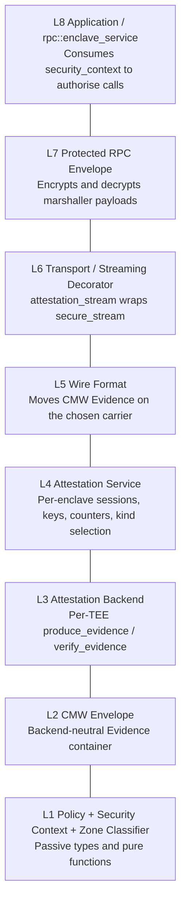
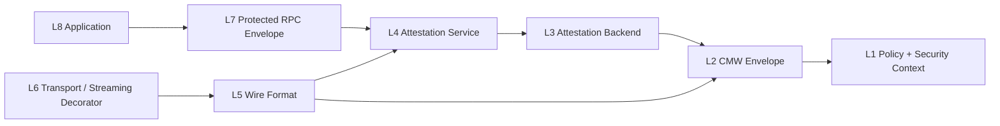
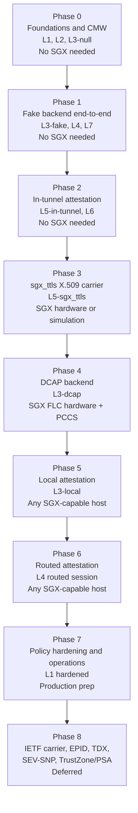

<!--
Copyright (c) 2026 Edward Boggis-Rolfe
All rights reserved.
-->

# Attestation Implementation Plan

## Purpose

A staged plan that turns the attestation design documents in this
directory into working code. Each phase is mergeable: at every phase
boundary the tree builds, existing tests pass, and the new functionality
is exercised by tests that can run on the available hardware.

The first production-shaped target is SGX/DCAP. The plan deliberately defers
anything that requires the IETF TLS attestation draft to stabilise. Phase 1
uses the fake backend with no SGX dependency; Phase 3 introduces Intel's
`sgx_ttls` helpers as the first concrete TLS-carried Evidence envelope. The
CMW-based in-process Evidence interface is in place from the start so the wire
format can be replaced later without re-shaping the rest of the code.

The SGX-first implementation must still keep the backend boundary portable.
Intel TDX, AMD SEV-SNP, and Arm TrustZone/PSA should be later L3 backend
additions with backend-specific policy, not changes to L4-L8.

## Design Inputs

This plan implements:

- [Overview](overview.md)
- [Attestation Backends](attestation-backends.md)
- [Wire Format](wire-format.md)
- [Protected RPC Envelope](protected-rpc-envelope.md)
- [Zone Address Validation](zone-address-validation.md)
- [Back-Channel Context](back-channel-context.md)
- [Failure Policy](failure-policy.md)
- [DCAP Operations](dcap-operations.md)

If a phase below conflicts with one of those documents, the documents are
authoritative and the plan must be amended.

## Implementation Checkpoint - 2026-05-15

The current tree contains a no-SGX proof of concept plus the first protected
RPC envelope implementation. It is a vertical development slice across the
fake backend, a first L4 `attestation_service`, an attestation stream
decorator, normal RPC traffic over that decorator, AES-GCM envelope helpers,
`rpc::enclave_service` send/post hooks, encrypted `try_cast`, `add_ref`, and
`release` payload wrapping, and the first route-state gate for
reference-control messages. It now also has the first generated-IDL
service-level route
attestation handshake payload carried by `i_marshaller::handshake()` and
SGX-sim host integration coverage that drives that handshake through a real
transport from an unknown-route `add_ref`. It is **not** completion of Phase 1
or Phase 2 as written below, because the protected envelope still needs
build-time backend selection and protected encrypted forms for the remaining
reference-control marshaller methods.

### Implemented

- `c++/security/attestation/` now builds a `security_attestation` target with
  backend-neutral passive types and a development fake backend:
  - `include/security/attestation/types.h`
  - `include/security/attestation/fake_backend.h`
  - `include/security/attestation/service.h`
  - `src/fake_backend.cpp`
  - `src/service.cpp`
- The fake backend produces CMW-like fake Evidence using
  `media_type == "application/canopy-fake-evidence"` and
  `content_format == "canopy.fake.v1"`.
- Fake Evidence verification checks:
  - policy permission for development Evidence;
  - required backend id;
  - minimum security level;
  - backend id;
  - attested enclave id and zone id;
  - transcript id;
  - nonce;
  - fake development signature.
- `c++/streaming/attestation/` now builds a `streaming_attestation` target:
  - `include/streaming/attestation/stream.h`
  - `src/stream.cpp`
- `streaming::attestation::stream` wraps a generic
  `std::shared_ptr<streaming::stream>`. In production-shaped direct paths this
  can wrap a secure stream; the current tests wrap SPSC streams so the POC can
  run without TLS, SGX, or DCAP.
- `streaming::attestation::stream` now calls `attestation_service` for local
  Evidence production, peer Evidence verification, policy checks, and session
  creation. It no longer talks directly to an attestation backend.
- The first `attestation_service` owns:
  - local enclave and zone identity;
  - local attestation policy;
  - selected backend;
  - established `security_context` records keyed by enclave-pair session id;
  - OpenSSL HKDF-SHA256 root-secret extraction for each established session;
  - AEAD key derivation scoped by session id, caller zone, destination zone,
    and direction;
  - per-derived-key monotonic send and receive counters.
- Key-derivation inputs now use a named Canopy Attestation v1 canonical KDF
  encoding instead of anonymous serializer bytes. This encoding uses
  length-prefixed fields, big-endian integers, explicit labels, and the fixed
  protocol id `Canopy-Attestation-v1`.
- The current fake path uses a deterministic development shared secret when a
  real key-exchange secret is not supplied. This is only for no-SGX developer
  tests; the `attestation_service` API already accepts explicit shared secret
  bytes for the real exchange.
- The current development handshake uses four in-tunnel frame kinds:
  - `client_hello_attest`
  - `server_hello_attest`
  - `evidence`
  - `evidence_verdict`
- The handshake supports both:
  - mutual fake attestation;
  - an unattested client verifying an attested server.
- `streaming::attestation::stream` exposes a `security_context()` after the
  handshake and delegates normal `send` / `receive` to the wrapped stream. The
  `security_context` is now created and cached by `attestation_service`.
- `streaming::attestation::stream` implements
  `canopy::security::attestation::security_context_source`, a small
  header-only interface that lets enclave-owned code discover attested streams
  without depending on the concrete decorator type.
- `rpc::i_marshaller` now has a route-addressed `handshake()` operation for
  service-level attestation and key exchange. Base service and transport
  implementations route it generically.
- `interfaces/rpc/rpc_types.idl` now defines the first service-level route
  attestation payloads:
  - `attestation_identity`;
  - `attestation_cmw`;
  - `route_attestation_handshake_request`;
  - `route_attestation_handshake_response`.
  These are generated RPC/YAS types and their generated fingerprints are used
  as the `handshake_params::type_id` and `handshake_result::type_id` values.
- `attestation_service` now exposes OpenSSL/SGXSSL-backed nonce generation for
  route-attestation Evidence bindings. The POC uses 32-byte nonces and rejects
  malformed service-level request/response nonces before Evidence
  verification.
- `rpc::enclave_service::handshake()` now handles local route-attestation
  requests. The first implementation:
  - deserializes bounded generated-YAS payloads;
  - verifies peer fake Evidence against claimed identity, transcript id, and
    nonce;
  - produces local Evidence for the response when policy requires it;
  - establishes and stores an attested `security_context` when peer Evidence is
    accepted;
  - marks routes `unattested_allowed` only when peer Evidence is absent and the
    local policy does not require it;
  - returns a structured rejection payload for malformed or policy-rejected
    handshakes.
- `rpc::enclave_service` stores attestation `security_context` records keyed by
  the attested peer route zone through a single `route_attestation_state` map.
  The `security_context` is optional inside the route state and is only
  authoritative when the route state is `attested`. For a direct stream that
  peer is the adjacent zone; for routed end-to-end protection it must be the
  final destination zone. The base `rpc::service` and generic
  `rpc::stream_transport::transport` remain attestation-neutral.
- `route_attestation_state` now has a pure
  `evaluate_route_attestation_state(...)` decision helper. It maps route state
  to `allow`, `start_handshake`, `wait_for_handshake`, or `reject`; host tests
  cover the state matrix.
- `try_cast_params`, `add_ref_params`, `release_params`,
  `object_released_params`, `transport_down_params`, and the streaming
  transport wire structs now carry `payload_type_id` plus `payload` fields so
  encrypted reference/control payloads can reuse the existing polymorphic
  marshaller shape. `try_cast`, `add_ref`, `release`, `object_released`, and
  endpoint-originated `transport_down` now use those fields for protected
  payloads.
- `rpc::enclave_service` has opt-in reference route enforcement:
  - `set_add_ref_attestation_required`;
  - `set_route_unattested_allowed`;
  - inbound `add_ref` checks the route in `remote_object_id.as_zone()`;
  - outbound `add_ref` checks the adjacent transport zone;
  - inbound `try_cast` checks the caller route without starting a new
    handshake;
  - outbound `try_cast` uses the protected destination route context;
  - inbound `release` checks the caller route without starting a new
    handshake;
  - outbound `release` checks the adjacent transport zone;
  - inbound `object_released` checks the released-object owner route without
    starting a new handshake;
  - outbound `object_released` checks the recipient caller route;
  - inbound `transport_down` unwraps protected payloads when present but still
    accepts empty plaintext route-layer notifications from intermediates;
  - unknown routes start the route-addressed service-level `handshake()` path;
  - successful Evidence verification marks the route `attested`;
  - accepted no-Evidence policy marks the route `unattested_allowed`;
  - failed or malformed handshakes mark the route `failed` and the call fails
    closed.
- `try_cast`, `add_ref`, `release`, `object_released`, and `transport_down`
  protected payloads are implemented in the L7 envelope helpers:
  - outbound `rpc::enclave_service::outbound_try_cast` wraps the requested
    interface id and object id when the destination route has an attested
    `security_context`;
  - inbound `rpc::enclave_service::try_cast` unwraps protected payloads before
    checking the existing caller route state;
  - outbound `rpc::enclave_service::outbound_add_ref` wraps when the adjacent
    route has an attested `security_context`;
  - inbound `rpc::enclave_service::add_ref` unwraps protected payloads before
    route validation;
  - outbound `rpc::enclave_service::outbound_release` wraps when the adjacent
    route has an attested `security_context`;
  - inbound `rpc::enclave_service::release` unwraps protected payloads before
    checking the existing caller route state;
  - outbound `rpc::enclave_service::outbound_object_released` wraps optimistic
    reference notifications when the recipient route has an attested
    `security_context`;
  - inbound `rpc::enclave_service::object_released` unwraps protected payloads
    before checking the owner route state;
  - inbound `rpc::enclave_service::transport_down` unwraps protected endpoint
    notifications when present and leaves the empty route-layer form available
    for intermediates;
  - `object_stub::add_ref` now calls the service `outbound_add_ref` virtual for
    outcall add-ref messages, so initial connection add-refs pass through the
    enclave policy hook;
  - `service::release_local_stub` now calls the service
    `outbound_object_released` virtual, so optimistic reference notifications
    generated inside an enclave pass through the enclave policy hook;
  - the current transport still needs visible `build_out_param_channel` for
    route construction, so that field is public but AEAD-bound and repeated in
    encrypted plaintext until the route-control refactor happens;
  - the current streaming release path still exposes `release_options` for
    lifetime accounting, so that field is public but AEAD-bound and repeated in
    encrypted plaintext.
- Protected envelopes now clear the public object id in outer
  `remote_object_id` values. Intermediates receive the destination zone needed
  for routing; endpoints recover the full remote object from the decrypted
  plaintext.
- Protected RPC treats back-channel vectors as mutable public metadata:
  intermediates may append entries, the vectors are not included in AEAD
  associated data, and inbound protected requests/responses pass the received
  outer vectors onward.
- Protected `send` keeps positive application-domain result codes inside the
  encrypted response. The public carrier status is now limited to `OK()` or
  built-in `rpc::error::*` control values; a positive public carrier status is
  rejected as a protocol error.
- `rpc::enclave_service` now sanitises `try_cast`, `add_ref`, and `release`
  control results so non-RPC positive values are not returned on those public
  control paths.
- Protected RPC runtime tests now observe public response statuses for
  protected `send`, `try_cast`, and `add_ref`, and fail if a non-RPC positive
  status becomes visible. A direct enclave-service regression test also forces
  positive statuses through protected `try_cast`, `add_ref`, and the one-way
  `release` outbound hook and verifies they are converted to
  `PROTOCOL_ERROR()`.
- Stream transport now sanitises routed `handshake` response statuses so
  positive application-domain values cannot be emitted as public handshake
  results. Runtime tests observe stream sign-on, generated route-attestation
  `handshake` request/response messages, and stream close messages; they
  assert that setup/handshake statuses remain RPC control statuses and that
  routed handshakes use the expected generated route-attestation type ids.
- Stream transport now sanitises `get_new_zone_id` carrier and response
  statuses so positive application-domain values cannot be emitted as public
  allocator results. Runtime tests observe `get_new_zone_id` request/response
  messages and the intentionally plaintext route-layer `transport_down` form
  used for intermediate route-liveness notifications.
- `documents/security/attestation/intermediate-visibility-audit.md` records
  the current field-by-field visibility decision. The audit confirms that
  intermediate transports and passthroughs need route zones, carrier metadata,
  and current route-control fields, but do not need application object ids,
  real application interface ids, real application method ids, or payload
  bytes.
- `rpc::encrypted_payload` is pinned in `interfaces/rpc/rpc_types.idl` with:
  - public `session_id`;
  - public `session_epoch`;
  - public `e2e_counter`;
  - encrypted `payload`;
  - AES-GCM `authentication_tag`.
- `c++/security/attestation/include/security/attestation/protected_rpc.h` and
  `c++/security/attestation/src/protected_rpc.cpp` implement the first L7
  protected-envelope helpers:
  - `protect_send_request` / `unprotect_send_request`;
  - `protect_send_response` / `unprotect_send_response`;
  - `protect_post_request` / `unprotect_post_request`;
  - outer `interface_id == rpc::id<rpc::encrypted_payload>::get(version)`;
  - outer `method_id == 0`;
  - YAS-binary serialization of the outer `encrypted_payload` carrier;
  - bounded canonical plaintext and AAD encoding using big-endian integers and
    length-prefixed fields;
  - AES-256-GCM encryption through OpenSSL/SGXSSL-compatible EVP APIs;
  - replay checks that accept receive counters only after successful
    authentication and plaintext validation.
- `rpc::enclave_service` now owns the protected-RPC integration point:
  - `set_attestation_service`;
  - `set_protected_rpc_enabled`;
  - inbound `send` / `post` unwrap;
  - outbound `send` / `post` wrap;
  - protected `send` response wrap/unwrap.
- `transport_sgx_coroutine_enclave` links the enclave attestation library so
  the protected-envelope helpers compile in SGX-sim and fake-SGX enclave
  builds. The base `rpc::service` remains free of attestation-specific logic.
- Raw stream POC coverage exists in
  `c++/streaming/attestation/tests/attestation_stream_test.cpp`.
- Attestation service coverage exists in
  `c++/security/attestation/tests/attestation_service_test.cpp`. It checks:
  - session ids are scoped to enclave pairs rather than zone pairs;
  - a stable golden vector for the fake-session AEAD key and nonce prefix;
  - key derivation agreement between both peers;
  - direction and zone-pair separation;
  - nonce construction from the per-key nonce prefix plus counter;
  - monotonic counter allocation;
  - replay/out-of-order receive-counter rejection;
  - configured counter exhaustion.
  - route attestation state decisions for unknown, handshaking, failed,
    explicitly allowed unattested, and attested routes.
  - OpenSSL/SGXSSL-backed 32-byte attestation nonce generation.
  - generated type ids and YAS round-tripping for the route-attestation
    handshake request and response payloads.
  - protected send request/response wrapping and unwrapping;
  - protected `try_cast`, `add_ref`, `release`, `object_released`, and
    `transport_down` wrapping and unwrapping;
  - positive application-domain `send` result codes are recovered only after
    decrypting the protected response;
  - positive public carrier statuses on protected `send` responses are
    rejected as protocol errors;
  - protected outer route carriers hide object ids while preserving
    decrypt-time object reconstruction;
  - tampered protected ciphertext rejection.
- RPC-level POC coverage exists in
  `c++/tests/test_host/attested_streaming_transport_poc_suite.cpp`.
  It proves that generated RPC traffic can run over `rpc::stream_transport`
  after the attestation stream handshake in two cases:
  - mutually attested SPSC peer services;
  - unattested client to attested server.
- Service-level route-attestation integration coverage also exists in
  `c++/tests/test_host/attested_streaming_transport_poc_suite.cpp`. It builds
  two `rpc::enclave_service` instances, drives an unknown-route `add_ref`
  through `rpc::stream_transport`, and proves that:
  - mutual fake Evidence marks both route-state maps `attested` with
    established security contexts;
  - an explicitly permitted no-Evidence client marks the responder route
    `unattested_allowed` while the client still verifies the attested server.
- Generated-RPC protected-runtime coverage exists in
  `c++/tests/test_host/attested_streaming_transport_poc_suite.cpp`. It builds
  two `rpc::enclave_service` instances with pre-established fake security
  contexts, drives generated `send`, `[post]`, and `add_ref` calls through
  `rpc::stream_transport`, drives a generated `try_cast`, observes cleanup
  `release` traffic, and verifies that:
  - inbound generated `send` traffic arrives as an encrypted outer
    `rpc::encrypted_payload`;
  - protected `send` responses carry encrypted payloads back to the caller;
  - generated `[post]` traffic also arrives as an encrypted outer payload;
  - generated `try_cast` traffic carries an encrypted payload carrier;
  - generated `add_ref` traffic carries an encrypted payload carrier;
  - generated `release` traffic carries an encrypted payload carrier;
  - no protected message exposes a nonzero public object id;
  - no generated `send`, response, `[post]`, `try_cast`, `add_ref`, or
    `release` traffic is observed in plaintext while protection is enabled.
  - no positive non-RPC public status is observed on protected `send`,
    `try_cast`, or `add_ref` responses.
  - positive protected control statuses returned by a transport for
    `try_cast`, `add_ref`, and `release` are sanitised to `PROTOCOL_ERROR()`
    by `rpc::enclave_service`.
  - stream sign-on messages are observed during generated RPC connection
    setup, stream close messages are observed during cleanup, and no non-RPC
    public status is observed on setup/handshake/control response paths.
  - service-level route handshakes use the generated
    `route_attestation_handshake_request` and
    `route_attestation_handshake_response` type ids.

### Verified

- `cmake --preset Debug_Coroutine`
- `cmake --build build_debug_coroutine --target rpc_test attestation_stream_test`
- `build_debug_coroutine/output/attestation_stream_test`
- `build_debug_coroutine/output/rpc_test --gtest_filter=attested_streaming_transport_poc_test/* --gtest_brief=1`
- `ctest --test-dir build_debug_coroutine -R attested_streaming_transport_poc_test --output-on-failure`
- `ctest --test-dir build_debug_coroutine -R attestation_stream_test --output-on-failure`
- `cmake --build build_debug --target security_attestation`
- `cmake --build build_debug --target rpc security_attestation`
- `ctest --test-dir build_debug_coroutine -R 'attestation_stream_test|attested_streaming_transport_poc_test' --output-on-failure`
- `cmake --build build_debug --target attestation_service_test security_attestation`
- `build_debug/output/attestation_service_test`
- `ctest --test-dir build_debug -R attestation_service_test --output-on-failure`
- `cmake --build build_debug_coroutine --target attestation_service_test attestation_stream_test rpc_test`
- `ctest --test-dir build_debug_coroutine -R 'attestation_service_test|attestation_stream_test|attested_streaming_transport_poc_test' --output-on-failure`
- `cmake --build build_debug --target attestation_service_test`
- `build_debug/output/attestation_service_test`
- `cmake --build build_debug_coroutine --target attestation_service_test attestation_stream_test`
- `build_debug_coroutine/output/attestation_service_test`
- `build_debug_coroutine/output/attestation_stream_test`
- `cmake --build build_debug_sgx_sim --target security_attestation_enclave attestation_service_test`
- `build_debug_sgx_sim/output/attestation_service_test`
- `cmake --build build_debug_coroutine_sgx_sim --target security_attestation_enclave transport_sgx_coroutine_enclave attestation_service_test attestation_stream_test`
- `build_debug_coroutine_sgx_sim/output/attestation_service_test`
- `build_debug_coroutine_sgx_sim/output/attestation_stream_test`
- `cmake --build build_debug_coroutine_fake_sgx --target security_attestation_enclave transport_sgx_coroutine_enclave attestation_service_test attestation_stream_test`
- `build_debug_coroutine_fake_sgx/output/attestation_service_test`
- `build_debug_coroutine_fake_sgx/output/attestation_stream_test`
- `cmake --build build_debug --target attestation_service_test`
- `cmake --build build_debug_coroutine --target attestation_service_test`
- `build_debug/output/attestation_service_test`
- `build_debug_coroutine/output/attestation_service_test`
- `cmake --build build_debug_coroutine_sgx_sim --target transport_sgx_coroutine_enclave security_attestation_enclave`
- `cmake --build build_debug --target attestation_service_test`
- `build_debug/output/attestation_service_test`
- `cmake --build build_debug_coroutine --target attestation_service_test`
- `build_debug_coroutine/output/attestation_service_test`
- `cmake --build build_debug_coroutine_sgx_sim --target transport_sgx_coroutine_enclave security_attestation_enclave`
- `cmake --build build_debug_coroutine_fake_sgx --target transport_sgx_coroutine_enclave security_attestation_enclave`
- `cmake --build build_debug_coroutine_sgx_sim --target rpc_test`
- `build_debug_coroutine_sgx_sim/output/rpc_test --gtest_list_tests`
- `build_debug_coroutine_sgx_sim/output/rpc_test --gtest_filter=attested_streaming_transport_poc_test/*`
- `cmake --build build_debug_coroutine_sgx_sim --target rpc_test`
- `build_debug_coroutine_sgx_sim/output/rpc_test --gtest_filter=ServiceLevelRouteAttestation.*:attested_streaming_transport_poc_test/*`
- `cmake --build build_debug_coroutine_fake_sgx --target rpc_test`
- `build_debug_coroutine_fake_sgx/output/rpc_test --gtest_filter=ServiceLevelRouteAttestation.*:attested_streaming_transport_poc_test/*`
- `cmake --build build_debug_coroutine_sgx_sim --target rpc_test`
- `build_debug_coroutine_sgx_sim/output/rpc_test --gtest_filter=ProtectedRpcRuntime.*:ServiceLevelRouteAttestation.*:attested_streaming_transport_poc_test/*`
- `cmake --build build_debug_coroutine_fake_sgx --target attestation_service_test`
- `build_debug_coroutine_fake_sgx/output/attestation_service_test --gtest_filter=AttestationService.ProtectsObjectReleasedRequest:AttestationService.ProtectsTransportDownRequest:AttestationService.ProtectsTryCastRequest:AttestationService.ProtectsReleaseRequest:AttestationService.ProtectedRequestsAllowMutablePublicBackChannels:AttestationService.ProtectsAddRefRequest:AttestationService.ProtectsSendRequestAndResponse:AttestationService.ProtectedSendRejectsTamperedCiphertext`
- `cmake --build build_debug_coroutine_fake_sgx --target rpc_test`
- `build_debug_coroutine_fake_sgx/output/rpc_test --gtest_filter=ProtectedRpcRuntime.*:ServiceLevelRouteAttestation.*:attested_streaming_transport_poc_test/*`
- `cmake --build build_debug_coroutine_sgx_sim --target rpc_test`
- `build_debug_coroutine_sgx_sim/output/rpc_test --gtest_filter=ProtectedRpcRuntime.*:ServiceLevelRouteAttestation.*:attested_streaming_transport_poc_test/*`
- `cmake --build build_debug_coroutine_fake_sgx --target rpc_test`
- `build_debug_coroutine_fake_sgx/output/rpc_test --gtest_filter=ProtectedRpcRuntime.*:ServiceLevelRouteAttestation.*:attested_streaming_transport_poc_test/*`
- `cmake --build build_debug_coroutine --target rpc_test`
- `build_debug_coroutine/output/rpc_test --gtest_filter=attested_streaming_transport_poc_test/*`
- `cmake --build build_debug --target attestation_service_test`
- `build_debug/output/attestation_service_test --gtest_filter=AttestationService.ProtectsObjectReleasedRequest:AttestationService.ProtectsTransportDownRequest:AttestationService.ProtectsTryCastRequest:AttestationService.ProtectsReleaseRequest:AttestationService.ProtectedRequestsAllowMutablePublicBackChannels:AttestationService.ProtectsAddRefRequest:AttestationService.ProtectsSendRequestAndResponse:AttestationService.ProtectedSendRejectsTamperedCiphertext`
- `cmake --build build_debug_coroutine_fake_sgx --target attestation_service_test`
- `build_debug_coroutine_fake_sgx/output/attestation_service_test --gtest_filter=AttestationService.ProtectsObjectReleasedRequest:AttestationService.ProtectsTransportDownRequest:AttestationService.ProtectsTryCastRequest:AttestationService.ProtectsReleaseRequest:AttestationService.ProtectedRequestsAllowMutablePublicBackChannels:AttestationService.ProtectsAddRefRequest:AttestationService.ProtectsSendRequestAndResponse:AttestationService.ProtectedSendRejectsTamperedCiphertext`
- `cmake --build build_debug_coroutine_fake_sgx --target rpc_test`
- `build_debug_coroutine_fake_sgx/output/rpc_test --gtest_filter=ProtectedRpcRuntime.*:ServiceLevelRouteAttestation.*:attested_streaming_transport_poc_test/*`
- `cmake --build build_debug_coroutine_fake_sgx --target rpc_test`
- `build_debug_coroutine_fake_sgx/output/rpc_test --gtest_filter=ProtectedRpcRuntime.*:ServiceLevelRouteAttestation.*:attested_streaming_transport_poc_test/*`
- `cmake --build build_debug_coroutine_sgx_sim --target attestation_service_test`
- `build_debug_coroutine_sgx_sim/output/attestation_service_test --gtest_filter=AttestationService.ProtectsObjectReleasedRequest:AttestationService.ProtectsTransportDownRequest:AttestationService.ProtectsTryCastRequest:AttestationService.ProtectsReleaseRequest:AttestationService.ProtectedRequestsAllowMutablePublicBackChannels:AttestationService.ProtectsAddRefRequest:AttestationService.ProtectsSendRequestAndResponse:AttestationService.ProtectedSendRejectsTamperedCiphertext`
- `cmake --build build_debug_coroutine_sgx_sim --target rpc_test`
- `build_debug_coroutine_sgx_sim/output/rpc_test --gtest_filter=ProtectedRpcRuntime.*:ServiceLevelRouteAttestation.*:attested_streaming_transport_poc_test/*`
- `cmake --build build_debug_coroutine_sgx_sim --target attestation_service_test`
- `build_debug_coroutine_sgx_sim/output/attestation_service_test --gtest_filter=AttestationService.ProtectsReleaseRequest:AttestationService.ProtectedRequestsAllowMutablePublicBackChannels:AttestationService.ProtectsAddRefRequest:AttestationService.ProtectsSendRequestAndResponse:AttestationService.ProtectedSendRejectsTamperedCiphertext`
- `cmake --build build_debug_coroutine_sgx_sim --target rpc_test`
- `build_debug_coroutine_sgx_sim/output/rpc_test --gtest_filter=ProtectedRpcRuntime.*:ServiceLevelRouteAttestation.*:attested_streaming_transport_poc_test/*`
- `cmake --build build_debug_coroutine_fake_sgx --target attestation_service_test`
- `build_debug_coroutine_fake_sgx/output/attestation_service_test --gtest_filter=AttestationService.ProtectsReleaseRequest:AttestationService.ProtectedRequestsAllowMutablePublicBackChannels:AttestationService.ProtectsAddRefRequest:AttestationService.ProtectsSendRequestAndResponse:AttestationService.ProtectedSendRejectsTamperedCiphertext`
- `cmake --build build_debug_coroutine_fake_sgx --target rpc_test`
- `build_debug_coroutine_fake_sgx/output/rpc_test --gtest_filter=ProtectedRpcRuntime.*:ServiceLevelRouteAttestation.*:attested_streaming_transport_poc_test/*`

### Not Yet Implemented

- `CANOPY_ATTESTATION_BACKEND` build selection.
- Separate `cmw.h`, `backend.h`, `policy.h`, and `security_context.h` header
  split. The current POC keeps these passive types together in `types.h`.
- `null_backend`.
- Full production CMW / attestation context IDL split. The current route
  handshake has minimal generated IDL carriers for fake Evidence and
  backend-neutral identity.
- Backend selection beyond explicit construction of one service with one
  backend.
- Strict end-to-end enforcement for every `transport_down`. The protected
  endpoint-originated form exists, but route-layer plaintext `transport_down`
  remains valid for intermediate-synthesized liveness notifications.
- A transport-route refactor that hides `add_ref` route-control options from
  intermediates. Today `build_out_param_channel` remains visible because
  `rpc::transport::inbound_add_ref` needs it before the service hook can unwrap
  the encrypted payload.
- Non-zero `service_request_id` semantics.
- TLS exporter binding. The current development binding is transcript id,
  identity, role, and nonce based.
- `sgx_ttls`, DCAP, local SGX attestation, EPID, TDX, SEV-SNP, or
  TrustZone/PSA backends.

### Current Best Next Step

Telemetry and `post_report` are demo/diagnostic surfaces and are intentionally
left out of the current production attestation path. The next implementation
slice should review stream sign-on policy controls, then continue reducing the
remaining public carrier fields documented in
`intermediate-visibility-audit.md`.

## Architectural Layers

The implementation is split into eight components with narrow contracts.
Each component depends only on what is below it. Cross-layer reaching is
forbidden.

### What Each Layer Does, And Does Not Do

- **L1 Policy / Security Context / Zone Classifier.**
  - *Does*: hold compile-time policy values (`MRSIGNER` allow-lists,
    `ISVSVN` minima, TCB acceptance), define the passive
    `security_context` record, expose
    `attestation_kind required_for(local, peer)` as a pure function of
    two `zone_address` values.
  - *Does not*: hold runtime state, perform I/O, know about any
    specific TEE, talk to any backend.

- **L2 CMW Envelope.**
  - *Does*: define the `cmw` value type
    `{media_type, content_format, payload}` and its serialisation in
    Canopy's existing encodings.
  - *Does not*: interpret payload bytes, know about TLS, generate or
    verify signatures.

- **L3 Attestation Backend.**
  - *Does*: implement one TEE technology (Fake, SGX local, SGX DCAP,
    SGX EPID, simulation, future TDX, future SEV-SNP, future
    TrustZone/PSA). Produce CMW Evidence binding a given key,
    transcript, or native report-data field. Verify CMW Evidence and
    return a typed verdict plus attested identity. Refuse production
    policy when the backend is development-grade.
  - *Does not*: own sessions, derive session keys, manage counters,
    decide local-versus-remote, touch TLS, touch RPC, log to
    application telemetry.

- **L4 Attestation Service.**
  - *Does*: one per enclave. Establish and cache enclave-pair
    sessions. Choose a backend per session using L1's classifier.
    Derive per-session AEAD keys (per caller-zone, destination-zone,
    direction). Own the monotonic counter store. Publish a
    `security_context` to the enclave service. Expose a typed handle for
    L7 to encrypt and decrypt with.
  - *Does not*: know which TEE produced the Evidence (delegated to
    L3). Know how Evidence travels on the wire (delegated to L5).
    Know what RPC payload looks like (delegated to L7).

- **L5 Wire Format.**
  - *Does*: serialise and deserialise the CMW Evidence onto a
    specific carrier. Phase 2: in-tunnel development exchange.
    Phase 3: `sgx_ttls` X.509 certificate extension. Phase 8:
    IETF TLS extensions. Negotiate carrier-level features such as
    attestation capability advertisement.
  - *Does not*: produce or verify Evidence itself (delegated to L3 via
    L4). Make policy decisions. Touch RPC payloads.

- **L6 Transport / Streaming Decorator.**
  - *Does*: `streaming::attestation::stream` wraps a
    `streaming::secure::stream`. After the secure stream handshake,
    drives the L5 wire exchange, calls L4 for session establishment,
    and exposes the resulting `security_context` for enclave-owned
    connection setup code to publish.
  - *Does not*: peek inside CMW payload bytes. Cache sessions
    (L4 does that). Encrypt application data (L7 does that).

- **L7 Protected RPC Envelope.**
  - *Does*: ask L4 for the AEAD key for a given (caller, destination,
    direction). Build the outer envelope with the public routing
    header and the encrypted plaintext inner block. Validate inbound
    envelopes by asking L4 to decrypt and check the counter, then
    hand the inner request to the existing stub dispatch.
  - *Does not*: derive keys, talk to a backend, terminate TLS, decide
    whether a peer is allowed (L8 decides).

- **L8 Application / `rpc::enclave_service`.**
  - *Does*: read `security_context` and apply application-level
    authorisation policy. Decide whether a peer enclave is allowed to
    call a specific interface or object.
  - *Does not*: cryptographic work. Session management.
    Wire-format decisions.

### Dependency Direction

A layer may call only into layers numerically below it. Specifically:

There is no reverse arrow. L3 never sees L4's session state. L4 never
sees L5's wire bytes. L7 never instantiates a backend.

### Why The Split Matters

- Swapping the wire format (`sgx_ttls` to IETF extensions) changes only
  L5.
- Adding a new TEE (DCAP to TDX) changes only L3.
- Adding a new transport (TCP to io_uring) changes only L6.
- Tightening production policy changes only L1.
- The protected RPC envelope (L7) is agnostic to all of the above:
  given a session handle, it encrypts and decrypts. This is the property
  that lets phases 1, 2, 3, and 4 progressively swap backends and wire
  formats without touching the envelope code.

## Phase / Layer Map

Each phase adds or replaces a layer without disturbing the layers above
or below it. This is the property that lets the team merge phase 1 (no
SGX) before phase 4 (real SGX) without rework.

Phases 0-2 can be developed and merged on machines with no SGX hardware
because everything compiles against the Fake backend.

## Phase 0 -- Foundations And CMW

Layers added: **L1, L2, L3-null.** No state, no I/O.

Goal: introduce the backend-neutral attestation interface, the CMW
envelope type, the security context type, and the routing classification
function. No backend yet beyond a `null` one that always refuses to
attest.

### Deliverables

- New CMake target tree under `c++/security/attestation/`:
  - `include/security/attestation/cmw.h` -- CMW value type with
    `media_type`, `content_format`, and `payload` fields, plus
    YAS/serialisation helpers.
  - `include/security/attestation/backend.h` -- abstract
    `attestation_backend` interface (`produce_evidence`,
    `verify_evidence`, `capabilities`).
  - `include/security/attestation/policy.h` -- `policy` value type from
    `attestation-backends.md`.
  - `include/security/attestation/security_context.h` -- per-session
    record (attested identity, session id, key id, backend id, security
    level).
  - `include/security/attestation/kind.h` -- `attestation_kind` enum and
    `kind required_for(local, peer)` derived from `zone_address` per
    `overview.md` "Routing Classification".
  - `src/null_backend.cpp` -- backend that returns
    `SUPPORTS_PRODUCTION_POLICY=false` and refuses every evidence call.
- Build option `CANOPY_ATTESTATION_BACKEND` with values
  `NULL` (default for current builds) and `FAKE` (added in phase 1).
- Conditional compilation: when set to `NULL`, the rest of Canopy keeps
  building exactly as today; no attestation paths are taken.
- IDL additions in `interfaces/rpc/`:
  - `cmw` value type (matches the C++ definition).
  - `attestation_context` and `security_failure_context` back-channel
    types, per `back-channel-context.md` (definitions empty for now if
    full schema is not yet pinned).
- Stub unit tests under `tests/attestation/` that exercise the CMW
  serialiser and the routing classifier.

### Verification

- `cmake --build build_debug --target attestation_test` runs the new
  unit tests.
- `rpc_test` and all other existing tests pass unchanged.

### Exit Criteria

- The `attestation_backend` interface is the only entry point used by
  later phases. No other Canopy code references SGX, DCAP, or sgx_ttls
  yet.
- CMW round-trips through the Canopy serialisers used elsewhere in the
  RPC stack.

### Notes

- The exact `encrypted_payload` IDL shape is pinned in phase 1, not here,
  to keep this phase scope-tight.
- Anything that would later require a real backend (sealed keys, the
  `tee_*` calls, AESM) is left out. This phase is pure abstraction.

## Phase 1 -- Fake Backend End-To-End

Layers added: **L3-fake, L4, L7.** No wire-format or transport changes
yet; sessions are established by direct method call between two
attestation services in the same process.

Goal: complete the in-process attestation, key-exchange, counter, and
protected-envelope code paths using a development backend that does not
need SGX hardware. After this phase, an enclave-pair session can be
established, keys derived, and a protected `send` round-tripped through
the existing Canopy transport, all on a plain Linux host.

### Deliverables

- `src/fake_backend.cpp` -- implements `attestation_backend` with:
  - deterministic-or-configured fake enclave identity;
  - fake evidence signed with a build-time development key (so
    `verify_evidence` exercises a real signature check);
  - explicit `backend_id == "fake"` and
    `security_level == development`;
  - refusal to attest when `policy.production` is true.
- `attestation_service` in
  `c++/security/attestation/src/service.cpp`:
  - one instance per enclave (or, for now, per process);
  - tracks active sessions keyed by enclave-pair identity;
  - per-session: peer identity, session id, per-key counters, key
    derivation context;
  - exposes `establish_session(peer_evidence_cmw)` and
    `produce_self_evidence(session_handle, key_to_bind)`.
- Key-derivation helper:
  - HKDF-Extract over the session shared secret;
  - HKDF-Expand-Label over `(enclave-pair session, caller zone,
    destination zone, direction)` per `protected-rpc-envelope.md`;
  - canonical KDF input encoding with golden vectors;
  - no direct dependence on YAS or protocol-buffer byte output for KDF inputs;
  - one AEAD key per derived label.
- Counter store: in-memory, per derived key, with monotonic guarantee
  and per-key exhaustion handling.
- `encrypted_payload` IDL type pinned in `interfaces/rpc/`:
  - outer marker fingerprint via
    `rpc::id<encrypted_payload>::get(version)`;
  - inner protected plaintext as defined in
    `protected-rpc-envelope.md`.
- Service hooks:
  - `outbound_send`, `outbound_post` paths in `c++/rpc/src/service.cpp`
    learn to call into the attestation service to wrap when a session
    exists;
  - inbound dispatch in `c++/rpc/src/service.cpp` learns to unwrap an
    inbound `encrypted_payload` and recover the inner request before
    handing to the existing stub-dispatch code.
  - `add_ref`, `release`, `try_cast`, `object_released` are wrapped
    behind a feature flag in this phase; default off until phase 5
    routed attestation is in place, because their semantics interact
    with route construction.
- `CANOPY_ATTESTATION_BACKEND=FAKE` makes the build use the fake backend
  by default for tests.
- Tests under `tests/attestation/`:
  - session establishment between two `attestation_service` instances
    in the same process;
  - key derivation determinism and direction separation;
  - counter monotonicity and exhaustion behaviour;
  - protected `send` round-trip through a loopback transport;
  - replay rejection;
  - fraud test: backend rejects evidence with a tampered preimage.

### Verification

- New tests pass on a developer laptop without SGX hardware.
- `rpc_test` continues to pass.
- A demo can be added under `c++/demos/` that runs two services in one
  process and prints "attested fake session established" before
  exchanging a protected call.

### Exit Criteria

- The protected-RPC envelope is on the hot path. Once a session exists
  between two services, ordinary `send`/`post` traffic and endpoint
  `add_ref` / `release` payloads are encrypted and authenticated end-to-end.
- The attestation service is the only producer of session keys. Nothing
  in transport code derives keys directly.
- The full CMW shape is exercised end-to-end. Phase 3 will replace the
  payload bytes with real DCAP quote bytes; nothing else above the
  backend interface changes.

### Notes

- Fake evidence is signed but the key is not a production root of trust.
  Production policy in phase 7 must reject `backend_id == "fake"`.
- AES-GCM is the provisional AEAD; nonce derivation is per
  `protected-rpc-envelope.md` ("Encryption"). Per-key fixed prefix plus
  monotonic counter.

## Phase 2 -- Streaming-Layer Attestation Decorator

Layers added: **L5-in-tunnel, L6.** This is the first phase where bytes
specific to attestation appear on a transport. L4 and below are
unchanged.

Goal: introduce the `attestation_stream` decorator that wraps
`streaming::secure::stream`, runs the attestation exchange immediately
after the TLS handshake, and makes the resulting `security_context`
available to `rpc::enclave_service`. Still uses the Fake backend; no SGX yet.

### Deliverables

- New CMake target `streaming_attestation` under
  `c++/streaming/attestation/`:
  - `include/streaming/attestation/stream.h` -- decorator that wraps a
    `std::shared_ptr<streaming::stream>` (the underlying secure
    stream).
  - `src/stream.cpp` -- runs the handshake exchange: client sends
    `evidence_proposal`-shaped CMW, server replies with selected
    evidence kind and its Evidence, client replies with its Evidence
    (if the session is mutual), both run their attestation service
    `verify_evidence`, both publish `security_context`.
- For phase 2 the exchange runs *inside* the established TLS tunnel as
  length-prefixed application bytes. This is the simplest form that can
  bind Evidence to the already-negotiated TLS session using a TLS exporter
  value plus Canopy transcript context. Phase 3 replaces this with the
  certificate-extension form using `sgx_ttls`, which uses a different
  report-data binding.
- Wire framing for phase 2 only: length-prefixed YAS binary frames using the
  four message kinds in
  [wire-format.md, "In-Tunnel Development Carrier"](wire-format.md).
- Transport plumbing:
  - enclave-owned connection setup publishes a `security_context` from
    an attested stream into `rpc::enclave_service`;
  - `rpc::enclave_service` exposes a `security_context` accessor keyed
    by adjacent zone. The base `rpc::service` remains attestation-neutral.
- Update the websocket demo
  (`c++/demos/websocket/server/enclave_websocket_server.cpp`) to wrap
  its TLS stream in `attestation_stream` when the listener policy
  requests attestation. Browser-facing listeners still pass the
  `kind::none` policy and behave unchanged.
- Tests:
  - two services connected by a loopback secure stream perform the
    attestation exchange, both sides verify fake Evidence, both
    publish a `security_context`;
  - failure tests: the verifier rejects mismatched binding, missing
    Evidence, downgraded backend.

### Verification

- The fake-backend demo from phase 1 now runs through a TLS-terminated
  loopback connection rather than direct loopback. Verification of the
  phase-2 session binding goes through real TLS exporter material.
- All existing TLS/websocket tests pass.

### Exit Criteria

- Every transport that uses `streaming::secure::stream` can opt into
  attestation by wrapping with `streaming::attestation::stream` and a
  policy.
- The TLS layer continues to terminate inside the enclave; no plaintext
  reaches the host.

### Notes

- The phase-2 in-tunnel exchange may remain as a development and fallback
  carrier, but it is not the same binding as `sgx_ttls`. Phase 3 moves the
  SGX production-shaped path into the X.509 certificate extension, where the
  attested certificate key signs the TLS handshake.

## Phase 3 -- sgx_ttls X.509 Carrier

Layers changed: **L5 replaced.** L1-L4 and L6-L8 are unchanged.

Goal: replace the in-tunnel CMW exchange with Intel's `sgx_ttls`
certificate extension carrying the Evidence. This is the
current SGX carrier described in [wire-format.md](wire-format.md). Still no DCAP
backend yet (the Fake backend can produce a synthetic "quote-like" CMW
that the verify path treats as if it came from the X.509 extension).

### Deliverables

- Add a certificate-extension flow for SGX production-shaped attestation:
  - Attester (server, and optionally client) builds an X.509 cert via
    `tee_get_certificate_with_evidence` whose extension carries a DCAP
    quote over the helper's public-key claims;
  - Relying Party installs a TLS verify callback that calls the
    DCAP/SGX certificate-evidence verifier during the standard TLS
    handshake, then applies Canopy policy to the attested identity.
- For the Fake backend, provide
  `fake_certificate_extension_helpers.cpp` that emits and parses a
  Canopy-owned development extension with the same carrier role. Do not route
  fake evidence through `tee_verify_certificate_with_evidence`; that helper
  verifies real Intel quote evidence.
- Build wiring:
  - link `libsgx_ttls.a` (in-enclave) and any host-side helpers when
    `CANOPY_BUILD_ENCLAVE=ON`;
  - import `submodules/confidential-computing.sgx/common/inc/sgx_ttls.edl`
    into `c++/transports/sgx_coroutine/edl/`.
- Tests:
  - the X.509 extension can be produced and consumed by the Fake
    backend;
  - the existing protected `send` test from phase 1 still passes via
    this new wire shape;
  - rejection tests: bad signature in extension, mismatched binding,
    unknown media type.

### Verification

- The websocket demo now uses the certificate-extension wire format.
  The TLS handshake itself fails closed when policy rejects the
  Evidence; there is no application-layer round-trip required.

### Exit Criteria

- The wire format matches what real DCAP will use, so phase 4 is purely
  a backend swap.

### Notes

- Document the custom OID used for the SGX RA quote extension in
  `wire-format.md` once it is pinned in code. `sgx_ttls` already picks
  one; Canopy should not invent a different one.
- This phase still does not require SGX hardware: the Fake backend
  emits its own extension layout, and `sgx_ttls` is only called when
  the DCAP backend is selected.

## Phase 4 -- DCAP Backend On Real Hardware

Layers added: **L3-dcap.** L4-L8 are unchanged because L3's contract did
not move.

Goal: implement the DCAP backend so production hardware can produce and
verify real Evidence. After this phase, an enclave-to-enclave session
between SGX-FLC machines is attested and protected.

### Deliverables

- `src/dcap_backend.cpp` implements `attestation_backend`:
  - `produce_evidence(report_data)` calls `sgx_qe_get_target_info`
    inside the host, `sgx_create_report` inside the enclave, and
    `sgx_qe_get_quote` back in the host, emitting a CMW with
    `media_type == "application/sgx-quote3"`;
  - `verify_evidence(cmw, expected_report_data, policy)` calls
    `sgx_qv_verify_quote` (or `tee_verify_quote`, see
    [DCAP Operations](dcap-operations.md)) with `qve_report_info`,
    then inside the enclave calls
    `sgx_tvl_verify_qve_report_and_identity`, then enforces application
    policy over the embedded report;
  - maps `sgx_ql_qv_result_t` to backend verdicts per the failure-mode
    catalog in `dcap-operations.md`.
- Build wiring:
  - link `libsgx_dcap_ql` and `libsgx_dcap_quoteverify` on the host;
  - link `libsgx_dcap_tvl.a` inside the enclave;
  - import `<dcap>/QuoteVerification/dcap_tvl/sgx_dcap_tvl.edl` into the
    enclave EDL (`<dcap>` is the `dcap_source` path used in
    `dcap-operations.md`);
  - new build option `CANOPY_ATTESTATION_BACKEND=DCAP` for SGX HW
    presets.
- Threading: `sgx_qe_get_quote` and `sgx_qv_verify_quote` are run on a
  dedicated worker thread off the io_uring proactor, per the threading
  guidance in `dcap-operations.md`.
- Policy enforcement plumbing:
  - production policy values (`MRSIGNER`, `ISVPRODID`, minimum
    `ISVSVN`, debug-bit policy, acceptable TCB statuses, QvE ISVSVN
    threshold) live in a compile-time header in `c++/security/policy/`
    that the enclave links against;
  - debug builds may provide a relaxed policy and must declare so via
    a build option.
- Operator runbook (developer-facing):
  - install `sgx-aesm-service`, `libsgx-dcap-*`, point
    `/etc/sgx_default_qcnl.conf` at a PCCS instance;
  - build and run the vendored PCCS from
    `submodules/confidential-computing.sgx/external/dcap_source/QuoteGeneration/pccs/`;
  - run `PCKRetrievalTool` (or `SGXPlatformRegistration` for server
    CPUs) to register the platform;
  - this runbook can live as a section in `dcap-operations.md` or as
    a new file under `documents/security/attestation/runbooks/`.
- Tests:
  - on an SGX-FLC machine: end-to-end attested enclave-to-enclave
    session via the websocket demo;
  - failure-mode tests using deliberately corrupted Evidence;
  - TCB out-of-date policy test: confirm the backend refuses by
    default and accepts only when the policy explicitly allows it.

### Verification

- The websocket demo, built with `CANOPY_ATTESTATION_BACKEND=DCAP`,
  produces a valid quote, the peer verifies it, and the resulting
  session carries protected RPC traffic.
- The same demo built with `=FAKE` continues to work on developer
  machines without SGX hardware. No code outside the backend module
  branches on backend choice.

### Exit Criteria

- A first production-shaped attestation path exists for direct
  enclave-to-enclave SGX connections.
- The build matrix gains a "real-SGX integration" job that exercises
  this path.

### Notes

- TCB collateral lifecycle (refresh, offline snapshots) is operationally
  managed by PCCS; nothing in this phase tries to schedule that inside
  the enclave. Phase 7 may add an in-enclave freshness scheduler.
- This is the earliest phase where a real production deployment is
  conceivable, modulo the policy-hardening work in phase 7.

## Phase 5 -- Local Attestation

Layers added: **L3-local.** Adds the kind selection branch in L4 to
choose between local and remote backends, but no other layer changes.

Goal: support same-platform sibling enclaves attesting to each other
without DCAP collateral, using `EREPORT`/`EVERIFYREPORT`. This is the
fast path for SGX coroutine transports between enclaves on the same
host.

### Deliverables

- `src/local_backend.cpp` implements `attestation_backend` for local
  attestation:
  - `produce_local(target_info, report_data)` calls
    `sgx_create_report`;
  - `verify_local(report)` calls `sgx_verify_report` (no collateral
    needed; CPU report key is the root of trust);
  - emits CMW with `media_type == "application/sgx-report"`.
- Selection logic in `attestation_service::establish_session` uses
  `attestation_kind required_for(local, peer)` from phase 0 to decide
  whether to attempt local first.
- Fallback path: if local attestation fails because the peer is not on
  the same platform (the routing-prefix heuristic was wrong), retry
  with remote attestation using the DCAP backend.
- Transport plumbing: the SGX coroutine transport between sibling
  enclaves on the same host wires the local backend into its
  attestation stream by default.
- Tests:
  - two enclaves in the same process attest mutually;
  - mixed test: one local, one remote peer; the selector picks the
    correct kind for each.

### Verification

- The SGX coroutine transport demo runs two sibling enclaves and shows
  a local-attested session forming.

### Exit Criteria

- Both local and remote attestation paths share the same
  `attestation_service`, `security_context`, and protected-RPC
  envelope. The only difference is the backend and the CMW media type.

### Notes

- Local attestation does not need PCCS or AESM (AESM is still needed
  for any path that touches QE/PCE).
- Local backend should be allowed independently of DCAP at build time:
  some deployments may use local-only.

## Phase 6 -- Routed Attestation

Layers changed: **L4 extended**, new IDL interface in L8. L5 is bypassed
for routed sessions because the Evidence travels as RPC payload over an
existing transport rather than as TLS bytes.

Goal: support the case where zone A learns about zone C through an
existing route via zone B. A and C establish their own end-to-end
attested session over that route without B being able to read the
payloads.

### Deliverables

- IDL: `interface i_remote_attestation` in `interfaces/rpc/` with one
  reserved attestation method that carries CMW evidence both ways.
- Service: route the reserved object id (max value at active
  `zone_address` object-id bit width) to the in-enclave attestation
  service rather than the normal stub dispatcher.
- Speculative call shape: caller sends an RPC to the reserved
  attestation object on the peer zone over the existing route; the
  payload is the same CMW exchange used in direct attestation; the
  Evidence binding now covers the routed transport's session keys
  instead of TLS handshake keys.
- End-to-end key exchange: Diffie-Hellman (or X25519) over the routed
  RPC payloads, bound to the Evidence at each end.
- Cache: the resulting session is cached by enclave-pair identity in
  the local `attestation_service`. Subsequent RPC traffic between A
  and C, over any route, uses that session's keys.
- Tests:
  - A and C attest each other through B; B cannot decrypt A's
    payloads;
  - revocation: when A's enclave restarts, the cached session is
    invalidated and the next call re-attests;
  - multi-route: A reaches C via B1 today and B2 tomorrow; the same
    attested session covers both.

### Verification

- Three-zone integration test passes: A `send`s to C through B; B's
  service observes only routing headers and CMW-wrapped ciphertext;
  C's service decrypts and dispatches.

### Exit Criteria

- The protected envelope works end-to-end across multi-hop routes.
- Reference-protocol messages (`add_ref`, `release`, `try_cast`,
  `object_released`) can now be protected end-to-end; their flag from
  phase 1 is enabled by default for attested sessions.

### Notes

- The reserved interface should be marked so that ordinary `try_cast`
  reflection does not expose it unless a policy explicitly permits
  bootstrap discovery. See `back-channel-context.md`.
- This is the first phase where Canopy needs an in-enclave secure
  random number source for ephemeral DH keys. Use the enclave's RDRAND
  via the SGX SDK; do not use host-supplied entropy.

## Phase 7 -- Policy Hardening And Operations

Layers hardened: **L1, plus operational tooling around L3 and L4.** No
layer is removed or replaced; existing layers are tightened.

Goal: move from "works on my machine" to "would survive an audit." All
the soft edges in earlier phases are pinned down with policy, logging,
audit, and operational tooling.

### Deliverables

- Compile-time policy header `c++/security/policy/policy.h`:
  - `MRSIGNER` allow-list;
  - `ISVPRODID` allow-list;
  - minimum `ISVSVN` per product;
  - debug-bit policy;
  - TCB status allow-list and audit policy for `OUT_OF_DATE`,
    `CONFIG_NEEDED`, `SW_HARDENING_NEEDED`;
  - QvE ISVSVN threshold sourced from the QvE identity collateral as of
    build time;
  - allowed backend list (must reject `fake`/`simulation` in
    production builds).
- Audit logging path that emits `security_failure_context` back-channel
  entries on policy failure, with field redaction applied per
  `failure-policy.md`.
- TCB collateral freshness: a scheduled task inside the enclave that
  asks the host to refresh PCCS collateral on a known cadence; refusal
  to accept stale collateral past the policy window.
- Re-attestation timers: per-session policy may require a fresh
  attestation handshake after a configurable interval; rekey path uses
  the same backend interface.
- AESM contention rate-limiting in the host shim: a per-process
  semaphore around `sgx_qe_get_quote` to bound concurrent QE calls.
- QvE enclave-load policy: select `PERSISTENT` on long-lived servers,
  `EPHEMERAL` on bursty test runs.
- Performance dashboards: handshake latency, AESM queue depth, QvE
  enclave load events. Exposed via existing Canopy telemetry hooks
  (see [Telemetry And Logging Security](../telemetry-and-logging.md)).
- Negative-test suite: deliberately corrupted quotes, expired
  collateral, downgrade attempts, fake-evidence-in-production
  rejection, replay across epoch boundaries.

### Verification

- Production builds reject every backend except DCAP (and Local, if
  enabled).
- Replay across an enclave restart is rejected and the session is
  re-established.
- Stale collateral past the policy window is rejected.

### Exit Criteria

- A reviewer can read the policy header and the `failure-policy.md`
  document together and see exactly what the system will and will not
  accept.
- Audit logs contain enough to investigate a failed handshake without
  containing anything sensitive.

## Phase 8 -- Deferred

Tracked here so the design is not forgotten.

- **EPID/IAS backend.** Implement only if a deployment with SGX1-only
  hardware requires it. The CMW envelope, backend interface, and
  policy layer all already accommodate it.
- **IETF wire format migration.** Replace the `sgx_ttls`
  certificate-extension envelope with the
  `evidence_proposal`/`evidence_request`/`attestation_evidence` TLS
  extensions when:
  - the IETF draft is adopted by the TLS WG (filename becomes
    `draft-ietf-tls-attestation-NN`);
  - IANA codepoints are allocated;
  - either Mbed TLS or SGXSSL ships upstream support, or Canopy
    decides to maintain a patch.
- **TDX backend.** When TDX support is required, add a backend that
  emits TDX quotes via the same DCAP host APIs (`tee_verify_quote` is
  already TDX-aware). CMW media types extend with
  `application/td-quote-v4` and similar.
- **AMD SEV-SNP backend.** Add a backend that maps SNP attestation
  reports and certificate-chain validation into the same CMW and verdict
  interface. Policy should use neutral measurement/version/debug fields
  so the RPC layer does not learn SNP-specific structures.
- **Arm TrustZone/PSA backend.** Add a backend for PSA/EAT-style
  attestation tokens or platform-specific TrustZone evidence. The
  transport and protected-RPC envelope should see only CMW plus the
  backend-neutral verdict.

## Cross-Phase Concerns

These run alongside the phase work and are not assigned to a single
phase.

### Build And CI

- A "no-SGX" CI job exercises phases 0-2 with `FAKE` backend on every
  PR.
- A "real-SGX" CI job exercises phases 3-7 on a SGX-FLC machine with
  PCCS available. Initially this job can be manual; once stable it
  should gate merges that touch the attestation code.

### Compatibility With Existing Code

- Until phase 4 ships, `CANOPY_ATTESTATION_BACKEND=NULL` is the
  default in production presets so existing deployments are unaffected.
- The websocket demo continues to ship a browser-facing listener that
  does not attest, regardless of phase.

### Documentation

- After each phase, update the relevant design doc in this directory if
  the implementation revealed something the design did not anticipate.
- `dcap-operations.md` gains the operator runbook content from phase 4.
- `wire-format.md` gains the concrete OID for the SGX RA quote
  extension once pinned in code.

## Risks And Mitigations

- **TLS library limits.** Mbed TLS and SGXSSL may not expose hooks
  Canopy needs for custom certificate extensions. Mitigation: prototype
  the verify callback in phase 3 against both backends; if one cannot
  support it, restrict the SGX-attestation profile to the working
  backend rather than block the project.
- **AESM availability in containers.** AESM serialisation can be a
  performance ceiling. Mitigation: phase 7 includes a per-process
  semaphore and dashboards; production deployments should not be
  surprised by AESM behaviour.
- **PCCS provisioning friction.** Every developer who needs phase 4
  must register their machine with a PCCS at least once. Mitigation:
  the phase-4 runbook covers this, and developers without SGX can stay
  on phase-2 paths via the FAKE backend.
- **CMW spec churn.** `draft-ietf-rats-msg-wrap` is itself a draft.
  Mitigation: the CMW representation Canopy uses internally is just a
  triple `(media_type, content_format, payload)`; if the wire encoding
  changes when the draft stabilises, only the framing module is
  affected.
- **Phase ordering.** Each phase requires the previous to be merged.
  Mitigation: the gates are real (exit criteria) and CI enforces them.
  If business priorities reorder phases, document the deviation here
  rather than silently skipping criteria.

## See Also

- [Overview](overview.md)
- [Attestation Backends](attestation-backends.md)
- [Wire Format](wire-format.md)
- [DCAP Operations](dcap-operations.md)
- [Protected RPC Envelope](protected-rpc-envelope.md)
- [Failure Policy](failure-policy.md)
