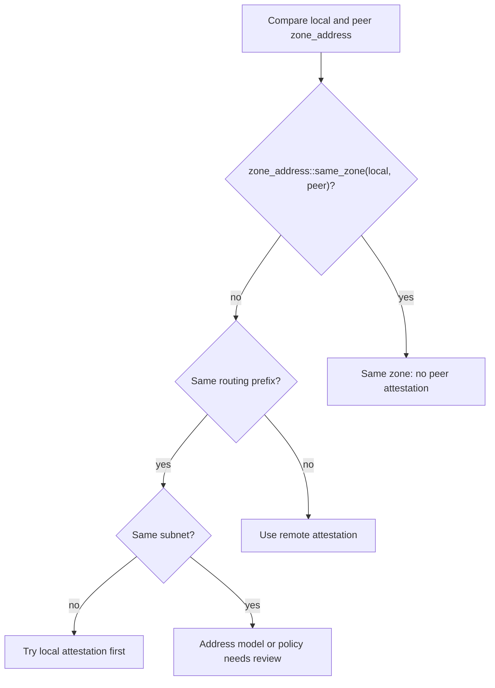
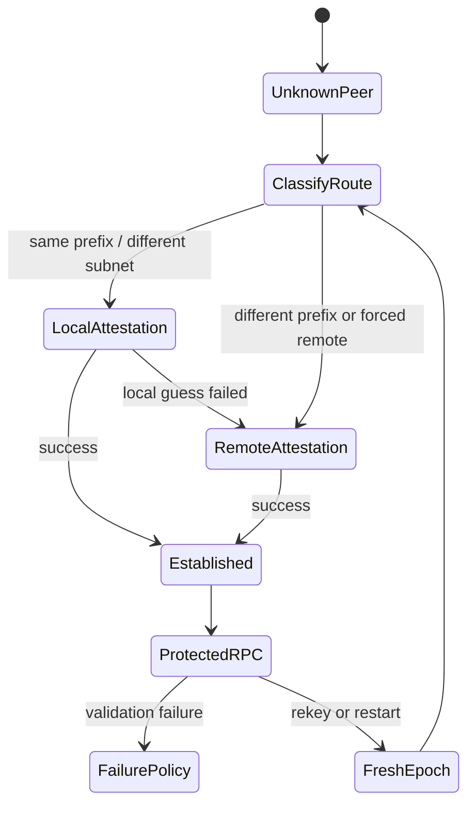
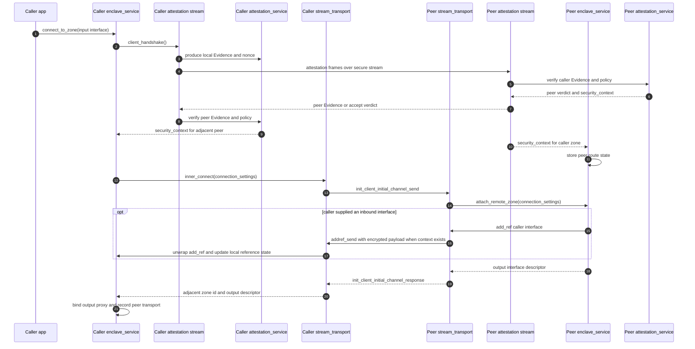
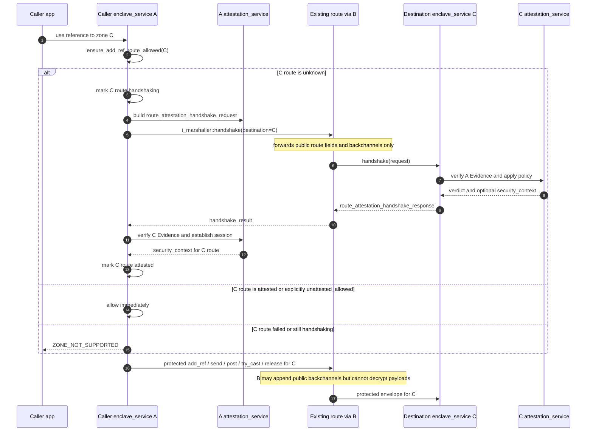

<!--
Copyright (c) 2026 Edward Boggis-Rolfe
All rights reserved.
-->

# Attestation And Protected RPC Overview

## Status

Design and implementation-tracking document. The current repository has a
development fake-attestation backend, an attestation stream decorator, an
enclave-service protected `send`/`post` envelope, encrypted `try_cast`,
`add_ref`, and `release` payload wrapping, route-state storage, and an opt-in
reference route-attestation gate backed by the first service-level
`i_marshaller::handshake()` payload. SGX-sim
host tests now drive an
unknown-route `add_ref` through `rpc::stream_transport` and verify the
service-level handshake updates both enclave-service route-state maps.
Additional host tests drive generated `send`, `[post]`, `try_cast`, `add_ref`,
and `release` traffic through `rpc::enclave_service` with protected RPC enabled
and verify that the observed streaming messages are encrypted payload carriers
rather than plaintext application calls. They also verify that protected outer
`remote_object_id` values expose only the destination zone, not the object id.
The repository does not yet have real SGX/DCAP evidence production or
protected encrypted carriers for every marshaller method.

This section describes the intended security model for enclave-to-enclave
Canopy RPC:

- direct peer-to-peer attestation when two machines or enclaves establish a new
  transport link;
- RPC-level attestation and key exchange when a zone is reached through an
  existing transport;
- end-to-end encrypted marshaller payloads for application RPC traffic;
- public back-channel records for routing, attestation context, key ids,
  telemetry ids, and other metadata that intermediates may read and append to;
- policy-driven validation of caller zone ids, destination zone ids, and
  enclave identity.

## RATS Vocabulary

Canopy attestation follows the RFC 9334 Remote Attestation Procedures (RATS)
architecture. The core roles are backend-neutral:

- **Attester** -- the party producing Evidence about itself. In Canopy, this
  is normally the enclave-resident attestation service. For DCAP, it asks the
  SGX QE3 for a quote. For fake, simulation, local SGX, or EPID backends, the
  Evidence producer is backend-specific.
- **Verifier** -- the party that evaluates Evidence against an
  Endorsement/Reference Value/Appraisal policy and produces Attestation
  Results. For DCAP, this may include the Intel Quoting Verification Enclave
  (QvE) plus the policy enforced by Canopy's attestation service.
- **Relying Party** -- the party that consumes Attestation Results to make
  an access or routing decision. For Canopy, an `rpc::service` deciding
  whether to admit a peer zone and grant capabilities.
- **Evidence** -- backend-specific proof material. For DCAP this is usually
  raw `sgx_quote3_t` bytes. For local SGX it is an `sgx_report_t`. For fake
  and simulation backends it is explicit development evidence.
- **Attestation Results** -- the appraised verdict. For DCAP this includes
  the QvE or quote-verifier result plus Canopy's policy outcome.

The two topologies the architecture defines, both relevant to Canopy:

- **Passport model** -- the Attester contacts a Verifier *before* the TLS
  handshake, receives a signed Attestation Result, and presents it to the
  Relying Party. Useful when the Relying Party is offline or constrained
  (e.g. browsers).
- **Background-check model** -- the Attester sends raw Evidence to the
  Relying Party, which relays it to a Verifier and receives Attestation
  Results back. This is the default for enclave-to-enclave Canopy. For DCAP,
  the verifier path may use the QvE when the relying side is itself an
  enclave.

Use these names throughout the rest of the design. Reserve "attestation
service" for the in-enclave implementation object that may play both
Attester and Verifier roles depending on which side of the handshake it is
on.

## Core Decisions

- The attestation service is backend-neutral. Fake, simulation, SGX local,
  SGX DCAP/ECDSA, SGX EPID/IAS, and verify-only host/browser backends should
  share the same high-level interface.
- Remote SGX attestation targets DCAP/ECDSA for modern production deployments.
  EPID/IAS remains a legacy SGX1 compatibility backend when policy explicitly
  accepts it.
- SGX is the first concrete target, but the service boundary, policy model,
  and wire records should not encode SGX-only assumptions. Intel TDX, AMD
  SEV-SNP, Arm TrustZone/PSA, and future TEE backends should plug in as
  backend implementations behind the same high-level interface.
- Fake attestation is a first-class development backend for machines without
  SGX hardware. It exercises protocol, envelope, key exchange, and policy code,
  but it is never production evidence.
- Local attestation is used for distinct enclaves on the same platform.
- Routing prefix classification is a heuristic, not proof. If two zones have
  the same `zone_address::get_routing_prefix()` and different subnets, the
  first attempt may use local attestation. If their routing prefixes differ,
  use remote attestation. If the local guess is wrong, the implementation may
  fall back to remote attestation.
- Each enclave owns an attestation/security service. Multiple Canopy services
  and zones inside the enclave share it.
- Non-enclave services cannot produce enclave attestation, but they can validate
  enclave evidence and can participate in protected key exchange if their policy
  allows it.
- Browser and JavaScript clients are asymmetric: they may verify enclave
  attestation when evidence is exposed, but they usually cannot provide SGX
  client attestation. FIDO or mobile identity can be a separate client-auth
  path.
- Once an enclave identity is established, trust initially applies to all zones
  in that enclave. Per-subnet or per-zone attestation may be added later.
- Direct intermediate zones do not decrypt ordinary `send` or `post` payloads.
  They lack the end-to-end keys and are not trusted for application
  confidentiality.
- Intermediates may still be trusted for route liveness/control messages, such
  as reporting that a route to a crashed downstream zone is gone, because they
  may be the only channel available.
- Enclave restarts create a fresh epoch. Message counters do not need to survive
  restart as long as keys are never reused across epochs.
- AES-GCM is acceptable for protected envelopes if nonce uniqueness is treated
  as a hard invariant: never reuse a `(key, nonce)` pair.

## Service And Transport Roles

The `rpc::service` class is the natural enforcement point. The service can
implement reserved control interfaces itself, while the key material and
attestation policy live in a separate enclave-wide attestation service object.

The current service has outbound hooks for these marshaller calls, so an
enclave-derived service should protect them before they leave the enclave:

- `send`
- `post`
- `try_cast`
- `add_ref`
- `release`

The `object_released` marshaller path also needs protection when optimistic
reference notifications cross an enclave boundary. The end-to-end protected
form of `transport_down` is deferred. For now, `transport_down` remains a
route-liveness/control message that an intermediate may synthesize according to
policy.

The other `i_marshaller` methods are:

- `object_released`
- `transport_down`
- `post_report`
- `get_new_zone_id`

`post_report` and `get_new_zone_id` are special cases. They commonly target a
host/root control path and may not be encrypted in the first implementation, but
`get_new_zone_id` still needs policy review because a hostile allocator can
assign misleading route ids. A likely design is for the host to suggest route
or subnet data while the enclave attestation service binds the allocation to
enclave identity.

Inbound marshaller methods on the enclave-derived service unwrap protected
payloads, validate policy, and then pass the recovered plaintext request to the
internal implementation or generated stub.

The first reference-control hardening step now combines route-state gating
with encrypted `payload_type_id` / `payload` carriers for `try_cast`,
`add_ref`, and `release`. `rpc::enclave_service` can require add-ref route
attestation, treat established attested routes as allowed, explicitly allow
configured unattested routes, and fail closed for failed or still-handshaking
routes. Unknown `add_ref` routes start the route-addressed `handshake()` path
and remain blocked until the service-level attestation exchange marks the
route allowed. `try_cast` and `release` do not start new handshakes: if the
caller route is unknown when one of those messages arrives, the system treats
that as an elided or failed protected `add_ref` and rejects it. The current
route-attestation payloads are generated RPC/YAS structs:
`route_attestation_handshake_request` and
`route_attestation_handshake_response`. They carry backend-neutral identity,
CMW-like Evidence, transcript id, nonce, backend id, security level, and the
structured accept/reject verdict. A route becomes `attested` only after peer
Evidence verifies and a `security_context` is established. A route becomes
`unattested_allowed` only when Evidence is absent and policy explicitly does
not require it.

For the current transport implementation, `build_out_param_channel` remains a
visible add-ref route-control field because `rpc::transport::inbound_add_ref`
uses it before the service hook can unwrap a protected payload. Protected
add-ref binds that visible value as AEAD associated data and repeats it inside
the encrypted plaintext. Hiding it is deferred to a later transport-route
refactor.

For the same reason, `release_options` remains visible to the transport
lifetime path. Protected release binds that value as AEAD associated data and
repeats it inside the encrypted plaintext.

Protected `try_cast` exposes only the route and the encrypted-payload carrier
type. The requested interface id is encrypted.

## Routing Classification

The attestation service can make an initial local-versus-remote choice from
`rpc::zone_address`:



`zone_address::same_zone()` already ignores object id and answers whether an
address belongs to the same zone. It should not be used as proof that two
different subnets are on the same physical CPU.

If `same_zone()` is false but the routing prefix and subnet are both equal,
the addresses differ in some other capability or format metadata. Treat that
as a policy/address-model review case rather than silently choosing local or
remote attestation.

`zone_address::get_routing_prefix()` is the routing hint for the local
attestation guess. This can change as the address model evolves. A deployment
may always use remote attestation locally if the routing-prefix heuristic is
wrong or too weak for policy.

## Control Envelope Composition

Protected traffic uses two different notions that should not be conflated:

- the outer protected-envelope marker tells the receiver to decrypt before
  dispatch;
- the inner decrypted target says which object/interface/method should receive
  the call.

The outer marker should use an IDL fingerprint for an envelope type, for
example `rpc::id<encrypted_payload>::get(version)`, carried in the outer
`interface_id` field with `method_id == 0`. In this role, `interface_id` is a
type discriminator rather than a normal interface implementation id.

`interface_id == 0` is the unset/invalid sentinel. For protected traffic it is
not a valid envelope marker. An inbound protected message with
`interface_id == 0` is invalid.

The decrypted inner target may be an ordinary application object, or it may be
the reserved service object id plus a reserved attestation/control interface
fingerprint such as `i_remote_attestation`.

## State Machine



## RPC Sign-On Sequence Diagrams

These diagrams show the intended RPC sign-on shape using the current code
names. Direct sign-on uses the attestation stream before the RPC transport
connects. Routed sign-on uses `i_marshaller::handshake()` after a route already
exists.

### Direct Stream Sign-On



After this sign-on, generated `send`, `[post]`, endpoint `try_cast`, endpoint
`add_ref`, and endpoint `release` traffic can be wrapped by
`rpc::enclave_service` using the established `security_context`.

### Routed Service-Level Sign-On



This is the path used when a remote client passes an interface whose
`remote_object_id` belongs to a zone behind the adjacent transport. The
adjacent zone is still the transport peer, but the attested route check is for
the zone named by the object being referenced.

### Protected Runtime After Sign-On

```mermaid
sequenceDiagram
    autonumber
    participant ProxyA as Caller proxy/stub logic
    participant ServiceA as Caller enclave_service
    participant AttA as Caller attestation_service
    participant Route as Route / intermediate zones
    participant ServiceC as Destination enclave_service
    participant AttC as Destination attestation_service
    participant StubC as Destination stub/service

    ProxyA->>ServiceA: outbound_send / outbound_post / outbound_try_cast / outbound_add_ref / outbound_release
    ServiceA->>AttA: find security_context and derive AEAD key
    AttA-->>ServiceA: key material and next e2e counter
    ServiceA->>Route: outer route fields + encrypted_payload
    Note over Route: may append public back_channel entries
    Route->>ServiceC: protected envelope
    ServiceC->>AttC: find session, derive key, accept counter
    AttC-->>ServiceC: decrypted payload accepted
    ServiceC->>ServiceC: recover inner fields; keep received outer backchannels
    ServiceC->>StubC: dispatch inner call or try_cast/add_ref/release

    alt send expects a response
        StubC-->>ServiceC: send_result
        ServiceC->>AttC: derive response key and next counter
        ServiceC-->>Route: encrypted response out_buf + public out_back_channel
        Route-->>ServiceA: response
        ServiceA->>AttA: decrypt response and accept response counter
        ServiceA-->>ProxyA: plaintext send_result
    else post/add_ref/release has no protected response body
        ServiceC-->>Route: ack or no response according to marshaller method
    end
```

## Direct Attestation Flow

When two zones connect directly over a new stream:

1. The secure stream establishes the encrypted byte channel.
2. The attestation stream uses the enclave attestation service to verify peer
   evidence and negotiate a session.
3. The attestation service creates an enclave-pair session id, keys, and
   counters.
4. The transport receives the session id and security context as part of its
   connection setup.
5. RPC marshaller traffic over that transport uses the established context.

The exact attestation evidence format is backend-specific. Modern SGX hardware
builds use DCAP/ECDSA for remote attestation and SGX local reports for
same-platform enclave pairs. SGX1 compatibility builds may use EPID/IAS if the
application policy accepts that legacy backend. Simulation and fake-SGX builds
use explicit development policy and must not silently claim production
attestation.

## Binding Modes

Canopy uses different binding inputs depending on where attestation is carried.
These modes must not be treated as interchangeable:

- `sgx_ttls` RA-TLS carries evidence in an X.509 certificate extension during
  the TLS handshake. Intel's helper hashes public-key claims into SGX
  `report_data`, and the same key signs `CertificateVerify`.
- The IETF TLS attestation draft carries CMW Evidence or Attestation Results in
  TLS Certificate message extensions. The attested TIK then proves possession in
  `CertificateVerify`.
- The in-tunnel development exchange carries evidence as application bytes
  after the TLS handshake. It can bind Evidence to a TLS exporter value plus
  Canopy transcript context.
- Routed RPC attestation carries evidence over an existing RPC route. It binds
  Evidence to the end-to-end key-exchange transcript, not to adjacent TLS.

In the TLS-attestation modes, the key being attested is the TLS Identity Key
(TIK). The IETF draft defines the TIK as the key used by a TLS peer to
authenticate during the handshake. In combined X.509 mode, the TIK is the leaf
certificate's end-entity key.

For the vendored Intel `sgx_ttls` path, the Evidence binding is not a Canopy
TLS-exporter hash. `tee_get_certificate_with_evidence` builds public-key claims
from the supplied certificate key and hashes those claims into SGX
`report_data`. `CertificateVerify` then proves possession of the same private
key during the TLS handshake.

The in-tunnel development exchange is a separate mode. It is useful before
certificate-extension support is wired in, and it can bind Evidence to a TLS
exporter value. It does not have the same handshake semantics as `sgx_ttls`
RA-TLS and should not be documented as if the two bindings are identical.

Routed RPC attestation is separate again. A route such as `A -> B -> C` does
not give A and C an adjacent TLS handshake. Their attestation transcript must
therefore bind Evidence to an end-to-end key exchange carried in RPC payloads.

The concrete wire format -- where the Evidence is carried and how peers
negotiate attestation use -- is described in [Wire Format](wire-format.md).

## Routed Attestation Flow

When zone A already has a route to zone B and learns about zone C through that
route, A cannot assume B is trusted to vouch for C's application payloads.
Instead, A and C establish their own end-to-end attestation/key-exchange
relationship using RPC messages carried over the existing route.

The current direction is:

- use a reserved service object id for service-level control traffic;
- use a reserved attestation interface fingerprint, such as
  `i_remote_attestation`;
- allow the caller to speculatively call the reserved attestation function once
  the route exists;
- keep ordinary `try_cast`/reflection for later discovery after attestation or
  when bootstrap policy explicitly permits it;
- carry the key-exchange transcript as routed RPC payloads understood only by
  the endpoints.

The reserved service object id is **not** fixed at `UINT64_MAX`; it must be the
maximum value representable by the active `zone_address` object-id bit width.
Implementations must derive it from `zone_address::get_object_id_size_bits()`
rather than hard-coding a literal. This avoids conflicts with variable-width
address layouts.

## Enclave Pair Identity

Attestation cache entries are keyed by an enclave-pair identity, not merely by
adjacent transport:

```text
local_enclave_id
remote_enclave_id
local_routing_identity
remote_routing_identity
attestation_epoch
```

The exact enclave id format is deferred. It must be derived from attested
identity and included in the protected payload or associated public context so
the destination can bucket sessions correctly.

## Policy Model

Production enclave policy is expected to be compiled into the enclave as
constant values. Debug builds may have relaxed policy.

Typical production checks include:

- allowed attestation backend and security level;
- expected `MRSIGNER`;
- expected product id;
- minimum `ISVSVN`;
- debug bit rejected;
- acceptable TCB status;
- acceptable enclave id / routing identity binding.

Upgrade handoff is policy-driven. One valid pattern is for enclave v1 to ask
the host to load enclave v2, attest v2 locally, transfer state if policy
allows, then die and hand over responsibility. Application developers may
choose whether identity keys or sealed state are copied during this handoff.

## Related Documents

- [Attestation Backends](attestation-backends.md)
- [Wire Format](wire-format.md)
- [DCAP Operations](dcap-operations.md)
- [Protected RPC Envelope](protected-rpc-envelope.md)
- [Zone Address Validation](zone-address-validation.md)
- [Back-Channel Context](back-channel-context.md)
- [Failure Policy](failure-policy.md)
- [Implementation Plan](implementation-plan.md)
- [SGX Enclave Threat Model](../sgx-threat-model.md)
- [SGX Runtime Lifecycle Security](../sgx-runtime-lifecycle.md)
