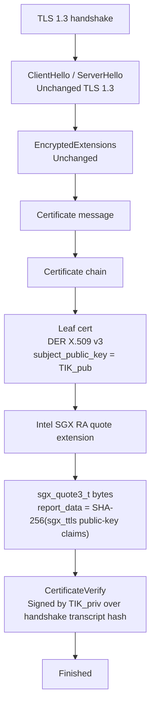

<!--
Copyright (c) 2026 Edward Boggis-Rolfe
All rights reserved.
-->

# Wire Format

## Purpose

This document describes how attestation Evidence and Attestation Results
travel on the wire between Canopy zones. It is deliberately separate from
the architecture in [overview.md](overview.md) because the wire format is
expected to evolve faster than the architectural roles: today on a
certificate envelope shipped by the SGX SDK; tomorrow possibly on the
forthcoming IETF TLS attestation extensions. Section labels in this
document name carriers, not implementation-plan phase numbers.

The architecture (Attester, Verifier, Relying Party, Evidence,
Attestation Results, passport vs background-check) and the binding to the
TLS Identity Key are stable design decisions for TLS-carried attestation. The
byte layouts below are the implementation choice that realises them.

## Design Constraints

- The format must be **backend-neutral**. DCAP, SGX local report, EPID,
  Fake, Simulation, TDX, SEV-SNP, TrustZone/PSA, and any future TEE must
  travel through the same shape with a discriminator.
- TLS-carried attestation must bind Evidence to the TLS Identity Key (TIK).
  The attested TIK signs the TLS handshake transcript hash in
  `CertificateVerify`. See [overview.md, "Binding Modes"](overview.md).
- The format must support both **mutual** and **asymmetric** attestation
  (e.g. browser clients that verify but cannot attest).
- The format must support both **passport** and **background-check**
  topologies, decided per side at session establishment.
- The first SGX carrier must run on the TLS stack Canopy already ships
  (Mbed TLS or SGXSSL) without forking the library.
- The IETF TLS-attestation carrier should be a transcription, not a rethink,
  if and when the standards work stabilises.

## Conceptual Envelope: CMW

Evidence and Attestation Results are carried in a RATS Conceptual
Messages Wrapper (CMW), per `draft-ietf-rats-msg-wrap`. CMW is a small,
serialisation-agnostic structure:

```text
cmw {
    media_type     : string or integer    // e.g. "application/eat+cwt"
                                          //      "application/sgx-quote3"
                                          //      "application/sgx-report"
                                          //      "application/canopy-fake-evidence"
    content_format : optional indicator   // e.g. CBOR vs JSON, content profile
    payload        : bytes                // the actual Evidence or Result
}
```

Canopy may serialise CMW with YAS binary on internal RPC carriers because that
matches the existing RPC stack. TLS-attestation standards work uses its own
CMW encodings and negotiation. The attestation service should consume a
normalised CMW value in either case, route inbound Evidence to a backend by
media type, and refuse unknown media types.

Reserved or provisional Canopy media types:

| Media type | Backend | Notes |
|---|---|---|
| `application/sgx-quote3` | DCAP | Raw `sgx_quote3_t` bytes. |
| `application/sgx-report` | SGX local | Raw `sgx_report_t` for local attestation. |
| `application/eat+cwt` | EAT | Reserved for future EAT/KAT use. |
| `application/canopy-fake-evidence` | Fake | Development backend. |
| `application/canopy-sim-evidence` | Simulation | Canopy SGX-sim development profile. May carry `sgx_sim_report_evidence`; not hardware evidence. |
| `application/canopy-sgx-epid-evidence` | SGX EPID | Canopy legacy SGX1 EPID profile. Carries `sgx_epid_quote_evidence` when a quote provider and verifier are configured; fail-closed otherwise. |
| `application/tdx-quote` | Intel TDX | Future backend; exact profile deferred. |
| `application/sev-snp-attestation-report` | AMD SEV-SNP | Future backend; exact profile deferred. |
| `application/psa-attestation-token` | Arm TrustZone/PSA | Future backend. |

These names are private to Canopy unless a future profile explicitly maps them
to registered IANA media types. In particular, `application/sgx-quote3` is a
Canopy-private name, not a registered standard media type.

CMW is the only "wire concept" the rest of the design needs to know
about. Everything else in this document is realisation choice.

## In-Tunnel Development Carrier

This carrier is used by [implementation-plan.md, phase 2](implementation-plan.md).
It runs after the normal TLS handshake, as length-prefixed application bytes
inside the already secure stream. It is useful for development because it needs
no custom certificate extension hooks.

The framing is deliberately small:

```text
attestation_frame {
    frame_kind
    transcript_id
    cmw
}
```

`frame_kind` is one of:

- `client_hello_attest` -- connector capabilities, nonce, requested mode.
- `server_hello_attest` -- listener selection, nonce, requested peer evidence.
- `evidence` -- CMW Evidence or Attestation Results from one side.
- `evidence_verdict` -- accept/reject result and selected security context.

Evidence in this carrier binds to a TLS exporter value plus Canopy transcript
context. That binding is intentionally different from `sgx_ttls`, where the
SGX report data is produced by Intel's certificate helper.

The same conceptual frame sequence can be reused later by direct HTTP and
WebSocket listeners after their ordinary TLS or secure-stream setup completes.
Those transports should treat the exchange as direct stream authentication:
publish the resulting `security_context` to the owning service, then let the
service-level route handshake protect any remote zones or references carried
over that stream. Browser-facing JSON APIs must encode opaque CMW payload bytes
as base64 and must opt in explicitly when the peer is allowed to verify the
server without sending enclave Evidence of its own.

## Current SGX Carrier: Quote-Bearing X.509 Via `sgx_ttls`

The vendored SGX SDK ships an Intel-blessed helper that embeds a DCAP
quote in an X.509 certificate extension:

- `tee_get_certificate_with_evidence` (enclave side, Attester)
- `tee_verify_certificate_with_evidence` (enclave side, Verifier)

See `submodules/confidential-computing.sgx/common/inc/sgx_ttls.h` and
[DCAP Operations](dcap-operations.md).

Wire shape for the `sgx_ttls` carrier:



The Relying Party's TLS verify callback runs
`tee_verify_certificate_with_evidence`, which:

1. Extracts the quote from the X.509 extension.
2. Runs full DCAP verification via the QvE.
3. Returns the quote verdict and supplemental data.

The Relying Party then applies Canopy application policy
(`MRENCLAVE` / `MRSIGNER` / `ISVPRODID` / `ISVSVN` / `DEBUG` / TCB
status / Canopy zone identity binding) to the embedded report.

Because the TIK is the leaf certificate's public key, the standard TLS
`CertificateVerify` signature performs the session binding. No Canopy
exporter-binding hash is required in this `sgx_ttls` RA-TLS mode.

### Encoding The CMW In The `sgx_ttls` Carrier

The `sgx_ttls` carrier uses native SDK structures rather than emitting CMW on the wire.
This is acceptable because the quote bytes are already self-describing
and the Verifier is `sgx_ttls`, not a generic CMW consumer.

Internally, the Canopy attestation service should still hand Evidence to its
backend layer as `CMW { media_type = "application/sgx-quote3", payload =
quote_bytes }`. The wire envelope is the X.509 extension; the in-process
boundary speaks CMW. This isolates the backend interface from the wire format
and lets a later TLS-extension carrier replace the envelope without rewriting
the backend.

### Capability And Backend Negotiation In The `sgx_ttls` Carrier

The `sgx_ttls` carrier has no in-handshake attestation negotiation. The agreement is
out-of-band: the listener is configured with a backend and a peer-
verification policy; the connector is configured to expect a matching
backend.

When the listener and connector disagree, the TLS handshake fails at
certificate verification. Canopy maps that failure to the failure-policy
document; there is no graceful fallback. A future revision may add a
back-channel `attestation_capability` entry so peers can detect a mismatch
before sending a quote.

## Future Carrier: IETF TLS Extensions

`draft-fossati-tls-attestation-09` defines TLS 1.3 extensions for attestation:

- `evidence_proposal` / `evidence_request`
- `results_proposal` / `results_request`
- `attestation_evidence` extension inside `CertificateEntry`
- new `attestation` certificate type for attestation-only mode

The draft uses CMW as the Evidence envelope inside the TLS Certificate
message. The binding mechanism is the same at the TLS layer: the attested TIK
signs the transcript hash through `CertificateVerify`, but the Evidence travels
in TLS attestation extensions rather than an Intel-specific X.509 extension.

Canopy should migrate to this format when:

- the draft is adopted by the IETF TLS WG (filename becomes
  `draft-ietf-tls-attestation-NN`);
- IANA codepoints for the extensions and alerts are allocated;
- at least one TLS library Canopy uses (Mbed TLS or SGXSSL) ships
  upstream support, or Canopy commits to maintaining a patch.

Until those conditions hold, the `sgx_ttls` carrier is the practical SGX
implementation choice.

### Migration Shape

The migration is mechanical because the architectural roles do not
change:

- **Negotiate attestation use.** `sgx_ttls`: out-of-band configuration.
  IETF carrier: `evidence_proposal` and `evidence_request` extensions.
- **Carry Evidence.** `sgx_ttls`: X.509 extension on the leaf certificate.
  IETF carrier: TLS `attestation_evidence` extension, or the new
  `attestation` certificate type for attestation-only mode.
- **Carry Attestation Results (passport mode).** `sgx_ttls`: X.509 chain or a
  separate certificate. IETF carrier: `Certificate` message.
- **Bind to TLS session.** Both TLS carriers: the TIK signs the handshake
  transcript via `CertificateVerify`.
- **Evidence envelope (in-process).** Both TLS carriers: CMW.
- **Backend selector.** Both TLS carriers: `media_type` in CMW.
- **Refuse-on-mismatch.** `sgx_ttls`: TLS certificate verification failure.
  IETF carrier: `unsupported_evidence` and `unsupported_verifiers` alerts.

The backend interface, attestation service, and policy layer should not
need to change. Only the framing module that produces and consumes the
TLS-level bytes does.

## Passport Versus Background-Check On The Wire

Both topologies are supported by both TLS carriers.

- **Background-check (default for enclave-to-enclave Canopy).** The
  Attester sends Evidence in the X.509 extension or, with the IETF carrier,
  in a TLS extension. The Relying Party runs its local Verifier (the QvE)
  inline.
- **Passport (for constrained Relying Parties).** The Attester first
  contacts a Verifier out of band, receives signed Attestation Results
  (for example a JWT verification-result token from `tee_verify_quote_qvt`
  -- see [DCAP Operations](dcap-operations.md)), and presents those
  Results in place of raw Evidence. The Relying Party only checks the
  Verifier signature and applies policy.

The CMW envelope distinguishes the two by `media_type`: Evidence carries
the underlying quote media type; Results carry a verification-result-token
media type. Application policy decides which the listener will accept.

## Asymmetric Attestation (Browser And Public Clients)

Browser-class clients can verify Canopy enclave Evidence (they have full
TLS plus crypto) but cannot themselves produce SGX Evidence. The wire
format already supports this:

- the enclave listener attests as the TLS server (Attester);
- the browser does not attest;
- peer-verification on the server context is `none` for browsers, or
  `optional`/`required` only for non-browser peers;
- browser-side identity is established by an orthogonal mechanism (FIDO,
  bearer token, OAuth) that Canopy carries as an application capability,
  not as Evidence.

With the IETF carrier, the browser side does not advertise any
`evidence_proposal`, and the server omits `evidence_request`. The TLS
handshake completes normally; the server-side Evidence is still verified by
the browser if its TLS stack supports the IETF draft.

## What This Document Does Not Cover

- The protected RPC envelope that wraps marshaller payloads end-to-end --
  see [protected-rpc-envelope.md](protected-rpc-envelope.md). The TLS
  binding handles session authentication; the protected envelope handles
  application confidentiality and routing.
- Local attestation between same-platform sibling enclaves over SPSC or
  loopback transports -- that path does not use TLS at all and follows
  the SGX local-report exchange described in
  [implementation-plan.md, phase 5](implementation-plan.md).
- Routed attestation between zones reached through an existing RPC route
  -- see the "Routed Attestation Flow" section of
  [overview.md](overview.md).

## References

- RFC 9334, RATS Architecture.
- `draft-fossati-tls-attestation-09` (IETF, individual, TLS WG intended).
- `draft-ietf-rats-msg-wrap` (CMW envelope).
- `draft-bft-rats-kat` (Key Attestation Token, illustrative EAT
  instantiation).
- Intel SGX SDK `sgx_ttls` API
  (`submodules/confidential-computing.sgx/common/inc/sgx_ttls.h`).
- [DCAP Operations](dcap-operations.md).
- [Attestation Backends](attestation-backends.md).
