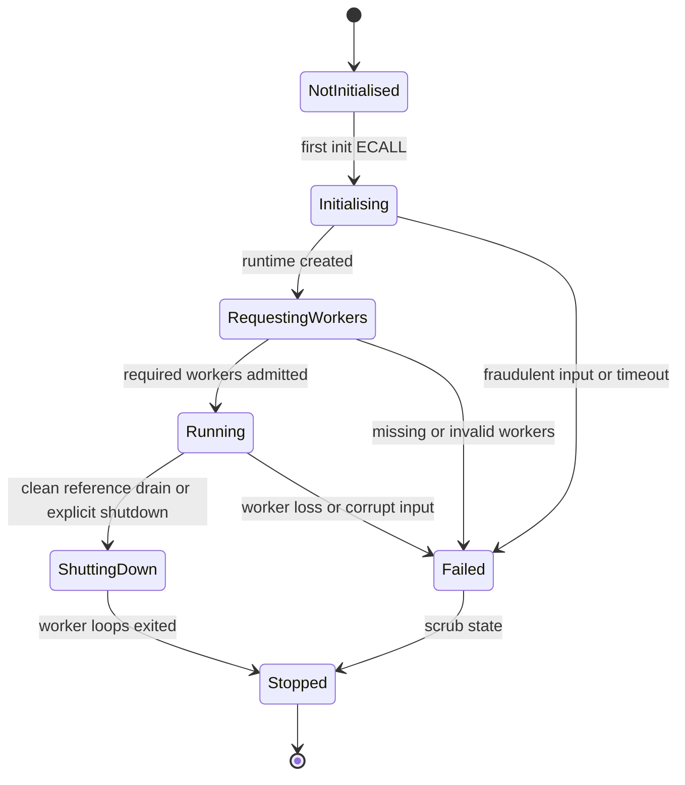

<!--
Copyright (c) 2026 Edward Boggis-Rolfe
All rights reserved.
-->

# SGX Runtime Lifecycle Security

This document tracks attacks against the SGX coroutine runtime lifecycle.

## Runtime State Machine

The enclave runtime should have a strict monotonic lifecycle:

There is no transition back to `NotInitialised`. A second init ECALL in the same
enclave instance is fraudulent even after shutdown.

## Coroutine Runtime Profile

Host coroutine builds should track upstream `jbaldwin/libcoro` as closely as
practical. The host side can use the full upstream feature set, including
networking, thread pools, poll/fd integration, and upstream task or scheduler
fixes. Host-specific Canopy changes should live outside libcoro where possible;
when a host-side libcoro change is genuinely required, prefer an upstreamable
patch over a private fork.

The enclave side should use a deliberately small libcoro-compatible profile
rather than a full libcoro port. It should expose only the subset Canopy needs:

- `coro::task`
- `coro::event`
- a minimal scheduler or executor model suitable for ECALL-driven workers
- small helpers such as `when_all` or `when_any` only when Canopy code directly
  requires them

The enclave profile should not include host OS integration:

- no TCP stack
- no DNS or c-ares
- no TLS or OpenSSL
- no `poll`, fd, socket, or thread-pool dependency
- no dependency on OCALL-driven logging or RPC

The enclave scheduler, event, and task implementation are enclave runtime code.
Detached task ownership, event wakeup deferral, coroutine-frame destruction, and
multi-ECALL worker admission are core correctness and security surfaces.

Canopy should depend on a narrow coroutine abstraction contract that both host
and enclave runtimes satisfy. Compatibility tests should cover:

- detached task lifetime
- event wait and event set ordering
- event wakeups that complete waiting coroutines
- scheduler shutdown with outstanding suspended tasks
- transport-style producer/consumer loops
- streaming transport setup and teardown under both host and enclave profiles

## Attack Vectors

### Reinitialisation

Attack:

- call `canopy_coroutine_init_enclave` a second time
- attempt to reuse residual scheduler, service, queue, or object state
- attempt to bind the enclave to a new host transport after secrets existed

Mitigation:

- maintain an enclave-local one-shot init guard
- return `FRAUDULANT_REQUEST()` on any second init
- require enclave destruction and recreation for a new runtime

### Worker Under-Supply

Attack:

- call init but never supply all requested worker ECALLs
- starve the enclave before runtime construction completes

Impact:

- denial of service
- potential timeout paths that must not leak state

Mitigation:

- enclave chooses required worker count
- init waits for the required workers
- timeout or shutdown request marks startup failed
- scrub sensitive state before returning failure

### Worker Over-Supply Or Duplicate Admission

Attack:

- enter extra workers
- enter the same worker index twice
- race worker admission to inflate the attached count

Impact:

- scheduler corruption
- unexpected concurrent execution
- possible misuse of worker-local queues

Mitigation:

- bound worker index against enclave-selected worker count
- maintain per-worker admission bits
- reject duplicate, out-of-range, or late workers as `FRAUDULANT_REQUEST()`

### Worker Loss During Runtime

Attack:

- stop or kill a host thread that is resident in the enclave
- leave the runtime with too few executor workers

Impact:

- denial of service
- possible stalled release/destructor paths

Mitigation:

- treat unexpected worker exit before shutdown as fatal
- stop accepting new inbound messages
- scrub secrets and enter fatal shutdown
- do not continue with a degraded executor unless explicitly designed

### Malformed ECALL Arguments

Attack:

- pass null, aliased, misaligned, or enclave-internal pointers where host memory
  is expected
- pass invalid request blobs
- use stale startup status memory

Mitigation:

- validate all ECALL blobs before deserialisation
- validate shared queue pointers as outside-enclave and aligned
- reject aliased queue pointers
- validate startup status ABI version and alignment
- treat malformed control-plane input as fraudulent

## Shutdown Rule

Clean object reference drain is not a transport failure. Fraudulent lifecycle
input is different: it should trigger a fatal path, not normal graceful
transport close.

The shutdown sequence itself is described in
[Zone Shutdown Sequence](../protocol/zone_shutdown_sequence.md).
