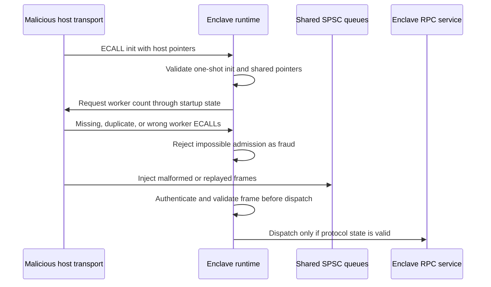

<!--
Copyright (c) 2026 Edward Boggis-Rolfe
All rights reserved.
-->

# SGX Enclave Threat Model

This document describes the threat model for Canopy SGX transports, especially
the coroutine SGX transport.

## Trust Boundary

The enclave trusts only code and data inside the enclave after validation. The
host process, host transport implementation, shared queues, ECALL arguments,
OCALL results, scheduling behaviour, and wall-clock progress are untrusted.

The host can:

- call ECALLs in an unexpected order
- call ECALLs repeatedly
- omit expected ECALLs
- stop, pause, or kill host threads that entered the enclave
- provide malformed ECALL buffers
- provide invalid or aliased shared-memory pointers
- corrupt shared queue contents
- replay or reorder queue messages
- inject syntactically valid but unauthorised RPC messages
- observe or suppress OCALL logging
- destroy the enclave at any time

SGX protects enclave memory from direct host reads, but it does not make the host
honest and it does not guarantee availability.

The host zone is therefore an untrusted router. It may be necessary for network
I/O, queue allocation, scheduling, and future io_uring integration, but enclave
application payloads, capability validation material, attestation-derived keys,
and object contents must remain inside the enclave or inside encrypted frames.

## Security Goals

- Do not disclose enclave secrets to a malicious host transport.
- Do not disclose application payloads to a host zone that only needs routing
  information.
- Do not act on unauthenticated or impossible protocol input.
- Do not allow a second runtime initialisation inside the same enclave instance.
- Do not continue executing after fraudulent control-plane input.
- Do not leak sensitive data through logs or diagnostic paths.
- Do not treat denial of service as recoverable protocol success.
- Bind remote peers to verified attestation evidence before trusting them as
  enclave zones.

## Non-Goals

The enclave cannot force the host to:

- supply worker threads
- keep worker threads alive
- continue pumping queues
- preserve wall-clock progress
- keep the enclave loaded

These are availability failures. The enclave response should be fatal shutdown
and state scrubbing, not optimistic recovery.

## High-Level Attack Flow

The last two steps require authenticated stream framing before the protection is
complete. Pointer and ECALL validation are not enough if queue messages remain
plain untrusted RPC frames.

## Current Hardening Baseline

The coroutine SGX runtime should enforce:

- `canopy_coroutine_init_enclave` is one-shot for the enclave lifetime
- there is only one runtime per enclave
- worker ECALLs are accepted only while the runtime is requesting workers
- each worker index is admitted at most once
- worker indices must be in range
- ECALL buffers must be valid enclave memory before deserialisation
- shared queue pointers must be outside enclave memory and properly aligned
- startup status must be outside enclave memory and ABI-compatible

## Major Remaining Work

The largest remaining gap is authenticated stream framing. The SPSC queue is
outside enclave memory, so the host can alter it. Every inbound message should
be authenticated before the RPC transport parses it or mutates service state.

Authenticated framing should include:

- message kind
- direction
- sequence number
- payload length
- source and destination zone information
- request id where applicable

The authenticated data must prevent replay, reordering, truncation, and
cross-direction reuse.

Remote attestation is also not implemented. DCAP or EPID mechanics should live
behind a narrow attestation module that can be used by transport handshakes and
service policy code. The transport handshake needs the attested peer identity
and session keys; service policy needs the resulting identity and measurements
to decide which objects, methods, references, and passthrough routes the peer is
authorised to use.

TLS or RA-TLS for enclave communication must terminate inside the enclave. A
host-side TLS wrapper protects network bytes from other machines, but it still
exposes plaintext to the host and therefore does not protect an enclave from its
host zone.

The future io_uring-in-enclave design should keep cryptographic framing,
sequence checks, deserialisation, and capability validation inside the enclave.
The host can still deny progress, but it should not see anything beyond
authenticated routing metadata and encrypted payload bytes.

The io_uring connectivity plan is tracked in
[SGX Connectivity And io_uring](../sgx/connectivity/README.md).
