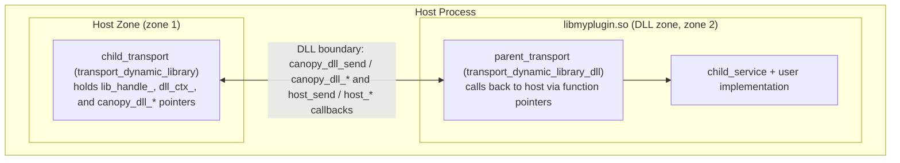
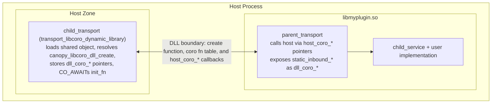

<!--
Copyright (c) 2026 Edward Boggis-Rolfe
All rights reserved.
-->

# Dynamic Library and IPC Child Transports

Scope note:

- this document is primarily a C++ transport document
- the transport concepts are still useful as shared Canopy semantics
- exact target names, ABI names, coroutine behavior, and process-hosting
  details should be read as C++ implementation details unless explicitly stated
  otherwise

Canopy now has four closely related transports and transport-adjacent runtime
components for loading child zones from shared objects or child processes:

- `rpc::dynamic_library` for blocking / non-coroutine builds
- `rpc::libcoro_dynamic_library` for coroutine builds
- `rpc::libcoro_spsc_dynamic_dll` for coroutine builds where the DLL is reached
  over an SPSC stream
- `rpc::ipc_transport` for coroutine builds where the host spawns and owns a
  child process and connects to it through an SPSC-backed `stream_transport`

These pieces are intentionally separate:

- `dynamic_library` and `libcoro_dynamic_library` load a DLL into the current
  process
- `libcoro_spsc_dynamic_dll` runs the DLL runtime behind an SPSC stream
- `ipc_transport` owns a child process and the shared-memory queue pair used to
  talk to it
- `ipc_child_host_process` is not a transport; it is a small executable that
  maps the shared queue pair and forwards it into `libcoro_spsc_dynamic_dll`
- `ipc_child_process` is also not a transport; it maps the shared queue pair and
  hosts a `rpc::stream_transport` directly inside the child process

`rpc::ipc_transport` is not necessarily a hierarchical transport. It is a
process-owning `rpc::stream_transport::transport` that can be combined with
either a direct child-process runtime or a DLL-hosting child-process runtime.

This page should therefore be read as C++ transport/runtime guidance for the
current tree, not as a statement that every Canopy implementation provides the
same DLL or child-process hosting stack.

## See Also

- [Stream Backpressure Guidelines](stream_backpressure_guidelines.md)
- [SPSC Queues and Streams](spsc_and_ipc.md)
- [Hierarchical Transport Pattern](hierarchical.md)

## How They Fit Together

### In-process DLL loading

Use one of these when you want a zone boundary without process isolation:

- `rpc::dynamic_library`
- `rpc::libcoro_dynamic_library`

In both cases the host and child zone live in the same operating-system
process, but the child implementation is loaded from a shared object at runtime.

### Out-of-process DLL loading

Use these together when you want process isolation as well as a DLL boundary:

- `rpc::ipc_transport` in the host process
- `ipc_child_host_process` as the spawned executable
- `rpc::libcoro_spsc_dynamic_dll` inside the child process

The ownership flow is:

1. `ipc_transport` creates a shared-memory SPSC queue pair
2. `ipc_transport` spawns `ipc_child_host_process`
3. the child process maps the queue pair and loads the DLL
4. `libcoro_spsc_dynamic_dll` hosts the child zone behind a
   `rpc::stream_transport`
5. when the transport disconnects, the child process exits and
   `ipc_transport` reaps it

### Out-of-process direct child service

Use these together when you want process isolation without a DLL:

- `rpc::ipc_transport` in the host process
- `ipc_child_process` as the spawned executable

In this mode the child process maps the queue pair and hosts a
`rpc::stream_transport` directly in the process executable.

## Variants At A Glance

| Variant | Namespace / executable | Build mode | Host-side transport | Child-side runtime |
|--------|-------------------------|------------|---------------------|--------------------|
| Blocking DLL | `rpc::dynamic_library` | `CANOPY_BUILD_COROUTINE=OFF` | `transport_dynamic_library` | `transport_dynamic_library_dll` inside the loaded DLL |
| Coroutine DLL | `rpc::libcoro_dynamic_library` | `CANOPY_BUILD_COROUTINE=ON` | `transport_libcoro_dynamic_library` | `transport_libcoro_dynamic_library_dll` inside the loaded DLL |
| Coroutine SPSC DLL | `rpc::libcoro_spsc_dynamic_dll` | `CANOPY_BUILD_COROUTINE=ON` | usually reached via `rpc::ipc_transport` | `transport_libcoro_spsc_dll_host` inside the loaded DLL |
| Process-owned SPSC transport | `rpc::ipc_transport` | `CANOPY_BUILD_COROUTINE=ON` | `transport_ipc_transport` | `ipc_child_host_process` or `ipc_child_process` |

## Entry Points At A Glance

| Variant | Export owned by child | User-implemented entry point |
|--------|------------------------|-------------------------------|
| Blocking DLL | `canopy_dll_*` | `canopy_dll_init` |
| Coroutine DLL | `canopy_libcoro_dll_create` plus `dll_coro_*` callbacks | `canopy_libcoro_dll_init` |
| Coroutine SPSC DLL | `canopy_libcoro_spsc_dll_start` | `canopy_libcoro_spsc_dll_init` |

## Blocking Transport (`rpc::dynamic_library`)

In-process communication between a host zone and a child zone that lives inside a
dynamically loaded shared object (`.so` / `.dll`).  The child zone is loaded at
runtime via `dlopen` / `LoadLibrary` and communicates with the host through a
plain-C ABI boundary consisting of the `canopy_dll_*` entry points.

## When to Use

- Plugin architectures where child zones are supplied as shared libraries
- Isolating third-party code into its own zone without process separation
- Hot-swapping implementations (unload old DLL, load new one)
- Keeping child zone symbols private from the rest of the process

### Requirements

- Non-coroutine build only (`CANOPY_BUILD_COROUTINE` must be **OFF**)
- Linux: `libdl` (linked automatically by CMake)
- Windows: `Kernel32` (linked automatically)

### Architecture



The boundary is a set of C function pointers — no C++ name mangling, no vtable
crossing.  Both sides compile against the same `rpc/` headers and share the
same C++ runtime (same process), so passing `rpc::send_params*` across the
boundary is safe by layout compatibility.

### Two CMake Targets

| Target | Links into | Purpose |
|--------|-----------|---------|
| `transport_dynamic_library` | Host executable | Provides `child_transport`; resolves and calls `canopy_dll_*` |
| `transport_dynamic_library_dll` | Shared object payload | Provides all `canopy_dll_*` entry points; DLL author only writes `canopy_dll_init` |

### Host Side Setup

Create a `child_transport` with the path to the shared object and call
`connect_to_zone` as with any other hierarchical transport.  No factory lambda
is required — the factory lives inside the DLL.

```cpp
#include <transports/dynamic_library/transport.h>

// root_service already created
rpc::shared_ptr<yyy::i_host> host_ptr(new MyHostImpl());

auto child_transport = std::make_shared<rpc::dynamic_library::child_transport>(
    "plugin",           // transport name
    root_service,       // host service
    "/path/to/libmyplugin.so");  // shared object path

auto result = root_service->connect_to_zone<yyy::i_host, yyy::i_example>(
    "plugin", child_transport, host_ptr);

if (result.error_code != rpc::error::OK())
{
    // load or init failed — DLL was not loaded / canopy_dll_init returned error
}

rpc::shared_ptr<yyy::i_example> plugin = std::move(result.output_interface);
```

`connect_to_zone` calls `dlopen`, resolves all `canopy_dll_*` symbols, and
invokes `canopy_dll_init`.  If any step fails the transport is never marked
`CONNECTED` and the error code is returned.

### DLL Side Setup

Link `transport_dynamic_library_dll` into your shared object and provide one
function: `canopy_dll_init`.  All other entry points are compiled for you.

```cpp
// libmyplugin.cpp
#include <transports/dynamic_library/dll_transport.h>
#include <rpc/rpc.h>

// The user must also provide rpc_log (see "Logging" section below).

extern "C" CANOPY_DLL_EXPORT
int canopy_dll_init(rpc::dynamic_library::dll_init_params* params)
{
    return rpc::dynamic_library::init_child_zone<yyy::i_host, yyy::i_example>(
        params,
        [](rpc::shared_ptr<yyy::i_host> host,
           std::shared_ptr<rpc::child_service> svc)
            -> rpc::service_connect_result<yyy::i_example>
        {
            auto impl = rpc::shared_ptr<yyy::i_example>(
                new MyExampleImpl(svc, host));
            return {rpc::error::OK(), std::move(impl)};
        });
}
```

`init_child_zone<P, C>` creates the `parent_transport`, calls
`child_service::create_child_zone<P, C>`, invokes your factory, and writes the
opaque `dll_ctx` handle and the root object descriptor back into `*params`.

#### CMakeLists.txt for the shared object

```cmake
add_library(myplugin SHARED src/myplugin.cpp src/rpc_log.cpp)

target_compile_definitions(myplugin PRIVATE CANOPY_DLL_BUILDING)

target_link_libraries(myplugin PRIVATE
    transport_dynamic_library_dll
    rpc::rpc
    yas_common)

target_compile_options(myplugin PRIVATE
    $<$<CXX_COMPILER_ID:GNU,Clang>:-fvisibility=hidden>
    $<$<CXX_COMPILER_ID:GNU,Clang>:-fvisibility-inlines-hidden>)
```

### Symbol Visibility and Isolation

The DLL is opened with `RTLD_NOW | RTLD_LOCAL` on Linux (or `LoadLibraryA` on
Windows):

- **`RTLD_NOW`**: All undefined symbols are resolved at load time; missing
  symbols cause `dlopen` to fail immediately rather than crashing later.
- **`RTLD_LOCAL`**: The DLL's symbols are not added to the global symbol table.
  Host symbols are not visible inside the DLL, and DLL implementation symbols
  are not visible to the host or other loaded libraries.

Only the `canopy_dll_*` entry points carry
`__attribute__((visibility("default")))` (via `CANOPY_DLL_EXPORT`), making them
discoverable by `dlsym` even when the DLL is compiled with `-fvisibility=hidden`.

The practical consequence: the DLL has its **own statically linked copy** of
`librpc.a` and any other static dependencies.  This is intentional — zones are
designed to be separate worlds communicating only through the transport layer.

### Logging

Because `RTLD_LOCAL` hides host symbols, the DLL cannot use the host's
`rpc_log` function.  Every DLL payload must provide its own `rpc_log`:

```cpp
// rpc_log.cpp — compiled into the shared object
extern "C" void rpc_log(int level, const char* str, size_t sz)
{
    // Route to your preferred logging backend.
    // level: 0=trace 1=debug 2=info 3=warn 4=error 5=critical
    if (level >= 3)
        fprintf(stderr, "[plugin] %.*s\n", (int)sz, str);
}
```

### Lifetime and dlclose Safety

The shared object is kept loaded for as long as the host holds any proxy
reference into the DLL zone.

**When `dlclose` is safe:**  Only after all host-side proxy objects have been
released.  The base class calls `on_destination_count_zero()` at that point,
which is the only place `dlclose` is called.

**Why `set_status(DISCONNECTED)` does not call `dlclose`:**  Disconnect can be
triggered from inside a DLL callback (e.g. the DLL calls a host method which
propagates a transport-down notification back into the DLL).  At that moment
DLL code is still on the call stack.  `set_status` therefore only nulls the
function pointers so that subsequent outbound calls fail gracefully; the actual
unload is deferred until `on_destination_count_zero` (or the destructor if
`child_transport` is destroyed before all proxies are released — e.g. after an
init failure).

```
Sequence for normal shutdown:
  1. Host releases last rpc::shared_ptr<yyy::i_example>
  2. Proxy release propagates to DLL zone via outbound_release
  3. DLL zone ref-count reaches zero → child_service destructs
  4. parent_transport::set_status(DISCONNECTED) fires
     → notify_all_destinations_of_disconnect() called
     → host_ctx_ nulled (no further callbacks)
  5. Host inbound_transport_down handler runs
  6. Host proxy count drops to zero → on_destination_count_zero()
  7. canopy_dll_destroy called → DLL service/transport torn down
  8. dlclose called → shared object unloaded
```

### Key Characteristics

| Property | Value |
|----------|-------|
| Build mode | Non-coroutine only |
| Symbol isolation | `RTLD_LOCAL` + `-fvisibility=hidden` |
| ABI boundary | Plain-C function pointers (`canopy_dll_*`) |
| Zone type | Hierarchical (parent/child) |
| DLL author writes | `canopy_dll_init` + `rpc_log` |
| dlclose timing | Deferred to `on_destination_count_zero` |
| `CONNECTED` set | Inside `inner_connect`, after successful `canopy_dll_init` |

### Hierarchical Transport Pattern

The dynamic_library transport implements the same hierarchical parent/child
pattern as the local and SGX transports.  See
`documents/transports/hierarchical.md` for the circular-reference architecture,
stack-based lifetime protection, and safe disconnection protocol.

The key difference from the local transport is the boundary crossing mechanism:
instead of direct C++ function calls, every call crosses via C function pointers
stored during `canopy_dll_init`.

### Differences from Local Transport

| Aspect | Local | Dynamic Library |
|--------|-------|-----------------|
| Child factory | `set_child_entry_point` lambda | `canopy_dll_init` in DLL |
| Boundary | Direct C++ calls | C function pointer table |
| Symbol isolation | None (same address space) | `RTLD_LOCAL` + visibility |
| `child_service` access | Host holds `shared_ptr` | Opaque inside DLL |
| dlclose | N/A | Deferred to proxy count zero |
| Coroutine support | Yes | No |

### Limitations

- Non-coroutine builds only
- Both host and DLL must be built against compatible versions of `librpc.a`
  (same process; ABI must match)
- `RTLD_LOCAL` means the DLL cannot call back into host-side static library
  functions other than through the explicit `host_*` callback pointers
- One DLL instance per `child_transport`; to load the same `.so` multiple
  times create multiple `child_transport` objects

## Coroutine Transport (`rpc::libcoro_dynamic_library`)

This transport provides the same high-level parent/child-zone behaviour, but
for coroutine builds.  It lives under
`transports/libcoro_dynamic_library/` and uses a distinct ABI so a coroutine DLL
cannot be mistaken for the blocking variant.

### Requirements

- Coroutine build only (`CANOPY_BUILD_COROUTINE` must be **ON**)
- Linux: `libdl` (linked automatically by CMake)
- Windows: `Kernel32` (linked automatically)

### Architecture



The host first calls a synchronous exported function,
`canopy_libcoro_dll_create`, to construct the DLL-side `parent_transport` and
receive a table of coroutine function pointers.  It then `CO_AWAIT`s the
returned `init_fn` coroutine, which creates the child zone inside the DLL.

### Two CMake Targets

| Target | Links into | Purpose |
|--------|-----------|---------|
| `transport_libcoro_dynamic_library` | Host executable | Provides coroutine `child_transport`; loads the DLL and routes host-to-DLL calls through `dll_coro_*` |
| `transport_libcoro_dynamic_library_dll` | Shared object payload | Provides DLL-side transport helpers and ABI types for `canopy_libcoro_dll_create` |

### Host Side Setup

Create a `rpc::libcoro_dynamic_library::child_transport` and use it with the
normal coroutine `connect_to_zone` flow.

```cpp
#include <transports/libcoro_dynamic_library/transport.h>

auto child_transport = std::make_shared<rpc::libcoro_dynamic_library::child_transport>(
    "plugin",
    root_service,
    "/path/to/libmyplugin.so");

auto result = CO_AWAIT root_service->connect_to_zone<yyy::i_host, yyy::i_example>(
    "plugin", child_transport, host_ptr);

if (result.error_code != rpc::error::OK())
{
    CO_RETURN result.error_code;
}

rpc::shared_ptr<yyy::i_example> plugin = std::move(result.output_interface);
```

`inner_connect` performs two phases:

1. Synchronously load the library and call `canopy_libcoro_dll_create`
2. `CO_AWAIT` the DLL-provided `init_fn`

During setup the host also allocates the child zone ID and passes coroutine
callbacks such as `host_send`, `host_post`, and `host_get_new_zone_id` into the
DLL.

### DLL Side Setup

Link `transport_libcoro_dynamic_library_dll` into your shared object and export
`canopy_libcoro_dll_create`.  That function creates the DLL-side
`parent_transport`, returns the host-callable coroutine trampolines, and
supplies an init coroutine that calls `init_child_zone`.

```cpp
#include <transports/libcoro_dynamic_library/dll_transport.h>

static coro::task<rpc::connect_result> do_init(
    void* ctx,
    const rpc::connection_settings* settings,
    std::shared_ptr<coro::scheduler>* scheduler)
{
    return rpc::libcoro_dynamic_library::init_child_zone<yyy::i_host, yyy::i_example>(
        ctx,
        settings,
        scheduler,
        [](rpc::shared_ptr<yyy::i_host> host,
           std::shared_ptr<rpc::child_service> svc)
            -> CORO_TASK(rpc::service_connect_result<yyy::i_example>)
        {
            CO_RETURN {rpc::error::OK(), rpc::make_shared<MyExampleImpl>(svc, host)};
        });
}

extern "C" CANOPY_LIBCORO_DLL_EXPORT
void canopy_libcoro_dll_create(
    rpc::libcoro_dynamic_library::dll_create_params* params,
    rpc::libcoro_dynamic_library::dll_create_result* result)
{
    using namespace rpc::libcoro_dynamic_library;

    auto* pt = new parent_transport(
        params->name,
        params->dll_zone,
        params->host_zone,
        params->host_ctx,
        params->host_send,
        params->host_post,
        params->host_try_cast,
        params->host_add_ref,
        params->host_release,
        params->host_object_released,
        params->host_transport_down,
        params->host_get_new_zone_id,
        params->host_coro_release_parent);

    result->transport_ctx = pt;
    result->init_fn = &do_init;
    result->send_fn = &parent_transport::static_inbound_send;
    result->post_fn = &parent_transport::static_inbound_post;
    result->try_cast_fn = &parent_transport::static_inbound_try_cast;
    result->add_ref_fn = &parent_transport::static_inbound_add_ref;
    result->release_fn = &parent_transport::static_inbound_release;
    result->object_released_fn = &parent_transport::static_inbound_object_released;
    result->transport_down_fn = &parent_transport::static_inbound_transport_down;
}
```

### CMakeLists.txt for the shared object

```cmake
add_library(myplugin SHARED src/myplugin.cpp src/rpc_log.cpp)

target_link_libraries(myplugin PRIVATE
    transport_libcoro_dynamic_library_dll
    rpc::rpc
    yas_common)

target_compile_options(myplugin PRIVATE
    $<$<CXX_COMPILER_ID:GNU,Clang>:-fvisibility=hidden>
    $<$<CXX_COMPILER_ID:GNU,Clang>:-fvisibility-inlines-hidden>)
```

### ABI and Symbol Differences

- The coroutine transport exports `canopy_libcoro_dll_create`, not
  `canopy_dll_init`
- Host and DLL exchange `coro::task` function pointers directly
- No `sync_wait` bridge is needed on either side
- The separate `canopy_libcoro_dll_*` naming prevents loading a blocking DLL by
  mistake

### Lifetime and Unload Behaviour

The coroutine variant differs from the blocking transport in one important way:
on Linux it opens the DLL with `RTLD_NOW | RTLD_LOCAL | RTLD_NODELETE`.

`RTLD_NODELETE` is used because coroutine frames originating from the DLL's
statically linked `librpc.a` may still be scheduled when the last proxy is
released.  Keeping the code pages mapped allows those frames to complete safely
even after normal reference-count teardown has run.

As implemented in `transports/libcoro_dynamic_library/src/transport.cpp`:

- `on_destination_count_zero()` does not unload the library
- `child_transport` unloads the DLL only from its destructor
- function pointers are nulled before `dlclose` / `FreeLibrary`

### Key Characteristics

| Property | Value |
|----------|-------|
| Build mode | Coroutine only |
| Symbol isolation | `RTLD_LOCAL` + `-fvisibility=hidden` |
| ABI boundary | Plain-C create function plus coroutine fn pointers |
| Zone type | Hierarchical (parent/child) |
| DLL author writes | `canopy_libcoro_dll_create` |
| Linux load flags | `RTLD_NOW | RTLD_LOCAL | RTLD_NODELETE` |
| Host connect flow | Create synchronously, then `CO_AWAIT` init |

### Differences From Blocking Dynamic Library Transport

| Aspect | Blocking `dynamic_library` | Coroutine `libcoro_dynamic_library` |
|--------|----------------------------|-------------------------------------|
| Build mode | Non-coroutine only | Coroutine only |
| Primary entry point | `canopy_dll_init` | `canopy_libcoro_dll_create` |
| Cross-boundary calls | Plain C function table | `coro::task` function table |
| Host setup | Load and init inside `inner_connect` | Create synchronously, then `CO_AWAIT` DLL init |
| DLL unload trigger | Deferred until proxy count reaches zero | Deferred until `child_transport` destruction |
| Linux unload safety | Normal `dlclose` timing | Uses `RTLD_NODELETE` |

## SPSC DLL Transport (`rpc::libcoro_spsc_dynamic_dll`)

`rpc::libcoro_spsc_dynamic_dll` is the coroutine DLL runtime used when the DLL
is not loaded by the host directly. Instead, the DLL is given an already-open
SPSC queue pair and exposes its child zone behind a `rpc::stream_transport`.

This transport exists to separate two concerns that used to be coupled:

- how to host a child zone inside a DLL
- how to get bytes to that DLL across a process boundary

`libcoro_spsc_dynamic_dll` owns only the first concern. It assumes the queue
pair already exists and does not spawn processes or create shared-memory files.

### What It Does

- starts a dedicated coroutine scheduler for the loaded DLL
- creates a `streaming::spsc_queue::stream` over the supplied queue pair
- calls the user-provided `canopy_libcoro_spsc_dll_init(...)`
- hosts the DLL child zone behind `rpc::stream_transport`
- notifies the embedding host runtime when the parent transport expires

### What It Does Not Do

- it does not create the shared-memory file
- it does not spawn or reap a child process
- it does not parse process-launch policy

Those responsibilities belong to `rpc::ipc_transport` and the small child
executables in `transports/ipc_transport/`.

## IPC Process Transport (`rpc::ipc_transport`)

`rpc::ipc_transport` is a real transport derived from
`rpc::stream_transport::transport`. Its purpose is to encapsulate:

- creation of the shared-memory SPSC queue pair
- spawning of the child process executable
- optional OS-enforced child termination if the parent dies unexpectedly
- reaping the child process when the transport disconnects

It is intentionally separate from the DLL runtime. The child process may do one
of two things:

- run `ipc_child_host_process`, which maps the queue pair and forwards it into a
  `libcoro_spsc_dynamic_dll` DLL
- run `ipc_child_process`, which maps the queue pair and hosts a
  `rpc::stream_transport` directly in the child process

### Why This Split Matters

Separating the transport from the child runtime gives three independent
building blocks:

- DLL transport without process isolation: `dynamic_library` /
  `libcoro_dynamic_library`
- process isolation plus DLL hosting: `ipc_transport` +
  `ipc_child_host_process` + `libcoro_spsc_dynamic_dll`
- process isolation plus direct child service hosting: `ipc_transport` +
  `ipc_child_process`

That keeps each component responsible for one boundary:

- DLL ABI boundary
- stream/message boundary
- process lifetime boundary

### Parent-death behaviour

On Linux, `rpc::ipc_transport::options::kill_child_on_parent_death` uses
`PR_SET_PDEATHSIG(SIGKILL)` in the forked child before `execve()`. A readiness
pipe ensures this contract is armed before the parent returns from transport
construction.

## See Also

- `transports/dynamic_library/include/transports/dynamic_library/dll_abi.h` — C ABI types
- `transports/dynamic_library/include/transports/dynamic_library/transport.h` — `child_transport`
- `transports/dynamic_library/include/transports/dynamic_library/dll_transport.h` — `parent_transport`, `init_child_zone`, `dll_context`
- `transports/libcoro_dynamic_library/include/transports/libcoro_dynamic_library/dll_abi.h` — coroutine DLL ABI types
- `transports/libcoro_dynamic_library/include/transports/libcoro_dynamic_library/transport.h` — coroutine `child_transport`
- `transports/libcoro_dynamic_library/include/transports/libcoro_dynamic_library/dll_transport.h` — coroutine `parent_transport`, `init_child_zone`
- `transports/libcoro_spsc_dynamic_dll/include/transports/libcoro_spsc_dynamic_dll/dll_abi.h` — SPSC DLL ABI types and queue-pair definition
- `transports/libcoro_spsc_dynamic_dll/include/transports/libcoro_spsc_dynamic_dll/dll_transport.h` — `canopy_libcoro_spsc_dll_init` contract
- `transports/ipc_transport/include/transports/ipc_transport/transport.h` — process-owning transport
- `transports/ipc_transport/include/transports/ipc_transport/bootstrap.h` — named child-process bootstrap arguments
- `documents/transports/hierarchical.md` — Hierarchical transport pattern
- `documents/transports/local.md` — Local transport (conceptual peer)
- `documents/transports/spsc_and_ipc.md` — SPSC queue and stream background
